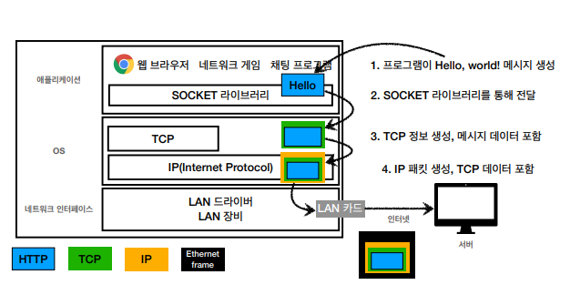
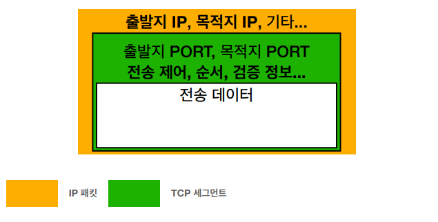
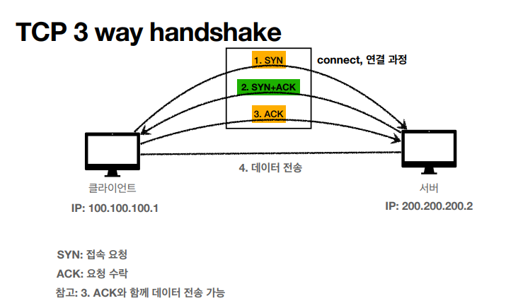
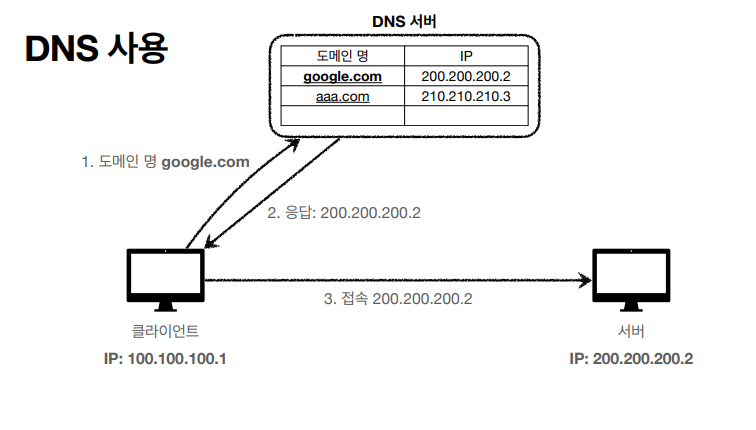

# 인터넷 네트워크

## 1. 인터넷 통신

> 인터넷에서 컴퓨터끼리는 어떻게 통신할까?

클라이언트와 서버가 멀리 존재할 때, 인터넷을 통해서 전달해야 한다.

인터넷 망은 복잡하게 구성되어 있다. 복잡한 인터넷 망 내에서 데이터들은 어떤 규칙으로 넘어갈까?

 

## 2. IP(Internet Protocol)

> 데이터 전송을 위한 최소한의 규칙으로 IP주소를 부여한다.

### 1) IP의 역할

- 지정한 IP 주소에 데이터를 전달한다.
- 패킷(Packet)이라는 통신 단위로 데이터를 전달한다.
  - IP 패킷 정보에는 `출발지 IP, 목적지 IP, 기타 ...` 가 포함된다. 

### 2) 클라이언트/서버의 패킷 전달

- IP 패킷을 인터넷 망에 던진다. 인터넷 망 속의 노드들이 서로 전달해주며 출발지와 목적지 IP주소에 도달하게 된다.

### 3) IP의 한계

- **비연결성**
  - 패킷을 받을 대상이 없거나 서비스 불능 상태여도 패킷을 전송한다.
  - 대상 서버가 패킷을 받을 수 있는 상태인지 아닌지 모르기 때문이다.
- **비신뢰성**
  - 중간에 패킷이 소실되어도 이를 해결할 수 없다.
  - 데이터의 용량이 크면 끊어서 전송하는데, 이 때 패킷이 순서대로 도착하여도 이를 해결할 수 없다.
- **프로그램 구분**
  - 같은 IP를 사용하는 서버에서 통신하는 애플리케이션이 둘 이상이여도 해결할 수 없다.

 

이런 문제와 한계를 해결해주는 것이 ↓

## 3. TCP UDP

| 인터넷 프로토콜 스택의 4계층  |
| :---------------------------: |
| 애플리케이션 계층 - HTTP, FTP |
|     전송 계층 - TCP, UDP      |
|       인터넷 계층 - IP        |
|   네트워크 인터페이스 계층    |

### 1) 프로토콜 계층

### 2) TCP/IP 패킷 정보

### 3) TCP 특징

> TCP(Transmission Control Protocol) : 전송 제어 프로토콜
>
> 신뢰할 수 있는 프로토콜이며 현재는 대부분의 애플리케이션에서 TCP를 사용하고 있다.

- 연결지향
  - TCP 3 way handshake(가상 연결)
  - 클라이언트와 서버가 연결 되어있는지 확인하고 전송을 시작한다.
- 데이터 전달 보증
  - 메세지를 보냈는데 패킷이 중간에 누락되면 그 누락된 사실을 알 수 있다.
- 순서 보장

### 4) TCP 3 way handshake (SYN : 접속 요청, ACK : 요청 수락)

1. SYN : 클라이언트에서 서버로 SYN을 보냄
2. SYN + ACk
3. ACK
4. 데이터 전송

- 요즘에는 최적화가 되어서 `3. ACK`와 함께 데이터 전송이 가능하다.
- 3 way handshake는 가상 연결이라고 볼 수 있다. 즉, 개념적(논리적)으로만 연결되었다는 걸 의미한다.
  - 클라이언트와 서버만 연결되었다고 생각하는 것이므로 실제로 인터넷 망에 있는 모든 노드가 연결되어있는지는 알 수 없다.

#### [데이터 전달 보증]

1. 데이터를 전송한다.
2. 데이터 잘 받았다는 메세지를 보내준다.

#### [순서 보장]

1. 패킷1, 패킷2, 패킷3 순서로 전송한다.
2. 패킷1, **패킷3**, 패킷2 순서로 도착한다.
3. 패킷2부터 다시 보내라고 요청한다.

#### ✔ 데이터 전달 보증과 순서 보장은 TCP 세그먼트에 정보들이 추가되어 있기 때문에 가능한 것

### 5) UDP 특징

> 사용자 데이터그램 프로토콜 (User Datagram Protocol)

- 주로 UDP는 하얀 도화지에 비유한다.
  - 기능이 거의 없다고 보면 된다.
- 연결지향 X, 데이터 전달 보증 X, 순서 보장 X
- 데이터 전달 및 순서가 보장되지 않지만, 단순하고 빠르다.
  - TCP는 전송속도가 느리고(3 way handshake 때문), 최적화 하기가 어렵다.
- IP와 거의 같은 역할을 하면서 `PORT와 체크섬` 정도만 추가한다.
- 애플리케이션에서 추가 작업이 필요하다.
- UDP가 뜨고 있는 이유는 HTTP3에서 사용하려고 하고 있기 때문이다.

 

## 4. PORT

> 같은 IP 내에서 프로세스를 구분한다.
>
> 예를 들어서 IP가 아파트라면 PORT는 몇 동, 몇 호인지 나타낸다.

- 한 번에 두 개 이상의 서버에 연결해야 하는 경우(ex. 게임과 화상 통화, 웹 브라우저 동시 실행하는 경우) 즉, 클라이언트 PC가 여러 개의 서버랑 통신해야하는 경우가 발생한다. 이럴 때 PORT를 활용한다.
- PORT 0 ~ 65535 할당 가능하다.
  - 0~1023 : 잘 알려진 포트, 사용하지 않는 것이 좋다.
    - FTP : 20 21
    - TELNET : 23
    - HTTP : 80
    - HTTPS : 443

 

## 5. DNS

> 도메인 네임 시스템(Domain Name System)
>
> 전화번호부라고 이해하면 된다. 도메인 명을 IP주소로 변환하는 역할을 한다.

- IP는 `200.200.200.2` 같은 형식이기 때문에 기억하기 어렵다. 또한, IP는 변경될 수 있어서 신규 IP로 바뀌면 더 이상 접근이 불가능하게 된다.

  → 따라서 DNS를 사용한다.

- DNS 사용
  1. DNS 서버에 도메인 명을 등록한다.
  2. 클라이언트에서 도메인 명으로 찾는다.
  3. DNS 서버가 도메인 명에 할당된 IP주소를 응답하고
  4. 이 IP 주소로 접속함

