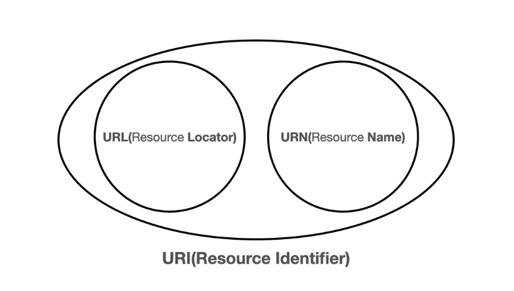
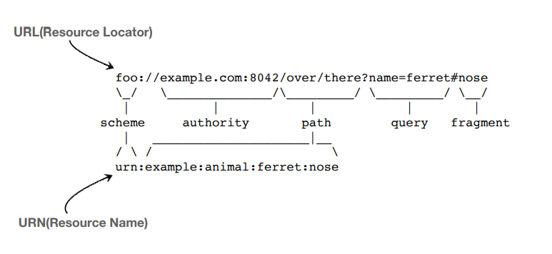
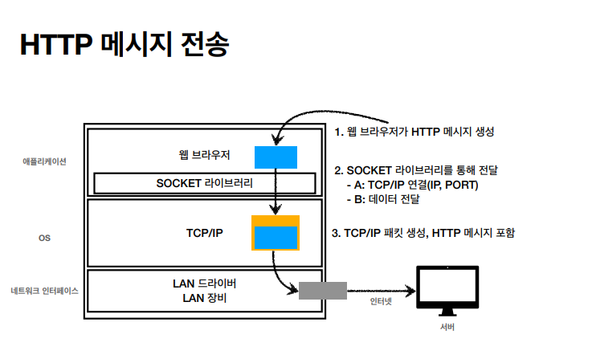

# URI와 웹 브라우저 요청 흐름

## 1. URI(Uniform Resource Identifier)

> URI는 로케이터(**L**ocator), 이름(**N**ame) 또는 둘 다 추가로 분류될 수 있다.

- Locator는 resource의 위치를 나타낸다. 거의 URL만 사용한다고 보면 된다.

### 1) URI

- **U**niform : 리소스를 식별하는 통일된 방식

- **R**esource : 자원, URI로 식별할 수 있는 모든 것(제한 없음)

- **I**dentifier : 다른 항목과 구분하는데 필요한 정보

### 2) URL, URN

- URL : Uniform Resource Locator
  - 리소스가 있는 위치를 지정한다.
- URN : Uniform Resource Name
  - 리소스에 이름을 부여한다.
- 위치는 변할 수 있지만, 이름은 변하지 않는다.
- URN 이름만으로 실제 리소스를 찾을 수 있는 방법이 보편화 되지 않았다.

### 3) URL 전체 문법

#### scheme://[userinfo@]host\[:port]\[/path]\[?query][#fragment]

#### ex) https://www.google.com:443/search?q=hello&hl=ko

 

#### [scheme]

- 주로 프로토콜을 사용한다.
- 프로토콜 : 어떤 방식으로 자원에 접근할 것인가하는 약속 규칙
- ex) `http`, `https`, `ftp` 등
- http는 80 포트, https는 443 포트를 주로 사용한다. 포트는 생략 가능하다.
- https는 http에 보안을 추가한 것이다(HTTP Secure)

#### [userinfo]

- URL에 사용자정보를 포함해서 인증한다.
- 거의 사용하지 않는다.

#### [host] 

- 호스트명
- 도메인 명 또는 IP 주소를 직접 사용한다.

#### [PORT]

- 접속 포트로, 일반적으로 생략한다.
- 생략할 때 http는 80, https는 443으로 기본 설정된다.

#### [path]

- 리소스 경로
- 계층적 구조를 가진다.

#### [query] 

- `key=value` 형태
- `?` 로 시작하고, `&`로 추가 가능하다.
- query parameter, query string 등으로 불린다. 
- 웹서버에 제공하는 파라미터로, 문자 형태로 넘어간다.

#### [fragment]

- html 내부 북마크 등에 사용한다.
  - 페이지의 특정 부분을 바로 보여줄 때 사용한다.
- 서버에 전송하는 정보는 아니다.

 

## 2. 웹 브라우저 요청 흐름

1. 웹 브라우저가 DNS 서버 조회해서 IP와 PORT 정보를 알아내서, HTTP 요청 메시지를 생성한다.
2.  SOCKET 라이브러리를 통해서 전달한다.
   - TCP/IP(IP, PORT) 연결
   - 데이터 전달
3. TCP/IP 패킷 생성하고 그 속에 HTTP 메시지 포함시킨다.
4. 요청 패킷을 서버로 전송한다.
5. 요청 패킷이 도착하면 HTTP 응답 메시지를 생성한다.
6. 그리고 클라이언트로 응답 패킷을 전송하고, 최종적으로 그 응답 패킷에 담겨있는 내용으로 웹 브라우저는 HTML를 랜더링한다.

