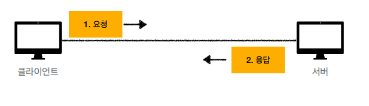
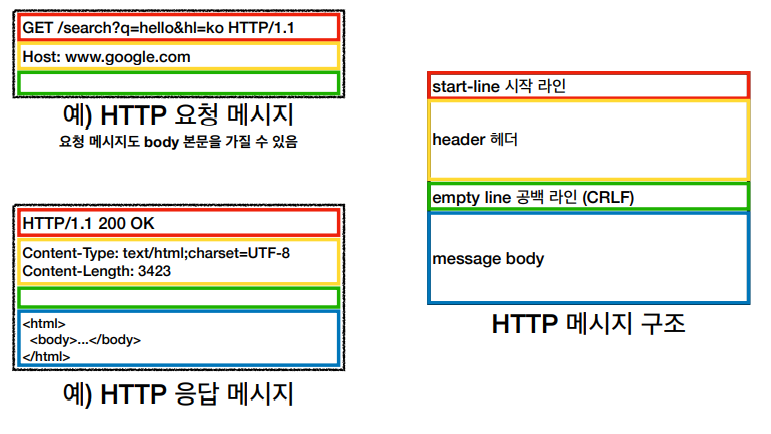

# HTTP 기본

## 1. HTTP(HyperText Transfer Protocol)

>  HTTP 메시지에 모든 것을 전송한다.
>

- HyperText : 문서 안의 링크를 통해서 연결할 수 있는 문서
- HTML, TEXT, IMAGE, 음성, 영상, 파일, JSON, XML(API) 등 거의 모든 형태의 데이터 전송이 가능하다.
- 서버 간에 데이터를 주고 받을때도 대부분 HTTP를 사용한다.

### 1) HTTP의 역사

- HTTP/0.9 : GET 메서드만 지원, HTTP 헤더 존재하지 않음
- HTTP/1.0 : 메서드, 헤더 추가
- **HTTP/1.1 : 가장 많이 사용하고, 우리에게 가장 중요한 버전**
- HTTP/2 : 성능 개선
- HTTP/3 : TCP 대신 UDP를 사용, 성능 개선

### 2) 기반 프로토콜

- TCP : HTTP/1.1, HTTP/2
- UDP : HTTP/3
- 현재 HTTP/1.1를 주로 사용한다
  - HTTP/2, HTTP/3도 점점 증가하는 추세이다.

### 3) HTTP 특징

- 클라이언트 서버 구조
- 무상태 프로토콜(Stateless), 비연결성
- HTTP 메시지로 통신
- 단순함, 확장 가능

 

## 2. 클라이언트 서버 구조

> Request Response 구조

- 클라이언트는 서버에 요청을 보내고, 응답을 대기한다.
- 서버가 요청에 대한 결과를 만들어서 응답을 한다.
- 비즈니스 로직, 데이터 등은 다 서버가 담당하고, 클라이언트는 UI와 사용성에 집중한다.
- 클라이언트와 서버가 각각 독립적으로 진화할 수 있다.

 

## 3. 무상태 프로토콜

> 스테이트리스(stateless)

- 서버가 클라이언트의 상태를 보존하지 않는다.
- 장점 : 서버의 확장성이 높다.
- 단점 : 클라이언트가 추가 데이터를 전송해야 한다.

### 1) Stateful, Stateless

#### ✔ 상태유지 - stateful

- 상태유지에서는 중간에 다른 점원을 만나면 서비스에 장애가 생긴다. 

  - 문맥을 찾기가 어려워서 원하는 데이터를 찾기가 어려워지기 때문이다.
  - 따라서 중간에 점원이 변경된다면, 상태 정보를 다른 점원에게 미리 알려줘야 한다.

#### ⭐ 무상태 - stateless

- 무상태에서는 고객이 필요한 데이터를 다 넘겨준다.
-  중간에 다른 점원으로 바뀌어도 된다.
  - 갑자기 고객이 증가해도 점원을 대거 투입할 수 있다.
  - 갑자기 클라이언트 요청이 증가해도 서버를 대거 투입할 수 있다.
- 무상태는 응답서버를 쉽게 바꿀 수 있다.  따라서 무한한 서버 증설이 가능하다.
- 무상태는 서버 개발자들이 어려워하는 업무이다.
  - 정말 같은 시간에 한 번에 발생하는 대용량 트래픽을 처리하기가 까다롭다.
  - ex) 선착순 이벤트, 명절 KTX 예약, 수강 신청

#### ✔ 정리

- 상태 유지 : 정해진 서버를 계속 호출해야 한다.
  - 중간에 서버에 장애가 생기면 문제가 발생한다.
- 무상태 : 아무 서버나 호출해도 된다.
  - 중간에 원래 서버에 장애가 발생해도 다른 서버로부터 응답을 받으면 된다.
  - 스케일 아웃 - 수평 확장에 유리하다.

### 2) stateless 실무 한계

- 모든 것을 무상태로 설계 할 수 있는 경우도 있고 없는 경우도 있다.
- 무상태  ex) 로그인이 필요없는 단순한 서비스 소개 화면
- 상태 유지  ex) 로그인
- 로그인한 사용자의 경우 로그인 했다는 상태를 서버에 유지한다.
- 일반적으로 브라우저 쿠키와 서버 세션 등을 사용해서 상태 유지를 한다.
- 상태 유지는 최소한만 사용한다.
- 무상태는 데이터를 많이 보내야 한다는 단점이 있다..

#### 최대한 무상태로 설계하고 어쩔수 없는 경우만 상태유지로 설계한다고 보면 된다.

 

## 4. 비연결성(connectionless)

- 연결을 유지하는 모델
  - TCP/IP 연결 후, 연결을 유지한다. 서버는 연결을 계속 유지 하니까 서버 자원이 소모된다.
- 연결을 유지하지 않는 모델
  - 할일이 끝나면 TCP/IP 연결을 종료시킨다. 서버는 연결을 유지 하지 않고 최소한의 자원을 유지한다.

 

> HTTP는 기본적으로 연결을 유지하지 않는 모델이다.

- 일반적으로 초 단위 이하의 빠른 속도로 응답
- 1시간 동안 수천명이 서비스를 사용해도 실제 서버에서 동시에 처리하는 요청은 수십개 이하로 매우 작다
  - 웹 브라우저에서 계속 연속해서 검색 버튼을 누르는 상황이 일반적으로 발생하지 않는다.
- 서버 자원을 매우 효율적으로 사용할 수 있다.

### 1) 한계와 극복

- 연결할 때마다, TCP/IP 연결을 새로 맺어야 한다.
  - 3 way handshake 시간이 추가된다.
- 웹 브라우저로 사이트를 요청하면 HTML뿐만 아니라 자바스크립트, css, 추가 이미지 등 수많은 자원이 함께 다운로드 된다.
- 현재는 HTTP 지속 연결로 이 문제를 해결하고 있다.
- HTTP/2, HTTP/3 에서 더 많은 최적화가 이루어지고 있다.

 

##  5. HTTP 메시지

> 요청 메시지와 응답 메시지의 구조가 다르다.

### 1) 시작라인

#### [요청 메세지]

- **request-line**
- request-line = method SP(공백) request-target SP HTTP-version CRLF(엔터)
- **method** : HTTP 메서드 
  - 서버가 수행해야 할 동작을 지정한다.
  - GET, POST, PUT, DELETE...
    - GET : 리소스 조회
    - POST : 요청 내역 처리
- **request-target** : 요청 대상
  -  absolute-path[?query] (절대경로[?쿼리])
  - 절대경로 : "/"로 시작하는 경로
  - 다른 방식도 존재한다.
- **HTTP-version**

#### [응답 메시지]

- **status-line**  
- status-line = HTTP-version SP status-code SP reason-phrase CRLF
- **HTTP-version**
- **status-code** : HTTP 상태 코드
  
  - 요청 성공, 실패를 나타낸다.
  - 200 : 성공
  - 400 : 클라이언트 요청 오류
  - 500 : 서버 내부 오류
- **reason-phrase** : 이유 문구

  - 사람이 이해할 수 있는 짧은 상태 코드를 설명하는 글

### 2) 헤더

- **header-field** = field-name":" OWS field-value OWS (OWS:띄어쓰기 허용)
- field-name은 대소문자를 구분하지 않는다.
- field-value는 대소문자를 구분한다.

#### ✔ 헤더의 용도

- HTTP 전송에 필요한 모든 부가정보를 포함한다.
- 메시지 바디의 내용, 메시지 바디의 크기, 압축, 인증, 요청 클라이언트(브라우저) 정보, 서버 애플리케이션 정보, 캐시 관리 정보 등등 표준 헤더가 많다.
- 필요시 임의의 헤더를 추가 가능하다.

### 3) 메시지 바디

- 실제 전송할 데이터
- byte로 표현할 수 있는 모든 데이터를 전송 가능하다.
  - ex) HTML 문서, 이미지, 영상, JSON ... 

 

## 6. 단순함 / 확장 가능

- HTTP는 단순하다.
- HTTP 메시지도 매우 단순하다.
- 크게 성공하는 표준 기술은 단순하지만 확장 가능한 기술이다.
