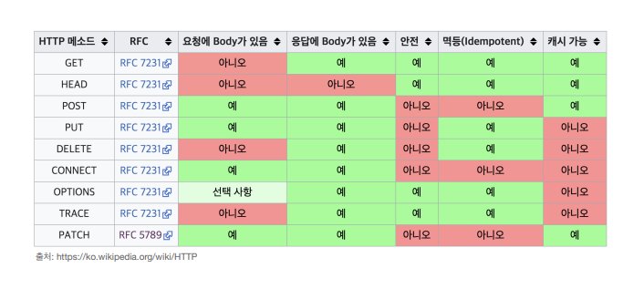

# HTTP 메서드

## 1. HTTP API

> 가장 중요한 것은 리소스를 식별하는 것이다.

### 1) API URI 

- 리소스의 의미는 뭘까?
  - 회원을 등록하고 수정하고 조회하는게 리소스가 아니다.
  - **회원이라는 개념 자체가 바로 리소스**라고 보면 된다.
- 리소스를 어떻게 식별하는게 좋을까?
  - 회원을 등록하고 수정하고 조회하는 것을 모두 배제한다.
  - **회원이라는 리소스만 식별**하면 된다. 
    - 회원 리소스를 URI에 매핑한다.

→ 리소스 식별, URI 계층 구조를 활용한다.

→ 계층 구조상 상위를 컬렉션으로 보고 복수단어 사용을 권장한다.

###  2) API URI 설계

> 리소스와 행위를 분리한다. 가장 중요한 것은 리소스를 식별하는 것이다.

- URI는 리소스만 식별하게 한다.
- 리소스와 해당 리소스를 대상으로 하는 행위를 분리한다.
  - 리소스 : 회원
  - 행위 : 조회, 등록, 삭제, 변경
- 리소스는 명사, 행위는 동사

 

## 2. HTTP 메서드

| 메서드  | 설명                                                       |
| ------- | ---------------------------------------------------------- |
| GET     | 리소스 조회                                                |
| POST    | 요청 데이터 처리, 주로 등록에 사용                         |
| PUT     | 리소스를 대체, 해당 리소스가 없으면 생성                   |
| PATCH   | 리소스 부분 변경                                           |
| DELETE  | 리소스 삭제                                                |
| HEAD    | GET과 동일, 메시지 부분을 제외하고 상태줄과 헤더만 반환    |
| OPTIONS | 대상 리소스에 대한 통신 가능 옵션(메서드)를 설명           |
| CONNECT | 대상 자원으로 식별되는 서버에 대한 터널을 설정             |
| TRACE   | 대상 리소스에 대한 경로를 따라 메시지 루프백 테스트를 수행 |

 

### 1) GET

- 리소스를 조회할 때 사용한다.
- 서버에 전달하려는 데이터는 query(쿼리 파라미터, 쿼리 스트링)를 통해서 전달한다.
- 메시지 바디를 사용해서 데이터를 전달할 수 있지만, 지원하지 않는 곳이 많아서 권장하지 않는다.

#### [데이터 전달 과정]

1. 클라이언트가 GET 요청으로 메시지를 전달한다.
2. 서버에 메시지가 도착한다.
3. 서버가 내부 DB 조회해서 응답할 데이터를 만든 후, 응답 메시지를 생성해서 클라이언트에게 보낸다.

 

### 2) POST

- 요청 데이터를 처리한다.
- **메시지 바디를 통해 서버로 요청 데이터를 전달**한다.
- 서버는 요청 데이터를 처리한다.
  - 메시지 바디를 통해 들어온 데이터를 처리하는 모든 기능을 수행한다.
- 주로 전달된 데이터로 신규 리소스 등록, 프로세스 처리에 사용한다.

#### [데이터 전달 과정]

1. 클라이언트가 POST 요청으로 메시지를 전달한다.
2. 서버에서 데이터를 받아서 열어본 후, 신규 리소스 식별자를 생성한다.
3. 리소스 식별자를 포함한 데이터를 응답 메시지에 포함해서 클라이언트에게 보낸다.
   - `location` : 생성된 위치가 전달된다.

#### POST는 요청 데이터를 어떻게 처리할까?

- POST 메서드는 대상 리소스가 리소스의 고유한 의미 체계에 따라 요청에 포함된 표현을 처리하도록 요청한다.
- 예를 들어 다음과 같은 기능에 사용된다.
  - HTML 양식에 입력된 필드와 같은 데이터 블록을 데이터 처리 프로세스에 제공한다.
    - HTML FORM에 입력한 정보로 회원가입, 주문 등에 사용
  - 게시판, 뉴스 그룹, 메일링 리스트, 블로그 또는 유사한 기사 그룹에 메시지를 게시한다.
    - 게시판 글쓰기, 댓글 작성
  - 서버가 아직 식별하지 않은 새 리소스를 생성한다.
    - 신규 주문 생성
  - 기존 자원에 데이터를 추가한다.
    - 한 문서 끝에 내용 추가
- 리소스 URI에 POST 요청이 오면 **요청 데이터를 어떻게 처리할지 리소스마다 따로 정해야 한다**. 
  - 정해진 것이 없다.

#### ✔ POST 정리

- 새 리소스를 생성, 등록한다.
  - 서버가 아직 식별하지 않은 새 리소스를 생성한다.
- 요청 데이터를 처리한다.
  - 단순히 데이터를 생성, 변경하는 것을 넘어서 프로세스를 처리해야 하는 경우에 사용한다.
    - ex) 결제완료 - 배달시작 - 배달완료처럼 프로세스의 상태가 변경되는 경우
- POST의 결과로 새로운 리소스가 생성되지 않을 수도 있다.
  - 따라서 컨트롤 URI를 써야하는 경우가 많다.
  - 리소스만 사용하는 건 이상적인 설계이다.
- 다른 메서드로 처리하기 애매한 경우, POST를 사용한다.
  - POST는 모든 걸 할 수 있다.
  - 조회할 때는 GET을 사용하는 것이 유리하다. GET으로 하면 캐싱 같은 것들이 쉬워진다.
  - 변경, 프로세스 처리 등은 POST로!

 

### 3) PUT

- 리소스를 대체한다. 완전히 대체해버린다.
  - 리소스가 있으면 대체하고 없으면 생성한다.
  - 쉽게 이야기해서 리소스를 덮어버린다.
  - 폴더에 파일을 넣는 것과 똑같다고 보면 된다.
- ⭐ **클라이언트가 리소스를 식별**한다.
  - 클라이언트가 리소스 위치를 알고 URI를 지정한다.
  - POST와 차이점
    - POST에서는 위치를 알고 있지 않다.
    - 서버에서 위치를 지정하는 것이기 때문이다.
- 완전히 대체하기 떄문에 리소스를 수정하기는 어렵다.

 

### 4) PATCH

- 리소스를 부분 변경한다.
- 지원이 안 되는 서버도 있다. 그런 경우에는 POST를 사용

 

### 5) DELETE

- 리소스를 제거한다.

 

## 3. HTTP 메서드 특징

### 1) 안전(Safe Methods)

- 호출해도 리소스를 변경하지 않는다.
- GET
- 해당 리소스가 변하는지 변하지 않는지만 고려한다.

### 2) 멱등(Idempotent Methods)

- f(f(x)) = f(x)
- 한 번 호출하든 두 번 호출하든 100번 호출하든 결과가 똑같다.
- 멱등 메서드
  - GET : 몇 번 조회하든 같은 결과가 조회된다.
  - PUT : 결과를 대체한다. 따라서 같은 요청을 여러번 해도 최종 결과는 같다.
  - DELETE : 결과를 삭제한다. 같은 요청을 여러번 해도 삭제된 결과는 똑같다.
- POST : 멱등이 아니다. 두번 호출하면 같은 결제가 중복해서 발생할 수 있다.
- 활용
  - 자동 복구 메커니즘에 사용된다.
  - 서버가 TIMEOUT 등으로 정상 응답을 못주었을 때, 클라이언트가 같은 요청을 다시 해도 되는지에 대한 판단 근거가 된다.
- 멱등은 외부 요인으로 중간에 리소스가 변경되는 것까지는 고려하지 않는다.

### 3) 캐시 가능(Cacheable)

- 응답 결과 리소스를 캐시해서 사용해도 되는지?
- GET, HEAD, POST, PATCH 캐시 가능
- 실제로는 GET, HEAD 정도만 캐시로 사용한다.
  - POST, PATCH는 본문 내용까지 캐시 키로 고려해야 하는데, 구현이 쉽지 않다.
- 캐싱을 하려면 key가 맞아야 한다.

