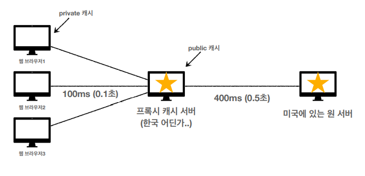
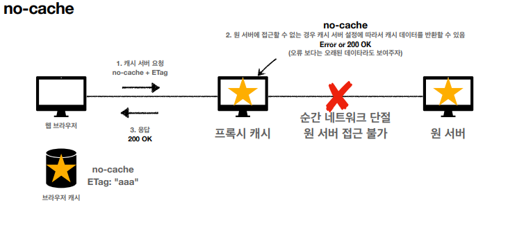
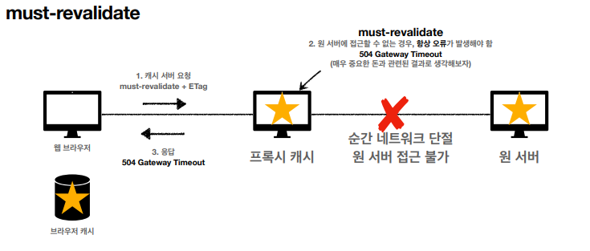

# HTTP 헤더 - 캐시와 조건부 요청

## 1. 캐시 기본 동작

### 1) 캐시가 없는 경우

- 요청할때마다 헤더랑 바디부를 다시 만들어서 전송하고 브라우저가 그때마다 다시 출력해야한다.
- 데이터가 변경되지 않아도 계속 네트워크를 통해서 데이터를 다운로드 받아야 한다.
- 브라우저 로딩 속도가 느려지고, 사용자들은 느린 사용자 경험을 하게 된다.

### 2) 캐시 적용

- 클라이언트에서 요청을 하면 서버는 `cache-control` 과 함께 데이터를 전송한다. 클라이언트는 응답 결과를 캐시에 저장한다.
- 또 다시 같은 데이터를 요청하면 캐시 데이터를 먼저 탐색한다. 캐시에 데이터가 있으면 유효 시간을 검증한 후, 캐시에서 바로 가져온다.
- 캐시 시간이 초과한다면 서버를 통해 데이터를 다시 조회하고 캐시를 갱신한다.
  - 이 경우에는 다시 네트워크 다운로드가 발생한다.
- 캐시를 사용하기 때문에 캐시 유효 시간동안 네트워크를 사용하지 않아도 된다.
- 브라우저 로딩 속도가 빨라지고, 사용자들은 빠른 사용자 경험을 하게 된다.

 

## 2. 검증 헤더와 조건부 요청 헤더

- 캐시 유효 시간이 초과해서 서버에 다시 요청하면 두 가지 상황이 나타난다.
  - 서버에서 기존 데이터를 변경하는 경우
  - 서버에서 기존 데이터를 변경하지 않는 경우

### [ 서버에서 기존 데이터를 변경하지 않는 경우 ]

- 데이터를 다시 전송하는 대신 저장해두었던 캐시를 재사용할 수 있다.
- 단, 클라이언트의 데이터와 서버의 데이터가 같다는 사실을 확인할 수 있는 방법이 필요하다.
  - 검증 헤더 : 캐시 데이터와 서버 데이터가 같은지 검증하는 데이터 (Last-Modified, ETag)
  - 조건부 요청 헤더 : 검증 헤더로 조건에 따른 분기를 발생시킨다.
    - If-Modified-Since -- Last-Modified
    - If-None_Match -- ETag
    - 조건이 만족하면 200 OK를, 만족하지 않으면 304 Not Modified를 응답한다.

#### 1) Last-modified -- if-modified-since

- 서버에서 데이터가 마지막에 수정된 시간을 검증 헤더 `Last-modified`를 통해 함께 전송한다.
- 캐시가 가지고 있는 최종 수정일을 조건부 요청 헤더 `if-modified-since`에 담아서 요청한다.
- 클라이언트의 최종 수정일과 서버의 최종 수정일이 동일하면 `304 Not Modified` 를 응답한다. 이 때, HTTP Body를 함께 전송하지 않는다.
- 그러면 응답 결과를 재사용하고, 헤더 데이터를 갱신시킨다.

> 캐시 유효 시간이 초과해도, 서버의 데이터가 갱신되지 않으면 304 Not Modified + 헤더 메타 정보(바디는 전송하지 않음)만 응답한다. 클라이언트는 서버가 보낸 응답 헤더 정보로 캐시의 메타 정보를 갱신하고, 캐시에 저장되어 있는 데이터를 재활용한다. 결과적으로 네트워크 다운로드가 발생하지만, 용량이 적은 헤더 정보만 다운로드 하기 때문에 매우 실용적인 해결책이다.

- 단점
  - 1초 미만 단위로 캐시 조정이 불가능하다.
  - 날짜 기반의 로직을 사용한다.
  - 데이터를 수정해서 날짜가 다르지만, 같은 데이터를 수정해서 데이터 결과가 똑같은 경우에는 다시 데이터를 다운로드 해야 한다.
  - 서버에서 별도의 캐시 로직을 관리하고 싶은 경우에도 인식하지 못한다.
    - ex) 스페이스나 주석처럼 큰 영향이 없는 변경에서 캐시를 유지하고 싶은 경우

#### 2) ETag -- if-none-match

- ETag(Entity Tag) : 캐시용 데이터에 임의의 고유한 버전 이름을 달아둔다.
- 데이터가 변경되면 이 이름을 바꿔서 변경한다(Hash를 다시 생성)
- 단순하게 ETag가 같으면 유지하고, 다르면 다시 받는다.
- 캐시 제어 로직을 서버에서 완전히 관리한다.
- 클라이언트는 단순하게 이 값을 서버에 제공한다(클라이언트는 캐시 메거니즘을 모름)
- ex) 서버는 베타 오픈 기간인 3일 동안 파일이 변경되어도 ETag를 동일하게 유지하고, 애플리케이션 배포 주기에 맞춰서 ETag를 모두 갱신한다.

 

## 3. 캐시와 조건부 요청 헤더

### 1) 캐시 제어 헤더

#### [ Cache-Control ] ⭐

- directives
- `Cache-Control: max-age`
  - 캐시 유효시간(초 단위)
- `Cache-Control: no-cache `
  - 데이터는 캐시해도 되지만, 항상 origin 서버에 검증하고 사용한다.
- `Cache-Control: no-store`
  - 데이터에 민감한 정보가 있으므로 저장하면 안된다(메모리에서 사용하고 최대한 빨리 삭제)

#### [ Pragma ]

- 하위 호환
- `Pragma: no-cahce`
- HTTP 1.0과 하위 호환하기 위해서 사용한다.

#### [ Expires ]

- 캐시 만료일 지정(하위 호환)
- 캐시 만료일을 정확한 날짜로 지정한다.
- HTTP 1.0 부터 사용했다.
- 현재는 `Cache-Control: max-age`를 권장한다.
- `Cache-Control: max-age`과 함께 사용하면 Expires는 무시된다.

### 2) 검증 헤더와 조건부 요청 헤더

#### [ 검증 헤더 ]

- ETag
- Last-Modified

#### [ 조건부 요청 헤더 ]

- if-match, if-none-match : ETag 값 사용
- if-modified-since, if-unmodified-since : Last-Modified 값 사용

 

## 4. 프록시 캐시

- origin 서버에 직접 접근을 하면 시간이 오래 걸리는 현상이 발생한다.
- 이를 극복하기 위해서 프록시 캐시 서버를 도입한다. 
- 클라이언트의 캐시를 private 캐시, 프록시 캐시 서버의 캐시를 public 캐시라고 한다.

### 1) Cache-Control

- `Cache-Control: public` : 응답이 public 캐시에 저장되어도 된다.
- `Cache-Control: private` : 응답이 해당 사용자만을 위한 것이므로, private 캐시에 저장해야 한다.(기본값)
- `Cache-Control: s-maxage ` : 프록시 캐시에만 적용되는 max-age
- `Age: 60 (HTTP 헤더)` : origin 서버에서 응답 후 프록시 캐시 내 에 머문 시간(초)

 

## 5. 캐시 무효화

- 확실한 캐시 무효화 응답 : 아래의 헤더를 다 넣어줘야 확실한 캐시 무효화가 된다.

> Cache-Control: no-cache, no-store, must-revalidate 
>
> Pragma: no-cache

- `Cache-Control: no-cache `

  - 데이터는 캐시해도 되지만, 항상 **origin 서버에 검증**하고 사용(이름에 주의!)
- `Cache-Control: no-store`

  - 데이터에 민감한 정보가 있으므로 저장하면 안됨 (메모리에서 사용하고 최대한 빨리 삭제)
- `Cache-Control: must-revalidate `
- 캐시 만료후 최초 조회시 origin 서버에 검증해야한다.
  - origin 서버 접근 실패시 반드시 오류가 발생해야한다 - 504(Gateway Timeout)
  - must-revalidate는 캐시 유효 시간이라면 캐시를 사용한다.
- Pragma: no-cache
  - HTTP 1.0 하위 호환을 위해 설정한다.

### [ no-cache vs must-revalidate]

#### 1) no-cache 기본 동작

- 캐시 서버에 요청을 하면, 프록시 캐시는 orgin 서버에 요청을 보낸다. 여기에서 origin 서버에 접근이 불가한 경우, 캐시 서버 설정에 따라서 캐시 데이터를 반환할 수 있다. 오류 보다는 오래된 데이터라도 보여주는 것을 선호한다. 따라서 변경되지 않은 데이터를 응답할 수 있다.

#### 2) must-revalidate 기본 동작

- 캐시 서버에 요청을 하면, 프록시 캐시는 origin 서버에 요청을 보낸다. origin 서버에 접근이 불가한 경우, 항상 오류가 발생(504 Gateway Timeout)한다.  

