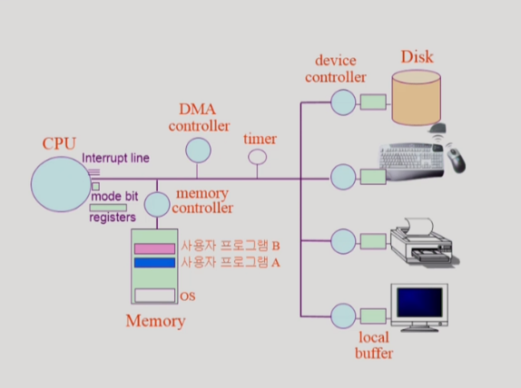
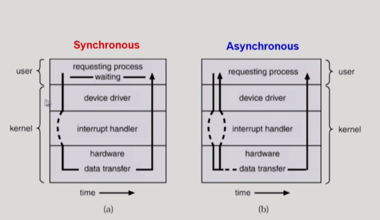
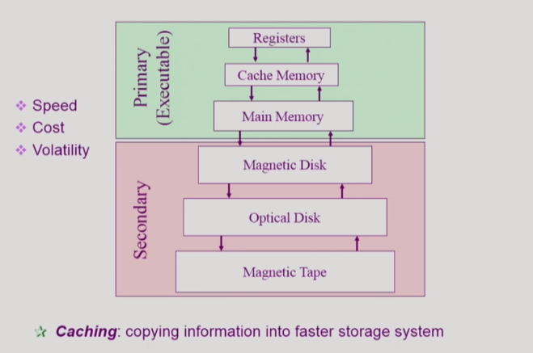
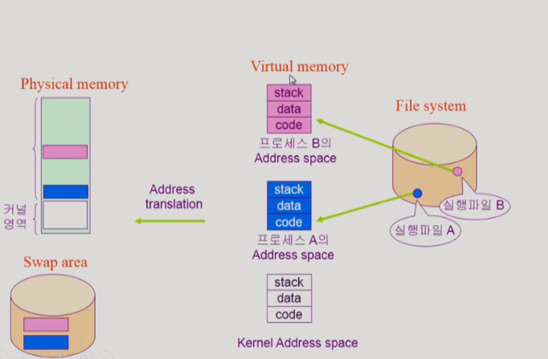
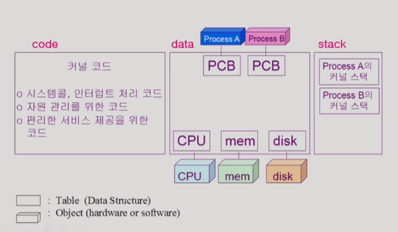
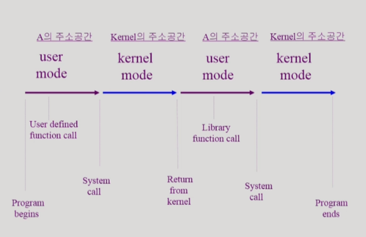

# System Structure & Program Execution 

> 컴퓨터 하드웨어 시스템에 대한 내용

## [ 컴퓨터 시스템 구조 ]

### 1. CPU

- 매 순간 기계어를 메모리에서 읽어서 실행한다.
- CPU는 항상 메모리에 있는 instruction만 실행한다.
- device에 직접 접근하지 않고 device controller에게 CPU가 일을 시킨다.
  - CPU는 본인이 할 수 있는 일을 계속 실행한다. I/O Device가 하는 일은 시간이 오래 걸리기 때문에 다 끝나면 알려달라고 하고 CPU는 빠르게 쉬지 않고 다른 일을 한다. 
  - I/O 작업을 해야하면 OS에게 접근해달라고 요청을 하게 된다. 보안 등의 여러 이유때문에 운영체제를 통해서만 I/O 작업을 해야하도록 설계되어 있다. 

 

### 2. Memory

- CPU의 작업공간이다.

 

### 3. I/O Device 

- 디바이스를 전담하는 작은 CPU들이 붙어있다.
  - device controller : 디바이스의 내부를 통제하는 역할
    - local buffer : device controller 각각의 작업공간
- 하드디스크 : I/O 역할을 동시에 수행한다.
  - 데이터를 메모리가 읽어들이기도 하고(input) 처리결과를 파일 시스템에 저장하기도 한다(output).
- CPU와 IO Device는 실행 시간에서 큰 차이를 보인다.

 

### 4.레지스터

- 메모리보다 더 빠르면서 정보를 저장할 수 있는 작은 공간

 

### 5. mode bit 

- CPU에서 실행되는 것이 운영체제인지 아니면 사용자 프로그램인지를 구분해주는 역할을 한다.
- 사용자 프로그램의 잘못된 수행으로 다른 프로그램 및 운영체제에 피해가 가지 않도록 하기 위한 보호장치가 필요하기 때문이다.
- OS에서 사용자 프로그램에게 CPU를 넘겨줄 때 mode bit을 1로 바꿔서 넘겨준다.
- mode bit을 통해 하드웨어적으로 두 가지 모드의 operation을 지원한다.
  - interrupt나 exception 발생 시 하드웨어가 mode bit을 0으로 바꾼다.
  - 사용자 프로그램에게 CPU를 넘기기 전에 mode bit을 1로 셋팅한다.

- 보안을 해칠 수 있는 중요한 명령어는 모니터 모드에서만 수행가능한 특권명령으로 규정한다.

- 1 : 사용자 프로그램
  - 제한된 instruction만 CPU에서 실행할 수 있도록 설계되어 있다. 
- 0 : 커널 모드 / 시스템 모드 / OS코드 수행
  - 무슨 일이든지 다 실행할 수 있도록 설계되어 있음

 

### 6. Timer

- 무한루프를 도는 프로그램에 CPU가 넘어가면 CPU가 다른 프로그램에게 넘어가지 못해서 Time sharing을 구현할 수 없게 된다. 
- 타이머는 time sharing을 구현하기 위해 널리 이용된다.
- 특정 프로그램이 CPU를 독점하는 것을 막기 위해서 사용한다. timer에 값을 세팅하고 사용자 프로그램에게 CPU를 넘기게 된다. 그러면 할당된 시간 (1초보다 짧음) 이 되면 timer가 CPU에게 interrupt를 건다. 하나의  instruction이 끝나면 interrupt line을 체크한다. CPU는 하던 일을 잠시 멈추고 CPU의 제어권이 사용자 프로그램에서 운영체제로 자동적으로 넘어간다. 운영체제가 CPU를 얻게 되면 다음 프로그램에게 CPU를 할당하는 역할을 수행한다. 

- 정해진 시간이 흐른 뒤 운영체제에게 제어권이 넘어가도록 인터럽트를 발생시킨다.
- 타이머는 매 클럭 틱 때마다 1씩 감소한다
- 타이머 값이 0이 되면 타이머 인터럽트가 발생한다.
- CPU를 특정 프로그램이 독점하는 것으로부터 보호한다.
- 타이머는 현재 시간을 계산하기 위해서도 사용된다.

 

### 7. Device controller

- I/O 장치를 관리하는 일종의 작은 CPU이다.
- 제어 정보를 위해 control register, status register를 가진다.
- local buffer를 가진다.(일종의 data register)
  - 정보는 local buffer에 저장하고, 명령은 device controller가 처리한다.
- I/O는 실제 device와 local buffer 사이에서 일어난다.
- Device controller는 I/O가 끝났을 경우 interrupt로 CPU에 그 사실을 알린다.
- device driver(장치구동기) : OS코드 중 각 장치별 처리루틴 - SW
- device controller(장치제어기) : 각 장치를 통제하는 일종의 작은 CPU  - HW

 

### 8. DMA controller

- 직접 메모리에 접근할 수 있는 컨트롤러
- 메모리를 CPU도 접근할 수 있고 DMA도 접근할 수 있게 해 놓았다.
- 특정 메모리 영역을 동시에 접근할 때 문제가 생기기 때문에 누가 먼저 접근하게 할지 컨트롤하는 역할을 한다.

 

## [ 입출력의 수행 ]

- 모든 입출력 명령은 특권명령
- 사용자 프로그램은 어떻게 I/O를 하는가?
  - 시스템콜(System Call) : 사용자 프로그램은 운영체제에게 I/O를 요청
  - trap을 사용하여 인터럽트 벡터의 특정 위치로 이동
  - 제어권이 인터럽트 벡터가 가리키는 인터럽트 서비스 루틴으로 이동
  - 올바른 I/O 요청인지 확인 후 수행
  - I/O 완료시 제어권을 시스템콜 다음 명령으로 옮긴다

 

##  [ 인터럽트 ]

- 인터럽트 당한 시점의 레지스터와 program counter를 save한 후 CPU의 제어를 인터럽트 처리루틴에 넘긴다.
- interrupt (넓은 의미)
  - interrupt(하드웨어 인터럽트) : 하드웨어가 발생시킨 인터럽트
  - trap(소프트웨어 인터럽트)
    - exception : 프로그램이 오류를 범한 경우
    - system call : 프로그램이 커널 함수를 호출하는 경우
- 인터럽트 관련 용어
  - 인터럽트 벡터 : 해당 인터럽트의 처리 루틴 주소를 가지고 있음
  - 인터럽트 처리 루틴(Interrupt Service Routine 인터럽트 핸들러) : 해당 인터럽트를 처리하는 커널 함수

- I/O 요청을 할때는 sw인터럽트 요청이 다 끝나면 hw 인터럽트로 알려준다.

- 현대의 운영체제는 인터럽트에 의해 구동된다.
  - 운영체제는 CPU를 사용할 일이 없고 인터럽트가 있을 때만 CPU로 넘겨준다.
- 시스템 콜 : 사용자 프로그램이 운영체제의 서비스를 받기 위해 커널 함수를 호출하는 것

 

## [ 동기식 입출력과 비동기식 입출력 ]

- 동기식 입출력(synchronous I/O)
  - I/O에 요청 후 입출력 작업이 완료된 후에야 제어가 사용자 프로그램에 넘어감
  - 구현 방법 1
    - I/O가 끝날때까지 CPU를 낭비시킴
    - 매시점 하나의 I/O만 일어날 수 있음
  - 구현 방법 2
    - I/O가 완료될때까지 해당 프로그램에게서 CPU를 빼앗음
    - I/O처리를 기다리는 줄에 그 프로그램을 줄 세움
    - 다른 프로그램에게 CPU를 줌
- 비동기식 입출력(asynchronous I/O)
  - I/O가 시작된 후 입출력 작업이 끝나기를 기다리지 않고 제어가 사용자 프로그램에게 즉시 넘어감
- 두 경우 모두 I/O의 완료는 인터럽트로 알려준다.

## [ DMA(Direct Memory Access) ]

작은 일 하나하나마다 인터럽트가 걸리면 CPU가 효율적인 동작을 하지 못한다. 굉장한 overhead가 따르기 때문에

- 빠른 입출력 장치를 메모리에 가까운 속도로 처리하기 위해 사용한다.
- CPU의 중재 없이 device controller가 device의 buffer storage의 내용을 메모리에 block 단위로 직접 전송한다.
- 바이트 단위가 아니라 block 단위로 인터럽트를 발생시킨다.

 

#### 서로 다른 입출력 명령어

- I/O를 수행하는 special instruction에 의해
- Memory Mapped I/O에 의해

 

## [ 저장장치 계층 구조 ]

- 위로 갈수록 속도가 빠른 매체, 단위 공간 당 비용이 비싸다. 그래서 용량이 적음
- 휘발성 / 비휘발성
- executable : 바이트 단위 접근이 가능한 것들
- 하드디스크 : 바이트 단위 접근 X 섹터 단위 접근.
- caching  : 재사용이 목적. 한 번 읽어들여 놓으면 같은 걸 두번째 요청할때는 바로 사용하기 위해 사용한다. 

 

## [ 프로그램의 실행(메모리 load) ]

- 보통 실행파일의 형태로 저장되어 있음
- 실행시키면 메모리에 올라가서 프로세스가 된다.
- 가상 메모리 단계를 거친다. 
- 프로그램을 실행시키게 되면 프로그램만의 독자적인 주소 공간이 형성된다(메모리 주소 공간)
- 주소공간은 code(기계어코드), data(변수/자료구조), stack(함수 호출/리턴할때 데이터 쌓아 놓는 역할)으로 구성된다.
- 주소공간을 물리적인 메모리에 올려서 실행시키는 것. 
- 커널 : 부팅시키고나면 메모리에 항상 상주.
- 프로그램은 실행시키면 만들어졌다가 종료시키면 없어짐.
- 통째로 메모리에 올리는 것이 아니라, 당장 필요한 부분만 메모리에 올린다. 그렇지 않은 부분은 메모리 낭비를 막기 위해서 disk에 내려놓는다. 사용하지 않으면 메모리에서 없애버린다.
- swap area의 내용은 전원이 꺼지면 사라진다(의미 없는 종료가 되어짐) - 메모리 연장 공간으로 사용
- file system - 저장하는 것으로 사용

### + 주소 변환 : 

#### + 커널 주소 공간의 내용

 

## [ 사용자 프로그램이 사용하는 함수 ]

- 함수
  - 사용자 정의 함수
    - 자신의 프로그램에서 정의한 함수
  - 라이브러리 함수
    - 자신의 프로그램에서 정의하지 않고 갖다 쓴 함수
    - 자신의 프로그램의 실행 파일에 포함되어 있다.
  - 커널 함수
    - 운영체제 프로그램의 함수
    - 커널 함수의 호출 = 시스템 콜

 

#### + 프로그램의 실행

 