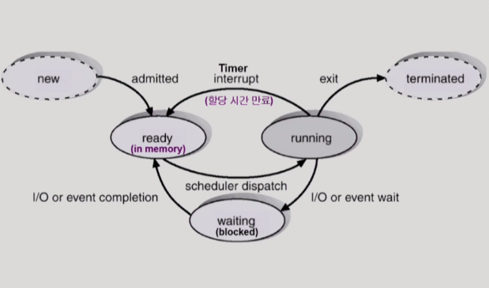
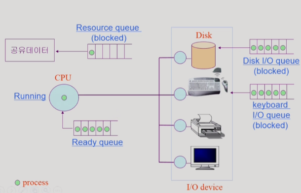
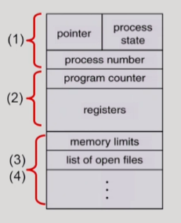
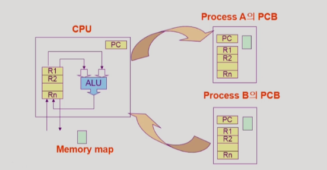
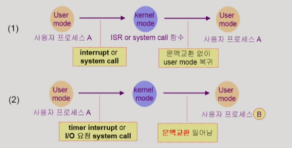
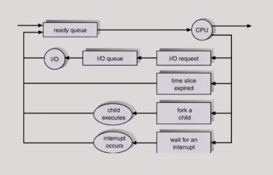
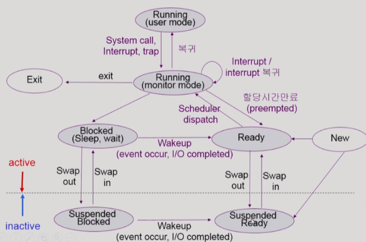

# Process

## 1. 프로세스의 개념

- Process is a program in execution : 실행 중인 프로그램
- 프로세스의 문맥(context) : 프로세스의 문맥을 알아야 현재 프로세스의 상태를 알 수 있다.
  - CPU 수행 상태를 나타내는 하드웨어 문맥
    - Program Counter가 어디를 가리키고 있는지
    - 각종 register에 어떤 값을 넣어두고, 어떤 instruction까지 실행했는지
  - 프로세스의 주소 공간
    - code, data, stack : 현재 변수의 값은 얼마인지. 무슨 내용을 어디까지 쌓아두고 있는지
  - 프로세스 관련 커널 자료구조

 

## 2. 프로세스의 상태

- Running : CPU를 잡고 instruction을 수행중인 상태
- Ready : CPU를 기다리는 상태(메모리 등 다른 조건을 모두 만족하고)
- Blocked(wait, sleep)
  - CPU를 주어도 당장 instruction을 수행할 수 없는 상태
  - Process 자신이 요청한 event가 즉시 만족되지 않아 이를 기다리는 상태
  - ex) 디스크에서 file을 읽어와야 하는 경우
- New : 프로세스가 생성중인 상태
- Terminated : 수행(execution)이 끝난 상태이지만 프로세스와 관련된 자료구조를 완전히 정리하지 못한 상태

- CPU dispatch : 준비 상태에 있는 프로세스들 중에서 CPU를 할당받을 프로세스를 선택한 후 실제로 CPU의 제어권을 넘겨받는 과정

 

## 3. Process Control Block(PCB)

- 운영체제가 각 프로세스를 관리하기 위해 프로세스당 유지하는 정보들을 담는 커널 내의 자료구조
- 다음의 구성 요소를 가진다(구조체로 유지)

1) OS가 관리상 사용하는 정보

- 프로세스의 상태 : CPU를 할당해도 되는지 여부를 결정하기 위해 필요하다.
- Process ID
- scheduling information, priority

2) CPU 수행 관련 하드웨어 값

- Program counter : 다음에 수행할 명령의 위치
- registers : CPU 연산을 위해 현 시점에 레지스터에 어떤 값을 저장하고 있는지

3) 메모리 관련

- Code, data, stack의 위치 정보

4) 파일 관련

- Open file descriptors

 

## 4. 문맥 교환(context Switch)

- CPU를 한 프로세스에서 다른 프로세스로 넘겨주는 과정
- CPU가 다른 프로세스에게 넘어갈 때 운영체제는 다음을 수행한다.
- CPU를 내어주는 프로세스의 상태를 그 프로세스의 PCB에 저장한다. 새롭게 CPU를 할당받을 프로세스는 예전에 저장했던 자신의 문맥을 PCB로부터 실제 하드웨어로 복원시키는 과정을 거친다.

- system call이나 interrupt 발생시 반드시 문맥교환이 일어나는 것은 아니다. CPU가 운영체제로 돌아가면 문맥교환이라고 볼 수는 없다.

- (1)의 경우에도 CPU 수행 정보 등 context의 일부를 PCB에 save해야 하지만 문맥교환을 하는 (2)의 경우 그 부담이 훨씬 크다.(cache memory flush)

 

## 5. 프로세스를 스케줄링하기 위한 큐

- Job queue : 현재 시스템 내에 있는 모든 프로세스의 집합
- Ready queue : 현재 메모리 내에 있으면서 CPU를 잡아서 실행되기를 기다리는 프로세스의 집합
- Device queue : I/O device의 처리를 기다리는 프로세스의 집합
- 프로세스들은 각 큐들을 오가며 수행된다.

 

## 6. 스케줄러(Scheduler)

> 어떤 프로세스에게 자원을 할당할지를 결정하는 운영체제 커널의 코드

### 1) Long-term scheduler(장기 스케줄러 or job scheduler)

- 시작 프로세스 중 어떤 것들을 ready queue로 보낼지 결정
- 프로세스에 memory을 주는 문제
- degree of Multiprogramming(메모리에 몇개의 프로그램을 올려놓을지)을 제어
- time sharing  system에는 보통 장기 스케쥴러가 없음(무조건 ready)

### 2) Short-term scheduler(단기 스케줄러 or CPU scheduler)

- 어떤 프로세스를 다음번에 running 시킬지 결정
- 프로세스에 CPU를 주는 문제
- 충분히 빨라야 함(millisecond 단위)

### 3) Medium-Term scheduler(중기 스케줄러 or Swapper)

- 여유 공간 마련을 위해 프로세스를 통째로 메모리에서 디스크로 쫓아냄
- 프로세스에게서 memory를 뺏는 문제
- degree of Multiprogramming을 제어

#### + 프로세스의 상태

- Running, Ready, Blocked 만으로는 중기 스케줄러에 의해서 빼앗긴 프로세스의 상태를 설명할 수 없음

- Suspended(stopped)
  - 외부적인 이유로 프로세스의 수행이 정지된 상태
  - 프로세스는 통째로 디스크에 swap out 된다
  - ex) 사용자가 프로그램을 일시정지시킨 경우(break key)
    - 시스템이 여러 이유로 프로세스를 잠시 중단시킴(메모리에 너무 많은 프로세스가 올라와 있을 때)
- Blocked : 자신이 요청한 event가 만족되면 Ready
- Suspended : 외부에서 resume해줘야 Active

 

## 7. Thread

> 프로세스 내부에 CPU 수행 단위가 여러개 있는 경우

- A thread(or lightweight process) is a basic unit of CPU utilization

- Thread의 구성 : program counter, register set, stack space
- Thread가 동료 thread와 공유하는 부분 : code section, data section, OS resources
- 프로세스 하나에 CPU 수행 단위만 여러개 둔 것
- 각 thread마다 코드 어느 부분을 실행하고 있었는지에 대한 정보를 별도로 유지하고 있다.
- 프로세스 하나에서 공유할 수 있는 것은 최대한 공유하게 만든다.

 

- 다중 스레드로 구성된 테스크 구조에서는 하나의 서버 스레드가 blocked(waiting) 상태인 동안에도 동일한 태스크 내의 다른 스레드가 실행(running)되어 빠른 처리를 할 수 있다.
- 동일한 일을 수행하는 다중 스레드가 협력하여 높은 처리율(throughput)과 성능 향상을 얻을 수 있다.
- 스레드를 사용하면 병렬성을 높일 수 있다.

 

#### + 스레드의 장점

빠른 응답성  / 자원 절약(자원 공유) / 경제성

 

#### + 스레드 구현 방법

- 어떤 스레드는 운영체제 커널의 지원을 받고 있고, 어떤 것들은 라이브러리 형식으로 구현된다.
- 커널 스레드 : 스레드가 여러 개가 있다는 사실을 커널이 알고 있다. 
- 유저 스레드 : 라이브러리를 통해서 지원됨. 운영체제는 스레드의 개수를 모른다. 유저 프로그램이 스스로 관리하는 것 - 구현 상의 제약점이 있을 수 있다. 
- 어떤 스레드는 real-time 스레드일 수도있다.

