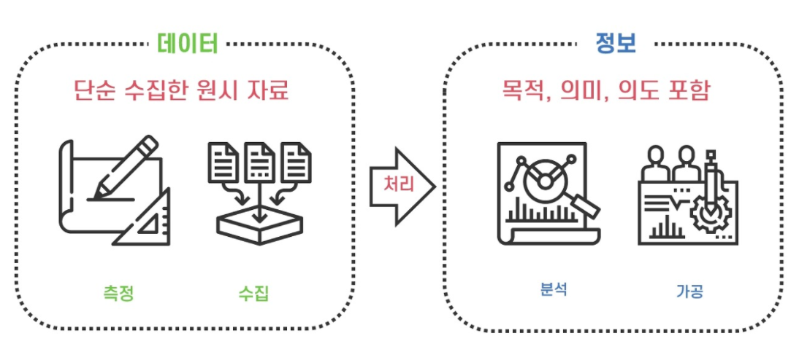

[TOC]

# Chapter 01. 데이터베이스 기본 개념

## 1. 데이터베이스의 필요성

### 1) 데이터와 정보

- `데이터 = 자료` : 현실 세계에서 측정하고 수집한 사실이나 값
  - 어떤 의미나 목적을 포함하지 않고 단순히 수집된 원시 자료
- `정보` : 어떠한 목적이나 의도에 맞게 데이터를 가공 처리한 것
- **데이터**에서 **정보**를 추출하는 과정을 **정보 처리(information processing)**라고 한다.
  - 데이터가 정확하고 의미있는 데이터여야 정확성이 보장되고 가치있는 정보를 얻을 수 있다.
  - 이러한 데이터를 효율적으로 저장하고, 필요할 때마다 정보를 정확하게 추출할 수 있도록 **데이터를 관리해주는 역할**을 **데이터베이스**가 한다.

### 2) 정보 시스템과 데이터베이스

- `정보 시스템` : 필요한 데이터를 저장했다가, 정보를 추출하게 만들어주는 수단
  - 정보 시스템 내에서 데이터베이스가 핵심 역할을 한다.
  - 사용 목적에 따라서 저장되는 데이터나 부르는 이름이 다르다.

 

## 2. 데이터베이스의 정의와 특징

### 1) 데이터베이스의 정의

> 특정 조직의 여러 사용자가 `공유`하여 사용할 수 있도록 `통합`해서 `저장`한 `운영` 데이터의 집합

#### - 공유 데이터(Shared Data)

- 특정 조직의 여러 사용자가 함께 소유하고 이용할 수 있어야 한다.
- 사용 목적이 다른 사용자들을 고려해서 데이터베이스를 구성해야 한다.

#### - 통합 데이터(Integrated Data)

- 데이터의 중복을 최소화하고 통제가 가능한 중복만 허용하는 데이터이다.

#### - 저장 데이터(Stored Data)

- 컴퓨터가 접근할 수 있는 매체에 데이터베이스를 저장해야한다.

#### - 운영 데이터(Operational Data)

- 조직을 운영하고 조직의 주요 기능을 수행하기 위해 필요하다.
- 일시적인 것이 아니라 지속적으로 유지, 운영해야 하는 데이터이다.

### 2) 데이터베이스의 특징

#### - 실시간 접근성(Real-time Accessibility)

- 사용자가 필요한 데이터를 실시간으로 응답할 수 있어야 한다.
  - 일반적으로 몇 초를 넘지 않는 시간 내에 데이터를 제공해줘야 한다.

#### - 계속 변화(Continuous Evolution)

- 데이터베이스는 현실 세계를 정확히 반영해야 의미가 있다. 현실 세계는 계속해서 변화하고, 따라서 데이터베이스에 저장된 데이터도 현실 세계의 변화에 맞춰서 계속 변화해야 한다.
  - 데이터베이스는 동적인 특징을 가지고, 데이터를 삽입, 수정, 삭제하여 정확한 데이터를 반영해야 한다.

#### - 동시 공유(Concurrent Sharing)

- 여러 사용자가 동시에 이용할 수 있어야 한다.
  - 서로 다른 데이터를 동시에 사용하는 것 + 같은 데이터를 동시에 사용하는 것

#### - 내용 기반 참조(Content Reference)

- 저장된 주소나 위치가 아닌 데이터의 내용(값)으로 참조할 수 있다.

 

## 3. 데이터와 데이터베이스

> 데이터베이스의 중요한 목적은 데이터를 저장해두는 것이다. 적합한 데이터를 수집하기 위해서는 수집 대상이 되는 데이터의 유형을 파악하고 있는 것이 중요하다.

### 1) 데이터의 유형

#### - 정형 데이터(Structured Data)

- 구조화된 데이터, 미리 정해진 구조에 따라 저장된 데이터
- ex) 엑셀파일, RDB의 테이블

#### - 반정형 데이터(Semi-Structured Data)

- 구조에 따라 저장된 데이터이지만, 데이터 내용 안에 구조에 대한 설명이 함께 존재하는 데이터
- 데이터 내용에 대한 설명, 즉 구조를 파악하는 파싱 과정이 필요하다.
- ex) HTML, XML, JSON 문서, 웹 로그, 센서 데이터

#### - 비정형 데이터(Unstructured Data)

- 정해진 구조가 없이 저장된 데이터
- SNS 사용의 증가로 실시간으로 많은 양의 비정형 데이터가 생산되고 있다.
- ex) 소셜 데이터의 텍스트, 영상, 이미지 or 워드나 PDF 문서 같은 멀티미디어 데이터

 

## 4. 참고 자료

- 김연희, 「데이터베이스 개론」, 한빛아카데미, 2019
- [데이터와 정보](https://better-together.tistory.com/133)