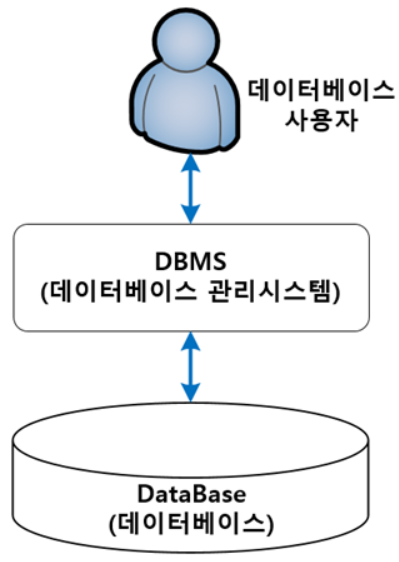

[TOC]

# Chapter 03. 데이터베이스 시스템

## 1. DBS의 정의

> - DB에 데이터를 저장하고, 저장된 데이터를 관리하여 조직에 필요한 정보를 생성해주는 시스템
> - 다양한 목적의 정보처리 시스템을 구축하는 데 필요한 핵심 요소

### 1) DB / DBMS / DBS 의 구분

- `DB` : 데이터를 저장해 두는 곳, 저장된 데이터의 집합
- `DBMS` : DB에 저장된 데이터가 일관되고 무결한 상태로 유지되도록 관리하는 역할
- `DBS` : DB와 DBMS를 이용해서 조직에 필요한 정보를 제공해주는 전체 시스템

### 2) DBS의 구성 요소

## 2. DB의 구조

### 1) 스키마

> DB에 저장되는 데이터 구조와 제약조건을 정의한 것

- `인스턴스` : 정의된 스키마에 따라 DB에 실제로 저장된 값
- 스키마는 한 번 정의되면 자주 변경되지 않지만, 인스턴스는 계속 변하는 특성이 있다.

### 2) 3단계 DB 구조

> 3단계 DB 구조는 하나의 DB를 세 단계로 나누어 이해한다.
>
> - DB 하나를 세 단계로 나누고, 각 단계별로 다른 추상화를 제공하면 DB를 효과적으로 관리할 수 있다.
> - 내부단계에서 외부단계로 갈수록 추상화 레벨이 높아진다.
> - 이를 통해 모든 데이터의 저장, 유지와 관련된 복잡한 내용을 숨기고 필요한 데이터만 단순화하여 일반 사용자들에게 제공할 수 있다.

#### - 외부 단계(External Level)

> 개별 사용자 관점에서 DB를 이해하고 표현함

- 사용 목적이 다르면 필요한 데이터 내용이 다르다.
- 사용자마자 생각하는 DB 구조가 다르다.
- `외부 스키마` : 외부 단계에서 사용자에게 필요한 DB를 정의한 것
  - 각 사용자가 생각하는 DB의 모습을 표현한 논리적인 구조 - 사용자마다 다름
  - DB 하나에 외부 스키마가 여러 개 존재할 수도 있고, 하나를 사용 목적이 같은 사람들끼리 공유할 수도 있음
  - 전체 DB 중 사용자가 관심을 가지는 일부분으로 볼 수 있어 `서브 스키마`라고도 함

#### - 개념 단계(Conceptual Level)

> DB를 이용하는 사용자들의 관점을 통합하여 DB를 조직 전체의 관점에서 이해하고 표현함

- `개념 스키마` : DBMS나 관리자의 관점에서 모든 사용자에게 필요한 데이터를 통합하여 전체 DB의 논리적 구조를 정의한 것
  - 조직 전체의 관점에서 생각하는 DB의 모습
  - 모든 개별 사용자가 생각하는 DB의 모습을 하나로 합친 형태
  - 전체 DB에 어떤 데이터가 저장되는지, 데이터들 간에는 어떤 관계가 존재하고 어떤 제약조건이 있는지에 대한 정의 + 데이터에 대한 보안 정책이나 접근 권한에 대한 정의
  - 데이터를 물리적으로 저장하는 방법이나 데이터 저장 장치와는 독립적
  - DB 하나에는 개념 스키마가 하나만 존재하고, 각 사용자는 개념 스키마의 일부분을 사용함
    - 외부 스키마는 개념 스키마를 기초로 하여 사용자의 이용 목적에 맞게 만들어짐
  - 일반적인 스키마 = 개념 스키마

#### - 내부 단계(Internal Level)

> DB를 디스크나 테이프 같은 저장 장치의 관점에서 이해하고 표현함

- `내부 스키마` : 전체 DB가 저장 장치에 실제로 저장되는 방법을 정의한 것
  - 파일에 데이터를 저장하는 레코드의 구조, 레코드를 구성하는 필드의 크기, 인덱스를 이용한 레코드 접근 경로 등을 정의함
  - DB의 개념 스키마에 대한 물리적인 저장 구조를 표현하기 때문에 하나의 DB에 하나만 존재함

### 3) 데이터 독립성

> 하나의 DB에는 세 가지 유형의 스키마가 존재하지만, 각각의 스키마는 DB를 바라보는 관점이 다를 뿐 실제로는 모두 같은 DB를 표현함
>
> - 따라서 세 가지 스키마 사이에는 유기적인 대응 관계가 성립해야 함

- `사상`, `매핑` : 스키마 사이의 대응 관계
  - 외부 스키마와 개념 스키마는 `외부/개념 사상(응용 인터페이스:application interface)` 에 의해 대응되고, 개념 스키마와 내부 스키마는 `개념/내부 사상(저장 인터페이스:storage interface)`에 의해 대응됨
  - 단계별로 스키마를 유지하고 스키마 사이의 대응관계를 정의하는 궁극적인 목적은 `데이터 독립성`을 실현하기 위해서
- `데이터 독립성` : 하위 스키마를 변경하더라도 상위 스키마가 영향을 받지 않는 특성

#### - 논리적 데이터 독립성

> 개념 스키마가 변경되더라도 외부 스키마가 영향을 받지 않는 것

- 전체 DB의 논리적인 구조가 변경되어도 관련된 외부/개념 사상 정보만 적절히 수정해주면 외부 스키마는 변경할 필요가 없음
- 외부 스키마의 사용자는 전체 DB의 논리적 구조가 변경되었다는 사실을 알 필요가 없음

#### - 물리적 데이터 독립성

> 내부 스키마가 변경되더라도 개념 스키마가 영향을 받지 않는 것
>
> - 결과적으로 외부 스키마도 영향을 받지 않음

- DB의 저장 구조가 변경되어도 관련된 개념/내부 사상 정보만 적절히 수정해주면 직접적으로 관련이 없는 DB의 논리적 구조는 영향을 받지 않음

### 4) 데이터 사전

> 데이터 사전 = 시스템 카탈로그 = 시스템 DB : DB에 저장되는 데이터에 관한 정보를 저장하는 곳

- 일반 사전처럼 DB에 저장되어 있는 데이터를 정확하고 효율적으로 이용하기 위해 참고해야 되는 스키마, 사상 정보, 다양한 제약조건 등을 저장하고 있음
- 데이터에 관한 정보이므로 데이터에 대한 데이터를 의미해서 `메타 데이터`라고 부르기도 함
- 주로 DBMS가 접근하지만, 일반 사용자도 접근할 수 있음
  - 다만, 사용자는 저장 내용을 검색만 할 수 있고, DBMS는 내용을 추가나 수정할 수 있는 권한도 가지고 있음
- 데이터 사전에 있는 데이터에 실제로 접근하는 데 필요한 위치 정보는 데이터 디렉터리에서 관리함
  - 데이터 디렉터리는 시스템만 접근할 수 있음 (일반 사용자는 접근할 수 없음)

 

## 3. DB 사용자

> DB를 이용하기 위해 접근하는 모든 사람

### 1) DB 관리자

> DBS를 운영, 관리하는 사람. DB를 직접 사용하기보다는 DB를 설계 및 구축하고, 제대로 서비스할 수 있도록 제어함

- 주로 DDL과 DCL을 이용해서 DB에 접근함
- DB 운영, 관리를 책임지기 때문에 컴퓨터 시스템과 DB와 관련해서 지식과 경험을 많이 가지고 있어야 함
- 주요 업무
  - DB 구성 요소 선정 : 사용자 요구사항을 분석해서 DB를 구성할 데이터를 결정함
  - DB 스키마 정의
  - 물리적 저장 구조와 접근 방법 결정
  - 무결성 유지를 위한 제약조건 정의
  - 보안 및 접근 권한 정책 결정
  - 백업 및 회복 기법 정의
  - 시스템 DB 관리
  - 시스템 성능 감시 및 성능 분석 : 병목 현상 등이 발생하지 않는지 확인
  - DB 재구성

### 2) 최종 사용자 = 일반 사용자

> 데이터를 조작하기 위해 DB에 접근하는 사람들

- 주로 DML을 사용함 (DDL도 사용 가능)
- `캐주얼 사용자` : DB에 대한 이론적 지식이 있으며, 주로 DML을 이용해 원하는 데이터와 데이터에 대한 처리를 DBMS에 직접 설명함
- `초보 사용자` : DB를 초보 수준으로 이용할 수 있어, 메뉴나 GUI 형태의 응용 프로그램을 통해 DB를 사용함

### 3) 응용 프로그래머

> C언어, JAVA 등과 같은 프로그래밍 언어로 응용 프로그램을 작성할 때 DB에 접근하는 DML을 삽입하는 사용자

- 주로 DML을 삽입함 (DDL도 삽입 가능)
- 최종 사용자는 응용 프로그래머가 작성한 응용 프로그램을 이용해 DB에 접근할 수 있음

 

## 4. 데이터 언어

> DB를 구축하고 활용 및 관리하는 DBMS에 부탁할 때 사용하는 언어
>
> 사용자가 DB를 구축하고 이에 접근하기 위해 DBMS와 통신하는 수단

### 1) 데이터 정의어 (DDL: Data Definition Language)

- 새로운 DB를 구축하기 위해 스키마를 정의하거나 기존 스키마의 정의를 삭제 또는 수정하기 위해 사용하는 데이터 언어
- 새로운 DB의 스키마를 설명하거나 존재하는 스키마를 변경/삭제할 때 사용함
- DDL로 정의된 스키마는 데이터 사전에 저장됨

### 2) 데이터 조작어 (DML: Data Manipulation Language)

- 사용자가 데이터의 삽입, 삭제, 수정, 검색 등의 처리를 DBMS에 요구하기 위해 사용하는 데이터 언어
- 사용자가 실제 데이터 값을 활용하기 위해 사용함
- `절차적 데이터 조작어` 
  - 사용자가 어떤 데이터를 원하고 해당 데이터를 얻으려면 어떻게 처리해야 하는지 설명함
- `비절차적 데이터 조작어`
  - 사용자가 어떤 데이터를 원하는지만 설명함
  - 어떻게 처리하는지는 DBMS에게 맡김
  - 사용자가 어떤 데이터를 원하는지만 DBMS에 선언하는 방식이기 때문에 선언적 언어라고도 함

### 3) 데이터 제어어 (DCL: Data Control Language)

- DB에 저장된 데이터를 여러 사용자가 무결성과 일관성을 유지하면서 문제없이 공유할 수 있도록, 내부적으로 필요한 규칙이나 기법을 정의하는 데 사용하는 데이터 언어
- DCL을 이용해서 규칙이나 기법을 정의하는 이유
  - 무결성(Integrity) : DB에 정확하고 유효한 데이터만 유지함
  - 보안(Security)
  - 회복(Recovery) : 장애가 발생해도 데이터의 일관성을 유지함
  - 동시성(Concurrency) : 여러 사용자가 같은 데이터에 동시에 접근하여 처리할 수 있게 함

 

## 5. DBMS의 구성

> DBS의 주요 구성요소
>
> - 사용자와 DB 사이에 위치함

### 1) 질의 처리기

> 사용자의 데이터 처리 요구를 해석하여 처리하는 역할

- DDL 컴파일러
- DML 프리 컴파일러
  - 응용 프로그램에 삽입된 DML을 추출하여 DML 컴파일러에 전달
- DML 컴파일러
- 런타임 데이터베이스 처리기
  - DML 컴파일러로부터 받은 데이터 처리 요구를 DB에서 실제로 실행
- 트랜잭션 관리자
  - 사용자의 접근 권한이 유효한지를 검사

### 2) 저장 데이터 관리자

> 디스크에 저장된 DB와 데이터 사전을 관리하고, 실제로 접근하는 역할

- 디스크에 저장된 데이터에 접근하는 것은 운영체제의 기본 기능이기 때문에 저장 데이터 관리자는 운영체제의 도움을 받아 DB에 대한 접근을 수행함

 

## 6. 참고자료

- [DBS](https://codedragon.tistory.com/4408)