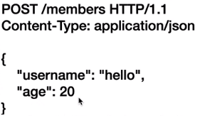
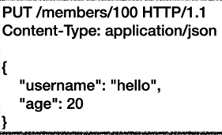
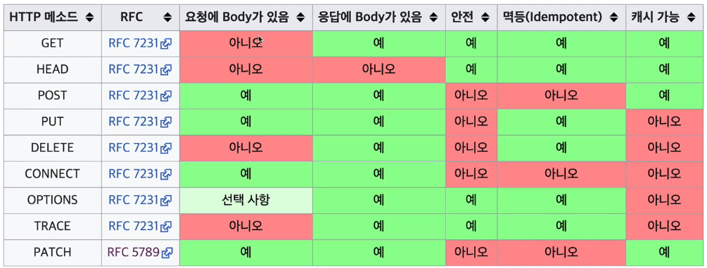

# 3. HTTP 메서드

> 2021.04.06

 

### 1) HTTP API를 만들어보자

- **요구사항**
  - 회원 목록 조회
  - 회원 조회
  - 회원 등록
  - 회원 수정
  - 회원 삭제
- **API URI 설계**
  - 회원목록조회: /read-member-list
  - 회원조회: /read-member-by-id
  - 회원등록: /create-member
  - 회원수정: /update-member
  - 회원삭제: /delete-member
  - 근데 이렇게 하는게 정말 좋은 설계일까? 가장 중요한 것은 **리소스 설계**!!!!!!
- **API URI 고민**
  - 리소스의 의미는 뭘까? -> 회원을 조회하는 것이 리소스가 아니라, **회원이라는 개념 자체가 바로 리소스다**
  - 리소스를 식별할 때는, 회원을 등록하고 수정하고 조회하는 이런건 모두 배제한다. 회원이라는 리소스만 식별하면 된다. 즉 회원 리소스를 URI에 매핑하자.
- **다시 API URI 설계**
  - 회원목록조회: /members
  - 회원조회: /members/{id}
  - 회원등록: /members/{id}
  - 회원수정: /members/{id}
  - 회원삭제: /members/{id}
  - 리소스 자체에 집중한 건 좋은데....조회/등록/수정/삭제를 어떻게 구분하지?
- **리소스와 행위를 분리한다.**
  - 가장 중요한 것은 리소스 자체를 식별하는 것
  - URI는 리소스만 식별
  - 리소스와 해당 리소스를 대상으로 하는 행위를 분리한다.
  - 리소스: 회원(명사)  /  행위: 조회, 등록, 삭제, 변경(동사)
  - `이러한 행위는 HTTP 메서드를 통해 구분한다`

 

### 2) HTTP 메서드 - GET, POST

- 주요 메서드

  - **GET**: 리소스 조회
  - **POST**: 요청 데이터 처리, 주로 등록에 사용
  - **PUT**: 리소스를 대체, 해당 리소스가 없으면 생성
  - **PATCH**: 리소스 부분 변경
  - **DELETE**: 리소스 삭제
  - HEAD, OPTIONS, CONNECT, TRACE 등도 있다.

   

- **GET: 리소스 조회**

  - 
  - 서버에 전달하고 싶은 데이터는 query parameter을 통해서 전달
  - GET에서도 메시지 바디를 사용해서 데이터를 전달할 수는 있다. 하지만 권장하지 않는다.

   

- **POST: 요청 데이터 처리**

  - 
  - 메시지 바디를 통해서 서버로 요청 데이터 전달
  - 서버는 요청 데이터를 처리하여 응답한다. 메시지 바디를 통해 들어온 데이터를 처리하는 모든 기능을 수행한다.
  - `목적`
    - 새 리소스 생성(등록)
    - 요청 데이터 처리: 단순히 데이터를 생성하거나 변경하는 것을 넘어서 프로세스를 처리해야 하는 경우
    - 다른 메서드로 처리하기 애매한 경우

 

### 3) HTTP 메서드 - PUT, PATCH, DELETE

- **PUT: 리소스를 대체**
  - 
  - 리소스가 있으면 대체, 없으면 생성 (덮어쓰기와 비슷)
  - **중요!!! 클라이언트가 리소스를 식별한다.**
    - 위 사진을 보면, `PUT /members/100` 이라고 정확히 100이라고 `URI를 지정`한다.
    - 즉 -> `members의 100번에 해당 데이터를 덮어씌우겠다` 라는 뜻
    - 이게 바로 POST와의 중요한 차이점이다.
  - **주의!!! 리소스를 완전히 대체한다.**
    - 기존에 username, age 필드가 있는데, 내가 age만 업데이트하면?
    - username도 다 지워지고 age 하나만 남는다. 따라서 일부분만 변경하려면 PATCH를 쓰자
- **PATCH: 리소스 부분 변경**
  - PUT과 다르게, 리소스의 부분적인 데이터를 변경 가능하다.
  - 혹시나 PATCH가 지원이 안되는 것을 사용한다면 POST로 흉내낼 수 있다.
- **DELETE: 리소스 제거**

 

### 4) HTTP 메서드의 속성

- `안전(Safe Methods)`
  - 호출해도 리소스를 변경하지 않는다.
- `멱등(Idempotent Methods)`
  - f(f(x)) = f(x) -> 한번 호출하든 두번 호출하든 100번 호출하든 결과가 똑같다.
  - **멱등 메서드**
    - GET: 한 번 조회하든, 두 번 조회하는 같은 결과가 조회
    - PUT: 결과를 대체한다. 따라서 같은 요청이면! 결과가 같다.
    - DELETE: 결과를 삭제한다. 따라서 같은 요청이면! 즉 똑같은 것을 계속 지워도 삭제된 결과는 같다.
    - **POST: 멱등이 아니다! 두 번 호출하면 같은 행위가 중복해서 발생한다.**
  - **활용**
    - 자동 복구 메커니즘
    - 서버가 TIMEOUT 등으로 정상 응답을 못주었을 때, 클라이언트가 멱등이라는 개념을 이용해서 "혹시 다시 같은 요청을 또 보내도 되나?"를 판단하는 기준이된다.
- `캐시가능(Cacheable Methods)`
  - 응답 결과 리소스를 캐시해서 사용해도 되나?
  - GET, HEAD, POST, PATCH는 캐시 가능, 실제로는 GET, HEAD 정도만 캐시 사용
  - POST, PATCH는 본문 내용까지 캐시 키로 고려해야 하는데, 구현이 쉽지 않다.
