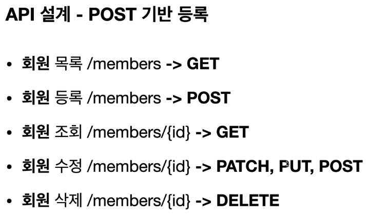
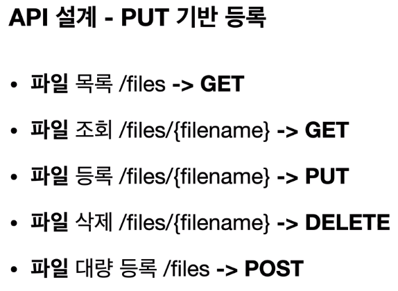
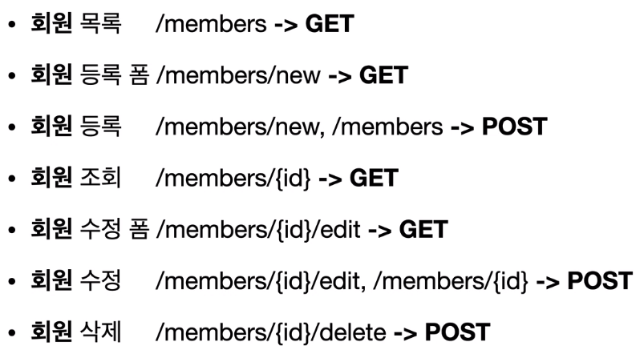

# 04_HTTP메서드활용

> 2021.04.10

 

### 1) 클라이언트에서 서버로 데이터 전송

> 데이터 전달 방식은 크게 2가지

- **쿼리 파라미터**를 통한 데이터 전송
  - GET
  - 주로 정렬 필터(검색어)
- **메시지 바디**를 통한 데이터 전송
  - POST, PUT, PATCH
  - 회원 가입, 상품 주문, 리소스 등록, 리소스 변경

 

> 데이터를 전송하는 4가지 상황

- **정적 데이터 조회**
  - 쿼리 파라미터를 사용하지 않는다.
  - 이미지, 정적 텍스트 문서
  - 조회는 `GET`을 사용
  - 정적 데이터는 일반적으로 쿼리 파라미터 없이 단순한 리소스 조회만으로도 가능
- **동적 데이터 조회**
  - 쿼리 파라미터를 사용한다.
  - `?q=hello&hl=ho` 와 같이 url에 붙인다.
  - 주로 검색, 게시판 목록에서 정렬 필터(검색어)
  - 조회 조건을 줄여주는 필터, 조회 결과를 정렬하는 정렬 조건에 주로 사용
  - 조회는 `GET `사용
  - GET은 쿼리 파라미터를 사용해서 데이터를 전달
- **HTML FORM 데이터 전송**
  - HTML FORM 전송은 GET과 POST만 지원
  - `POST로 전송` : HTTP body에 key value 형식으로 감춰서 데이터를 전송
  - `GET으로 전송`: 쿼리 파라미터에 공개되어 데이터를 전송 (조회가 아니면 GET사용 X)
  - `multipart/form-data` : 파일(이미지 등)을 전송할 때 사용하는 enctype(encoding type)
    - 텍스트와 이미지 등 여러 타입의 파일들이 전송 될 때 가능하게 하는 인코딩 타입 (그래서 multipart이다)
- **HTTP API 데이터 전송**
  - 서버 to 서버 (백엔드 시스템 통신)
  - 앱 클라이언트 (아이폰, 안드로이드)
  - 웹 클라이언트 (Form 전송 대신 Javascript를 통한 통신에 사용(Ajax))
  - POST, PUT, PATCH 가 가능
  - application/json 타입을 주로 사용

 

### 2) HTTP API 설계 예시

- **1. HTTP API - 컬렉션(서버가 관리하는 리소스 저장소)**
  - POST 기반 등록
  - 예) 회원 관리 API 제공
  - 
  - **서버가 새로 등록된 리소스 URI를 생성해준다.**(중요)
    - `Location: /members/100` -> HTTP 응답 메시지의 일부
- **2. HTTP API - 스토어(클라이언트가 관리하는 리소스 저장소)**
  - PUT 기반 등록
  - 예) 정적 컨텐츠 관리, 원격 파일 관리
  - 
  - **클라이언트가 리소스 URI를 알고 있어야 한다.**(중요)
    - 파일 등록할 때 `PUT /files/{filename}` 이기 때문이다.
    - 이게 바로 POST와 PUT의 차이점이다. 앞 chapter에서 보았다.
  - 클라이언트가 직접 리소스의 URI를 지정한다.
- **3. HTML FORM 사용**
  - 웹 페이지 회원 관리
  - GET, POST만 지원
  - AJAX 같은 기술을 사용해서 해결 가능, 하지만 여기서는 순수 HTML, FORM만 가지고 해본다.(따라서 제약 있음)
  - 
  - `컨트롤 URI` : GET, POST만으로는 제약이 있으므로, 동사로 된 리소스 경로를 사용한다.
  - HTTP 메서드로 해결하기 애매한 경우에 사용한다.

 

참고: https://restfulapi.net/resource-naming/

