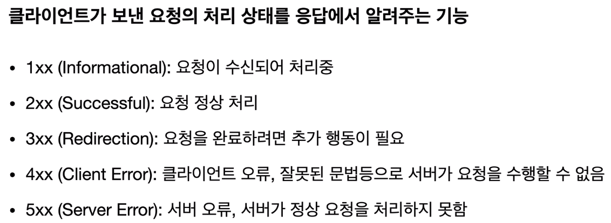
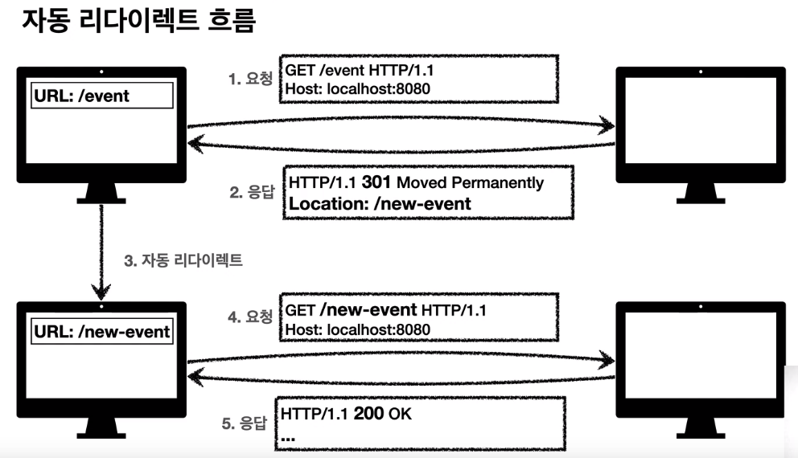
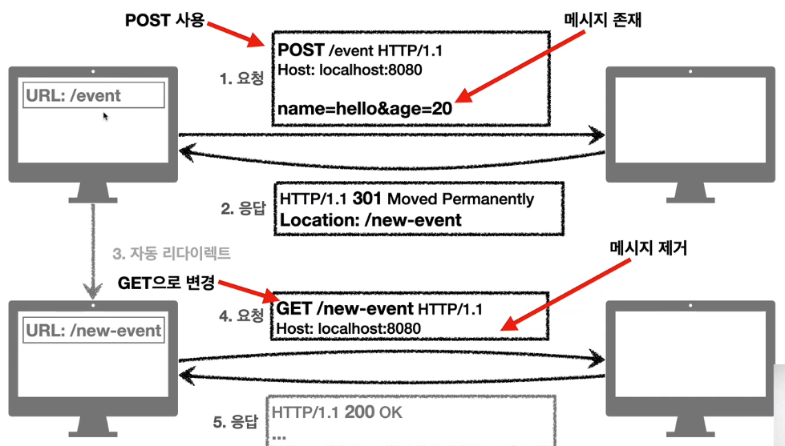
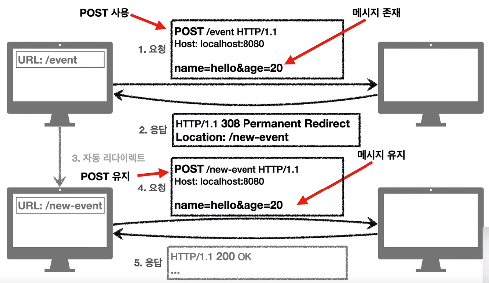
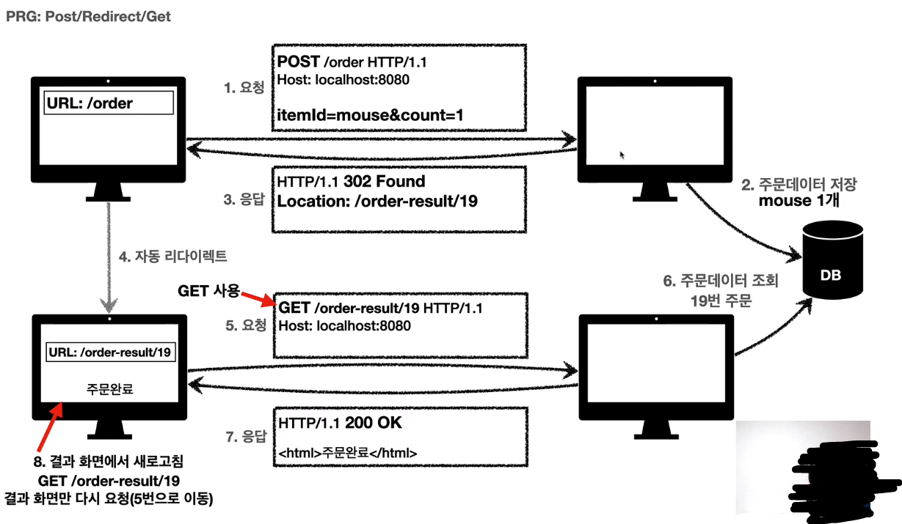
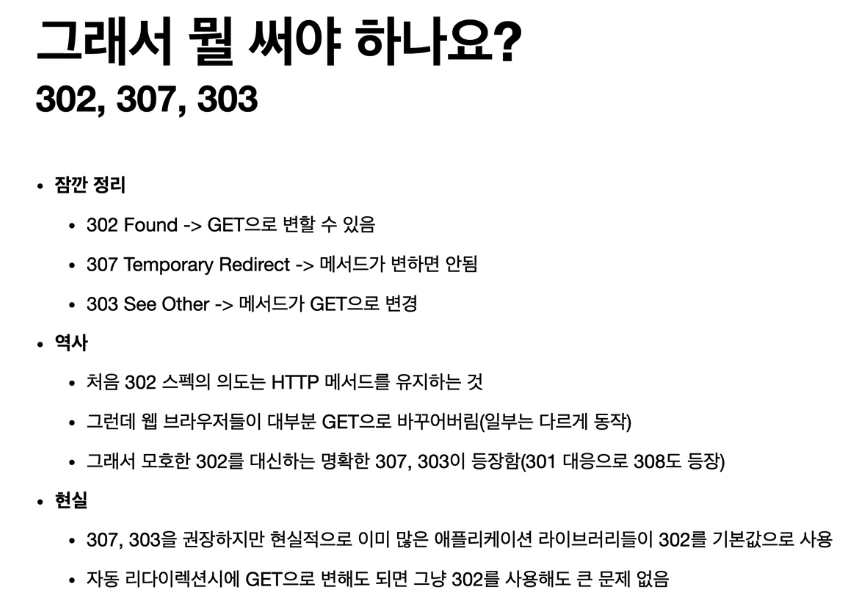

# 05_HTTP 상태코드

> 2021.04.12

 

### 1) HTTP 상태코드 소개

- 만약 모르는 상태 코드가 나타나더라도, 2xx / 3xx 처럼 몇 백대 오류인지를 파악하여 그에 대한 처리를 할 수 있다.
- 따라서 미래에 새로운 상태 코드가 추가되어도 클라이언트를 변경하지 않아도 된다.
- `1xx 상태코드`는 거의 사용하지 않으므로 생략한다.

 

### 2) 2xx - 성공

> 클라이언트의 요청을 성공적으로 처리
>
> 보통은 200이나 201을 많이 사용하는 편이다. 회사마다 정해진 규칙이 있다.

- **200 OK**
  - 요청에 성공함. 보통 GET 요청에 대해 정상적으로 응답했을 때 보낸다.
- **201 Created**
  - 요청에 성공하여 새로운 리소스가 생성됨. 보통 POST 요청에 대해 새로운 리소스 생성에 성공하면 응답으로 보낸다.
  - 생성된 리소스는 응답의 `Location` 헤더 필드로 식별한다.
- **202 Accepted**
  - 요청이 접수되었으나 처리가 아직 완료되지 않음. 배치 처리 같은 곳에서 사용
  - 사실 잘 사용하지는 않는다.
- **204 No Content**
  - 서버가 요청을 성공적으로 수행했지만, 응답 페이로드 본문에 보낼 데이터가 없음
  - `예) 웹 문서 편집기에서 save 버튼`
  - save 버튼의 결과로 아무 내용이 없어도 된다.
  - save 버튼을 눌러도 같은 화면을 유지해야 한다.
  - 결과 내용이 없어도 204 메시지만으로 성공을 인식할 수 있다.

 

### 3) 3xx - 리다이렉션1

> 요청을 완료하기 위해 유저 에이전트의 추가 조치 필요

- 웹 브라우저는 3xx 응답 결과에 Location 헤더가 있으면, Location 위치로 자동 이동한다. (리다이렉트)

- 

- 기존에 /event 라는 페이지가 /new-event 라고 페이지로 바뀌었을 때, 기존 클라이언트들이 /event 페이지로 접속할 경우, 3xx 상태코드를 반환하여 /new-event 페이지로 리다이렉트

- 리다이렉션의 종류

  - **영구 리다이렉션** : 특정 리소스의 URI가 영구적으로 이동 (위의 event, new-event 사례) - 301, 308
  - **일시 리다이렉션** : 일시적인 변경, 주문 완료 후 주문 내역 화면으로 이동하는 예 - 302, 307, 303
  - **특수 리다이렉션** : 결과 대신 캐시를 사용

- `301, 308`

  - `영구 리다이렉션`

  - 리소스의 URI가 영구적으로 이동

  - 원래의 URL을 사용하면 안됨. 검색 엔진 등에서도 변경을 인지

  - **301 Moved Permanently**

    - 리다이렉트시 요청 메서드가 GET으로 변하고, 본문이 제거될 수 있음
    - 실무에서는 308보다는 301을 많이 사용한다.
    - 

  - **308 Permanent Redirect**

    - 301과 기능은 같으나, 리다이렉트시 요청 메서드와 본문 유지한다.
    - 

     

### 4) 3xx - 리다이렉션2

- `302, 307, 303`

  - `일시적인 리다이렉션`
  - 리소스의 URI가 일시적으로 변경
  - 따라서 검색 엔진 등에서 URL을 변경하면 안됨
  - **302 Found**
    - 리다이렉트 시 요청 메서드가 GET으로 변하고, 본문이 제거될 수 있음
  - **307 Temporary Redirect**
    - 302와 기능은 같으나, 리다이렉트 시 요청 메서드와 본문 유지(요청 메서드를 변경하면 안된다.)

  - **303 See Other**
    - 302와 기능은 같으나, 리다이렉트 요청 메서드가 GET으로 변경

- **PRG (POST / REDIRECT / GET)**

  - `일시적인 리다이렉션의 예시`
  - POST로 주문후에 웹 브라우저를 새로고침하면?
  - 새로고침은 다시 요청
  - 따라서 중복 주문이 될 수 있다.
  - PRG를 이용하여 POST로 주문 후에 주문 결과 화면을 GET 메서드로 리다이렉트
  - 새로고침해도 결과 화면을 GET으로 조회하여 중복주문을 막는다.
  - 

- 결론

  

- `300, 304`

  - **300 Multiple Choices** : 안쓴다.
  - **304 Not Modified** : 캐시를 목적으로 사용
    - 클라이언트에게 리소스가 수정되지 않았음을 알려준다. 따라서 클라이언트는 로컬 PC에 저장된 캐시를 재사용한다. (캐시로 리다이렉트한다.)
    - 304 응답은 응답에 메시지 바디를 포함하면 안된다. (왜냐면 로컬 캐시를 사용해야 하니까!)
    - 조건부 GET, HEAD 요청 시 사용

 

### 5) 4xx - 클라이언트 오류, 5xx - 서버 오류

- `4xx - 클라이언트 오류`

  > 클라이언트의 요청에 잘못된 문법 등으로 서버가 요청을 수행할 수 없을 때
  >
  > **오류의 원인이 클라이언트**에 있다!!!!
  >
  > 클라이언트가 이미 잘못 된 요청을 하고 있기 때문에, 똑같은 재시도가 실패한다. (5xx 는 재시도 시 결과가 달라 질 수 있다.)

  - **400 Bad Request** : 클라이언트가 잘못된 요청을 해서 서버가 요청을 처리할 수 없음
    - 요청 구문, 메시지 등의 오류
    - 예) 요청 파라미터가 잘못되거나, API 스펙이 맞지 않는 경우
  - **401 Unauthorized** : 클라이언트가 해당 리소스에 대한 인증이 필요함
    - 인증 되지 않았을 때 나는 오류
    - 응답에 WWW-Authenticate 헤더와 함께 인증 방법을 설명한다.
    - (팁) `인증(Authentication)과 인가(Authorization)는 다르다.`  인증은 본인이 누구인지 확인하는 것이고, 인가는 권한을 부여하는 것이다. 특정 리소스에 접근할 수 있는 권한 말이다. 순서가 인증이 먼저 되어야 인가가 될 수 있다.
  - **403 Forbidden** : 서버가 요청을 이해했지만 승인을 거부함
    - 주로 인증 자격 증명은 있지만, 접근 권한이 불충분한 경우
    - 예) admin 등급이 아닌데, 접근하려고 하는 경우
  - **404 Not Found** : 요청 리소스를 찾을 수 없음
    - 요청 리소스가 서버에 없는 경우
    - 또는 클라이언트가 권한이 부족한 리소스에 접근할 때, 해당 리소스를 숨기고 싶은 경우 (403으로 알려주면 권한 때문이라는 걸 클라이언트가 알게 되니까, 그걸 숨기기 위해서 404로 위장하는 경우)

 

- `5xx - 서버 오류`

  > 서버 문제로 오류가 발생
  >
  > 서버에 문제가 있으므로, 서버 복구시 재시도 하면 성공할 수도 있음 (4xx 오류와의 차이점)

  - **500 Internal Server Error** : 서버 문제로 오류 발생, 애매하면 500 오류를 발생시키면 된다.
  - **503 Service Unavailable** : 서비스 이용 불가. 서버가 일시적인 과부하 또는 예정된 작업으로 잠시 요청을 막을 때 사용