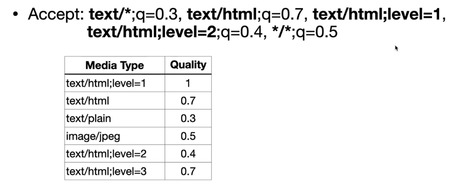

# 06_HTTP 헤더1 - 일반 헤더

> 2021.04.12

 

### 1) HTTP 헤더 개요

- 용도 

  - HTTP 전송에 필요한 모든 부가정보
  - 예) 메시지 바디의 내용, 메시지 바디의 크기, 압축, 인증, 요청 클라이언트, 서버 정보, 캐시 관리 정보 등등
  - 표준 헤더가 너무너무 많다.
  - 필요시 임의의 헤더 추가 가능하다.

- **HTTP Body**

  - 메시지 본문을 통해 표현 데이터를 전달
  - 메시지 본문 = 페이로드(payload)
  - **표현**은 요청이나 응답에서 전달할 실제 데이터
  - **표현 헤더**는 표현 데이터를 해석할 수 있는 정보 제공 (데이터 유형, 데이터 길이, 압축 정보 등)
  - 

 

### 2) 표현

- **Content-Type** : 표현 데이터의 형식
  - 미디어 타입, 문자 인코딩
  - 예) `text/html; charset=utf-8`, `application/json`, `image/png`
- **Content-Encoding** : 표현 데이터의 압축 방식
  - 데이터를 전달하는 곳에서 압축 후, 인코딩 헤더 추가
  - 데이터를 읽는 쪽에서 인코딩 헤더의 정보로 압축 해제
  - 예) `gzip`, `deflate`, `identity`
- **Content-Language** : 표현 데이터의 자연 언어
  - 예) `ko`, `en`, `en-US`
- **Content-Length** : 표현 데이터의 길이
  - 바이트 단위
  - Transfer-Encoding(전송 코딩)을 사용하면 Content-Length를 사용하면 안된다. (아래에 더 구체적으로 있음)
- **표현 헤더는 전송, 응답 둘다 사용**

 

### 3) 콘텐츠 협상(네고시에이션)

> 클라이언트가 선호하는 표현 요청

- **Accept** : 클라이언트가 선호하는 미디어 타입 전달
- **Accept-Charset** : 클라이언트가 선호하는 문자 인코딩
- **Accept-Encoding** : 클라이언트가 선호하는 압축 인코딩
- **Accept-Language** : 클라이언트가 선호하는 자연 언어
  - Accept-Language를 적용하지 않으면, 우리가 한국어 브라우저를 사용할 때, 외국 사이트에 요청하면, 응답이 기본 언어인 영어로 온다.
  - 그래서 Accept-Language를 적용하면, 우리가 외국 사이트에 Language를 ko로 한다고 요청을 보내면, 외국 사이트가 한국어를 지원할 때, 한국어 데이터를 제공할 수 있다.
  - **협상과 우선순위1**
    - Quality Values(q) 값 사용
    - 0~1, 클수록 높은 우선순위를 가진다.
    - 생략하면 1이다.
    - Accept-Language: ko-KR, ko;q=0.9,en-US;q=0.8,en;q=0.7
    - 이런식으로 언어에 대한 우선순위를 나누게 되면, ko-KR이 없을 때는 ko를 먼저 찾게 되고, ko 마저도 없으면 en-US 순으로 찾게된다.
  - **협상과 우선순위2**
    - 구체적인 것이 우선한다.
    - Accept: `text/*`, `text/plain`, `text/plain;format=flowed`,` */*`
    - 이 중에서 가장 구체적인 text/plain;format=flowed 를 우선하게 되고, 그 다음으로 구체적인 정도를 기준으로 우선한다.
  - **협상과 우선순위3**
    - 구체적인 것을 기준으로 미디어 타입을 맞춘다.
    - 

- **협상 헤더는 요청시에만 사용**

 

### 4) 전송 방식

- **단순 전송**
  - Content-Length를 알 수 있을 때 사용하는 전송 방식
  - 단순하게 해당 컨텐트를 요청하고, 한번에 쭉 받는 방식
- **압축 전송**
  - gzip 같은 방식으로 컨텐트를 압축 했을 때 사용하는 전송 방식
  - 이때는 Content-Encoding이라는 것을 추가로 넣어주어야, 클라이언트가 받아서 압축을 풀 수 있다.
- **분할 전송**
  - `Transfer-Encoding:chunked` 와 같은 방식으로 보낸다.
  - 컨텐트를 chunk로 나누어서 차례차례로 보내는 방식.
  - 분할 전송 때는 Content-Length를 넣으면 안된다. 왜냐면 어차피 각 chunk들 마다의 byte 정보를 같이 보내기 때문에 Content-Length를 넣지 않는다.
- **범위 전송**
  - `Content-Range`를 사용하는 방식, 일정 byte의 범위를 보내서 해당 범위만큼 전송하는 방식

 

### 5) 일반 정보

- **From **: 유저 에이전트의 이메일 정보
  - 일반적으로 잘 사용되지 않음
  - 검색 엔진 같은 곳에서 주로 사용
  - 요청에서 사용
- **Referer **: 이전 웹 페이지 주소
  - 현재 요청된 페이지의 이전 웹 페이지 주소
  - A -> B로 이동하는 경우, B를 요청할 때 Referer: A를 포함해서 요청
  - Referer를 사용해서 `유입 경로 분석 가능`
  - 요청에서 사용, 정말 자주 쓰이는 정보
- **User-Agent** : 유저 에이전트 애플리케이션 정보
  - 클라이언트의 애플리케이션 정보(웹 브라우저 정보 등)
  - 통계 정보
  - `어떤 종류의 브라우저에서 장애가 발생하는지 파악 가능`
  - 요청에서 사용
- **Server **: 요청을 처리하는 ORIGIN 서버의 소프트웨어 정보
  - 요청/응답 사이에는 수많은 프록시 서버를 거치게 되는데, 그거말고 진짜 나의 요청을 받는 마지막 서버를 ORIGIN 서버라고 한다.
  - 응답에서 사용
- **Date **: 메시지가 발생한 날짜와 시간
  - 응답에서만 사용

 

### 6) 특별한 정보

- **Host **: 요청한 호스트 정보(도메인)
  - 요청에서 사용
  - `필수`값이다.
  - `하나의 서버가 여러 도메인을 처리`해야 할 때
  - 하나의 IP주소에 여러 도메인이 적용되어 있을 때
  - 가상호스팅을 통해서 하나의 서버는 여러개의 도메인을 거느릴 수 있는데, 클라이언트가 서버에 요청할 때 과연 어떤 도메인에 요청하는것인가? 이를 알 수 없다.
  - 따라서 이를 구별하기 위해 Host 정보를 사용한다. `예) Host: aaa.com`
- **Location **: 페이지 리다이렉션
  - 웹 브라우저는 3xx 응답 결과에 Location 헤더가 있으면, Location 위치로 자동 이동(리다이렉트)
  - 자세한 내용은 3xx 응답코드에 대한 위 설명에서 확인!
- **Allow **: 허용 가능한 HTTP 메서드
  - 405 (Method Not Allowed) 에서 응답에 포함되어야 함
  - 서버에서 많이 구현되어 있지는 않음
  - `예) Allow: GET, HEAD, PUT`
- **Retry-After** : 유저 에이전트가 다음 요청을 하기까지 기다려야 하는 시간
  - 503 Service Unavailable : 서비스가 언제까지 불능인지 알려줄 수 있음
  - 날짜 혹은 초 단위로 표기 가능

 

### 7) 인증

- **Authorization **: 클라이언트 인증 정보를 서버에 전달
- **WWW-Authenticate** : 리소스 접근시 필요한 인증 방법
  - 리소스 접근 시 필요한 인증 방법 정의
  - 401 Unauthorized 응답과 함께 사용
  - "당신이 인증을 하려면, 이러한 정보를 사용해서 제대로 된 인증 정보를 만들어라"

 

### 8) 쿠키

- **쿠키란?**
  - HTTP는 `Stateless`한 프로토콜이다.
  - 따라서 요청/응답을 주고 받으면 연결이 끊어지므로 이전 요청에 대해 기억하지 못한다.
  - 클라이언트와 서버는 서로 상태를 유지하지 않는다!!!! 그래서 쿠키가 필요하다!
  - 사용자 로그인 세션 관리, 광고 정보 트래킹 등의 목적
  - `쿠키 정보는 항상 서버에 전송`된다.
    - 네트워크 트래픽 추가 유발
    - 최소한의 정보만 사용(세션 id, 인증 토큰)
    - 서버에 전송하지 않고, 웹 브라우저 내부에 데이터를 저장하고 싶으면 웹 스토리지 참고
  - 보안에 민감한 데이터는 쿠키에 저장하면 안된다! (주민번호, 카드번호 등)
  - **세션 쿠키** : 만료 날짜를 생략하면 브라우저 종료시 까지만 유지
  - **영속 쿠키** : 만료 날짜를 입력하면 해당 날짜까지 유지
- **Set-Cookie** : 서버에서 클라이언트로 쿠키 전달(응답)
  - 서버에서 쿠키를 만들 때 사용한다.
  - `expires, max-age` : 생명주기를 만들 때 사용
  - `domain `: 도메인을 명시할 때 사용 / 생략하면 쿠키를 생성한 도메인에서만 쿠키 접근한다.
  - `path `: 경로를 지정할 때 사용, 이 경로를 포함한 하위 경로 페이지만 쿠키 접근한다.
  - Secure, HttpOnly, SameSite : 보안에 사용
    - `Secure `: 원래 쿠키는 http, https를 구분하지 않고 전송. Secure를 적용하면 https인 경우에만 전송
    - `HttpOnly` : XSS 공격 방지. 자바스크립트에서 접근 불가. HTTP 전송에만 사용
    - `SameSite `: XSRF 공격 방지. 요청 도메인과 쿠키에 설정된 도메인이 같은 경우만 쿠키 전송
- **Cookie **: 클라이언트가 서버에서 받은 쿠키를 저장하고, HTTP 요청 시 서버로 전달

