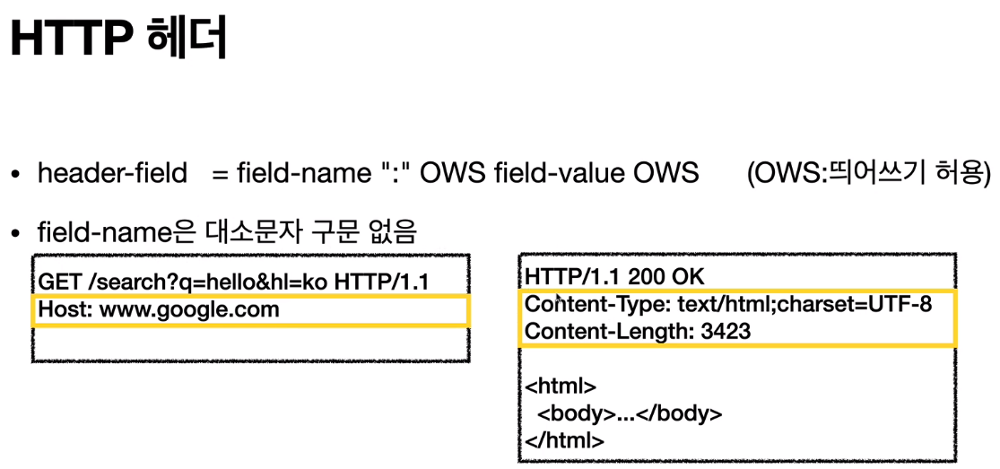
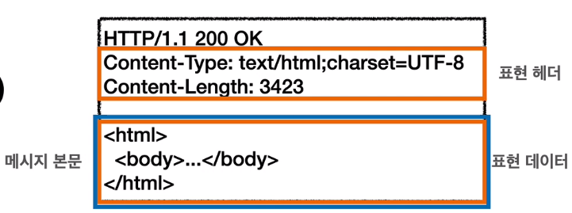

# 06_HTTP 헤더1 - 일반 헤더

> 2021.04.12

 

### 1) HTTP 헤더 개요

- 용도 

  - HTTP 전송에 필요한 모든 부가정보
  - 예) 메시지 바디의 내용, 메시지 바디의 크기, 압축, 인증, 요청 클라이언트, 서버 정보, 캐시 관리 정보 등등
  - 표준 헤더가 너무너무 많다.
  - 필요시 임의의 헤더 추가 가능하다.

- **HTTP Body**

  - 메시지 본문을 통해 표현 데이터를 전달
  - 메시지 본문 = 페이로드(payload)
  - **표현**은 요청이나 응답에서 전달할 실제 데이터
  - **표현 헤더**는 표현 데이터를 해석할 수 있는 정보 제공 (데이터 유형, 데이터 길이, 압축 정보 등)
  - 

  

