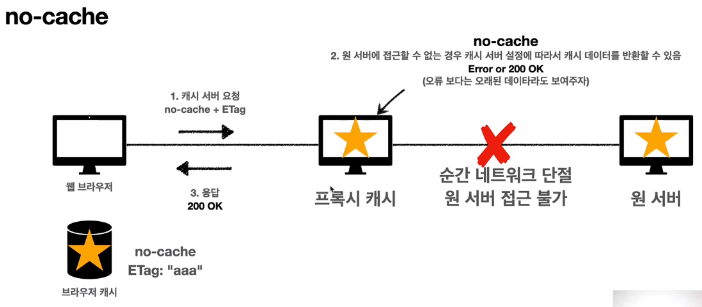

# 07_HTTP헤더2_캐시와 조건부 요청

> 2021.04.14

 

### 1) 캐시 기본 동작

- **캐시가 없다면**
  - 원하는 이미지 등의 파일을 서버에 요청할 때, 해당 파일의 헤더, 바디 부분을 요청할 때 마다 새로 받는다.
  - 그래서 데이터가 변경되지 않아도 계속 네트워크를 통해서 데이터를 다운로드 받아야 한다.
  - 따라서 느리고, 돈도 많이 나가고, 사용자 경험이 더뎌진다.
- **캐시를 적용하면**
  - `cache-control: max-age=60` 이런식으로 요청하면, 캐시가 최대 60초 살아있다는 뜻이다.
  - 따라서 요청한 파일을 캐시에 저장하고, 60초 간은 이 파일이 로컬에 살아있는 것이다.
  - `만약 캐시내의 파일이 지워지기 전에 사용자가 같은 정보를 요청하면, 서버에서 가져오지 않고 캐시에서 바로 불러온다.`
  - 그래서 빠르고 네트워크 사용량을 줄일 수 있어서 사용자 경험이 빨라진다!
- **캐시 시간 초과**
  - 만약 위의 조건에서, 60초가 초과되어서 캐시 데이터가 삭제되면? -> 당연히 서버에 다시 요청해야지
  - 캐시 유효 시간이 초과하면, 서버를 통해 데이터를 다시 조회하고 캐시를 갱신한다.
  - 이때 다시 네트워크 다운로드가 발생한다.

 

### 2) 검증 헤더와 조건부 요청 1

- 캐시 유효 시간이 초과해서 서버에 다시 요청하면 다음과 같은 두 가지 상황이 나타난다.
  - 1) 서버에서 기존 데이터를 변경함
  - `2) 서버에서 기존 데이터를 변경하지 않음`
    - 생각해보면 데이터를 전송하는 대신에 저장해 두었던 `캐시를 재사용` 할 수 있다.
    - 단 클라이언트의 데이터와 서버의 데이터가 같은지 어떻게 알지? 그걸 확인하는 방법이 필요하다!
    - 그 방법이 바로 `검증 헤더`! 그리고 `조건부 요청`!
- **검증 헤더와 조건부 요청**
  - 서버는 `Last-Modified: 2020년 11월 10일 10:00:00 (검증헤더)` 을 담아서 응답을 보내고 클라이언트는 그 정보를 캐시에 넣는다.
  - 그러면 로컬의 캐시에는 해당 데이터의 최종 수정일이 들어있다. 그리고 60초가 지나서 캐시가 삭제된다.
  - 그리고 클라이언트가 서버에 다시 요청을 보낼 때, 캐시에 들어있던 Last-Modified 정보를 넣어서 요청을 보낸다.
  - `if-modified-since: 2020년 11월 10일 10:00:00 (조건부 요청)` 를 넣어서 말이다.
  - 그러면 서버에서 자신의 데이터 최종 수정일과, 클라이언트가 보낸 데이터 최종 수정일을 비교하면 된다.
  - 날짜와 시간이 똑같으면? 데이터를 변경하지 않았다는 뜻!!!! 그러면 클라이언트는 그냥 기존 캐시에 있던 데이터를 쓰면 된다.
  - 그러면 서버가 클라이언트에게 `304 Not Modified 를 응답`한다. 이때 `HTTP 바디 부분은 없다!` (이게 중요)
  - 원래 데이터 파일 자체가 들어가는 HTTP 바디가 용량이 큰데, 바디가 없으므로 용량이 매우 적다. (HTTP 헤더만 보낸다.)
  - 클라이언트는 이러한 응답을 받으면, "아~캐시에 있는 데이터 사용해도 되는거구나~" 라고 생각하고 캐시에 있는 데이터를 쓴다.

 

### 3) 검증 헤더와 조건부 요청 2

- **검증 헤더**
  - 캐시 데이터와 서버 데이터가 같은지 검증하는 데이터
  - `Last-Modified, ETag`
- **조건부 요청 헤더**
  - 검증 헤더로 조건에 따른 분기
  - `If-Modified-Since` : Last-Modified 사용
  - `If-None-Match` : ETag 사용
  - 조건이 만족하면 `200 OK`, 만족하지 않으면 `304 Not Modified`
- **만약 If-Modified-Since 이후에 데이터가 수정되었다면?**
  - **데이터가 변경되지 않았다면**
    - 캐시: 2020년 11월 10일 10:00:00 vs 서버: 2020년 11월 10일 10:00:00
    - `304 Not Modified`, 따라서 HTTP 헤더 데이터만 전송(Body가 없으므로 용량 적음)
  - **데이터가 변경되었다면**
    - 캐시: 2020년 11월 10일 10:00:00 vs 서버: 2020년 11월 10일 11:00:00
    - `200 OK`, 모든 데이터 전송(Body가 같이 있으므로 용량 큼)
- **If-Modified-Since와 Last-Modified의 단점**
  - 1초 미만 단위로는 캐시 조정이 불가능하다.
  - 날짜 기반의 로직을 사용한다. 따라서 아래와 같은 단점이 있다.
  - 데이터를 수정해서 날짜가 다르지만, `같은 데이터를 수정해서 데이터 결과가 똑같은 경우에는 다시 불러온다.` (날짜가 다르니까, 데이터가 변경되었다고 인식)
  - 서버에서 별도의 캐시 로직을 관리하고 싶은 경우
  - 그래서 이러한 단점들을 보완하기 위해 ETag를 사용한다!
- **ETag와 If-None-Match**
  - ETag : Entity Tag
  - `캐시용 데이터에 임의의 고유한 버전 이름`을 달아둠
  - 데이터가 변경되면 이 이름을 바꾸어서 변경함(hash를 다시 생성) -> 파일 자체가 같으면 hash 값이 동일하다. 아무리 변경을 많이 하더라도 데이터가 똑같은 결과를 가지면 같은 hash를 가짐.
  - 진짜 단순하게 ETag만 보내서 같으면 유지하고, 다르면 다시 받는다!
  - 결국은 캐시 제어 로직을 서버에서 완전히 관리하는 방식이다. 왜냐면 서버에서 이름을 부여해서 클라이언트에게 주니까!

 

### 4) 캐시와 조건부 요청 헤더

- 캐시 제어 헤더 (서버에서 클라이언트에게 보내는 HTTP 응답코드에 담김)
  - **Cache-Control : 캐시 제어**
    - `Cache-Control: max-age` - 캐시 유효 시간, 초 단위
    - `Cache-Control: no-cache` - 데이터는 캐시해도 되지만, 항상 ORIGIN 서버에 검증하고 사용 (항상 조건부 요청을 해서 서버에 검증을 받고나서(304 상태코드 받고나서), 캐시 데이터를 써라)
    - `Cache-Control: no-store` - 데이터에 민감한 정보가 있으므로 저장하면 안됨(메모리에서 사용하고 최대한 빨리 삭제)
    - `기타`
      
  - **Pragma : 캐시 제어(하위 호환)**
    - `Pragma: no-cache` - HTTP 1.0 하위호환이므로 거의 사용X
  - **Expires : 캐시 만료일 지정(하위 호환)**
    - 캐시 만료일을 정확한 날짜로 지정
    - HTTP 1.0 부터 사용 하지만, Cache-Control: max-age를 더 권장한다.

 

### 5) 프록시 캐시

- 원래라면 웹 브라우저 1, 2, 3은 미국에 있는 ORIGIN 서버와 통신해야 하는데, 일일히 통신하기에 너무 느리다는 단점이 있다.
- 따라서 한국 어딘가에 프록시 캐시 서버를 만들어서 거기에 데이터를 저장해놓으면, 더 응답이 빠를 것이다.
- 프록시 캐시 서버는 public 캐시이고 개인 웹 브라우저는 private 캐시이다. (위의 cache control의 기타 부분 참고)

 

### 6) 캐시 무효화

- **확실한 캐시 무효화 응답**

  - 캐시를 만들지 않아도, 요즘은 브라우저가 자동으로 캐시를 만드는 경우가 많다. 따라서 캐시를 무효화 하기 위해서 아래와 같은 캐시 제어 헤더를 사용한다.
  - 따라서 확실한 캐시 무효화 응답을 위해서는 아래에 나오는 헤더들을 모두 넣어주면 좋다!!!! (구닥다리 페이지를 위해서 Pragma도 함께)
  - `Cache-Control: no-cache, no-store, must-revalidate`
    - `no-cache` : 데이터는 캐시해도 되지만, 항상 ORIGIN 서버에 검증하고 사용
    - `no-store` : 데이터에 민감한 정보가 있으므로 저장하면 안됨(메모리에서 가능한 빨리 삭제)
    - `must-revalidate` : 캐시 만료 후 최초 조회시 ORIGIN 서버에 검증해야함
  - `Pragma: no-cache` : HTTP 1.0 하위 호환

- **no-cache vs must-revalidate**

  - `no-cache	`

    

    - 만약 ORIGIN 서버와 프록시 캐시 서버가 단절되는 일이 발생하면, 프록시 캐시 서버에서는 오류 보다는 200 OK를 응답하면서 예전 데이터라도 보여주려고 한다.

  - `must-revalidate`
    

    - 그러나 must-revalidate는 ORIGIN 서버와 프록시 캐시 서버가 단절되면, 항상 오류를 발생시킨다.
    - 즉 예전 데이터를 보여주면 안되는 경우 (주로 통장이나 돈과 관련된 경우)에는 이런 기능이 필요하다.
    - 이때는 504 Gateway Timeout을 응답한다.

 

### 7) 강의를 마치며 다음으로

- HTTP에 대해서 더 깊이 있게 학습하고 싶다면 스펙을 확인하자.
- RFC 7230~7235 로 모두 개정되었으니 이걸 확인하자!

