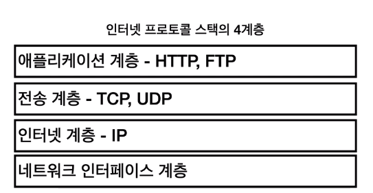
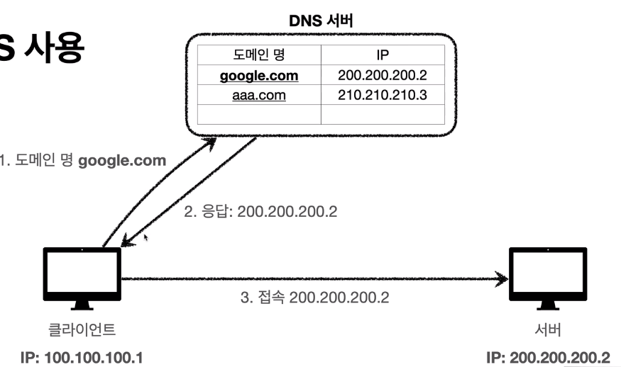
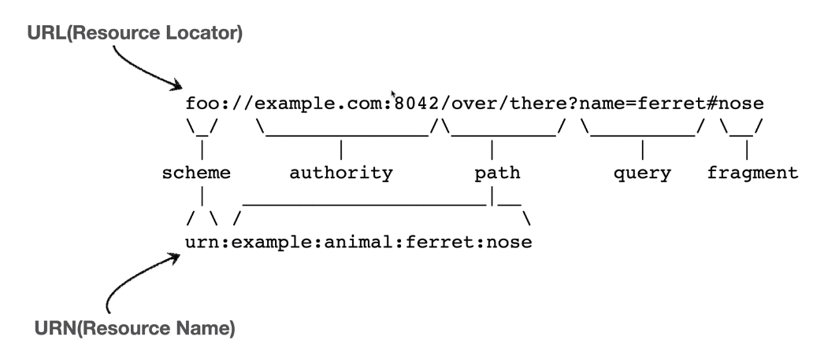
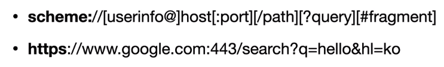
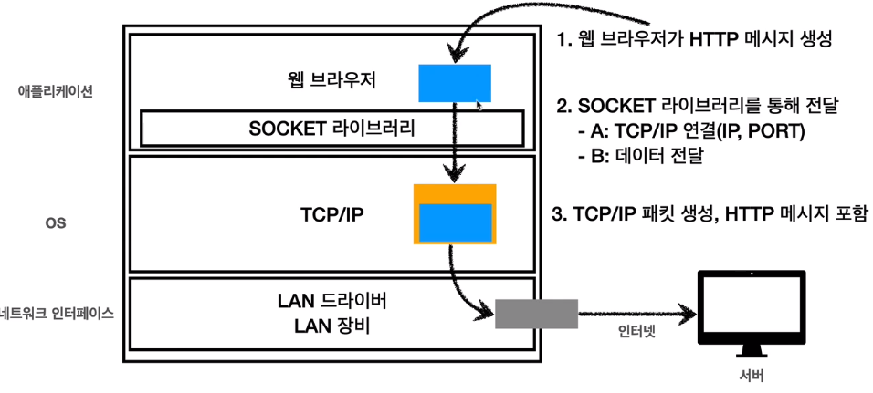

# 인터넷 프로토콜과 URI의 개념

> 인프런 - 모든 개발자를 위한 HTTP 웹 기본 지식 (김영한) 강의 내용 정리
>
> 2021.04.03 작성

 

## 1. 인터넷 네트워크

1. 인터넷 통신

   - 클라이언트와 서버가 만약 바로 옆에 있다면, 인터넷이 필요없이 케이블만 연결하면 될 것이다.
   - 하지만 실제 세계에서는 클라이언트와 서버가 물리적으로 굉장히 떨어져 있다.
   - 따라서 중간에 인터넷이라고 하는 서버 노드들의 집합을 통해서 통신을 하게 된다.
   - 과연 어떤 과정을 통해서 통신이 이루어질까? 이를 위해 일단 IP의 개념을 알아야 한다!

   <br>

2. IP (인터넷 프로토콜)

   - 클라이언트와 서버는 각각 고유의 IP 주소를 가진다.

   - 인터넷 프로토콜은 지정한 IP 주소에 데이터를 전달하는데, 그 데이터의 단위를 **패킷**이라고 한다.

   - IP 패킷의 정보는 다음과 같다.
     

   - 출발지에서 출발한 이 패킷은 인터넷의 수많은 노드를 지나면서 목적지를 향해 나아간다.

   - 목적지에 도착하면, 이제 response를 다시 출발지로 보내줄 텐데, 이 과정도 똑같다.

   - `IP 프로토콜은 한계를 가진다.`

     - **비 연결성**: 패킷을 받을 대상이 없거나 서비스 불능 상태여도 패킷을 전송한다.
     - **비 신뢰성**: 중간에 패킷이 사라지거나, 패킷이 순서대로 오지 않을 수 있다.
     - **프로그램 구분**: 같은 IP를 사용하는 서버에서 통신하는 애플리케이션이 둘 이상일 때 어떻게 구분할 것인가
     - 따라서 TCP를 통해 이 문제를 해결한다!!!!!

     <br>

3. TCP와 UDP

   - 

   - 애플리케이션 계층을 통해 보내진 데이터는 전송, 인터넷 계층을 거치면서 패킷 정보가 하나씩 덧씌워진다.

   - TCP 세그먼트에서는 `출발지PORT, 목적지PORT, 전송제어, 순서, 검증정보`와 같은 정보들이 붙게 되는데, 이러한 정보들이 인터넷 프로토콜만으로는 한계를 가졌던 점들을 해결해준다.

   - IP 패킷까지 덧씌워진 데이터는 네트워크 계층에서 ethernet frame을 통해서 외부로 전송된다.

   - `TCP의 특징`

     - TCP : 전송 제어 프로토콜 (Transmission Control Protocol)
     - **연결 지향**: 먼저 연결을 하고나서 메시지를 보낸다. 비연결성을 해결. TCP 3 way handshake(가상 연결)
     - **데이터 전달 보증** : 정보가 누락되면 누락되었는지를 알 수 있다.
     - **순서 보장** : 패킷의 도착 순서를 보장한다.
     - TCP는 이미 신뢰를 받고 있는 프로토콜로써, 대부분 사용된다.

   - 1) 연결지향 `TCP 3 way handshake`

     - 클라이언트는 서버에게 SYN (접속 요청)을 보낸다.
     - 서버는 클라이언트에게 SYN과 함께 ACK(요청 수락)을 같이 보낸다.
     - 클라이언트는 서버와 연결되었다는 점을 파악하였고, 이제 ACK를 보낸다. 그 후 데이터를 전송한다.
     - 요즘은 최적화가 되어서 클라이언트가 ACK를 보낼 때 데이터를 같이 보내기도 한다.
     - 그런데! 이렇게 연결하는 과정은, 물리적으로 연결되어있는 것이 아니라, 개념적으로 즉 가상으로 연결이 된것이다!
     - 그러니까 어떤 노드를 거쳐서 물리적으로 연결되었는지는 모르고, 그냥 어쨌든 SYN과 ACK를 주고 받으니까 중간에 어떤 과정을 거쳐서 연결이 되었나보다~ 라고 생각하는 것이다.

   - 2) 데이터 전달 보증

     - 클라이언트가 서버에 데이터를 전달하면, 서버에서도 데이터를 잘 받았는지 여부를 클라이언트에 보내준다.
     - 그 여부를 받느냐 안받느냐에 따라 데이터의 전달 여부를 알게 된다.

   - 3) 순서 보장

     - 패킷1, 패킷2, 패킷3 순서로 전송했는데, 서버는 패킷1,패킷3,패킷2 순서로 도착했다면
     - 서버에서는 클라이언트에게 패킷2 부터 다시 보내라고 요청을 보낸다.

   - `UDP의 특징`

     - 연결지향, 데이터 전달 보증, 순서 보장 기능이 없다.
     - IP와 거의 같으나,  PORT와  checksum 이 추가 된 것이다.
     - TCP 만큼의 신뢰성, 연결성은 없지만 단순하고 빠르다. 그리고 사용자가 개인적으로 최적화 할 수 있다.

     <br>

4. PORT

   - 만약 클라이언트가 서버와 통신을 하는데, 여러가지 애플리케이션을 사용하는 상황이라면 이를 어떻게 구분할 것인가?
   - 더 구체적으로 얘기해서, 게임 / 메신저 / 음악 등의 애플리케이션의 패킷들이 각각 어떤 애플리케이션의 패킷인지 어떻게 구별하나?
   - 이를 위해 PORT가 있다. TCP에서는 출발지 PORT와 목적지 PORT를 두어 어떤 애플리케이션의 패킷인지 구별한다.
     
   - 0 ~ 65535 까지 할당 가능, 0 ~ 1023은 잘 알려진 포트이므로 사용하지 않는 것이 좋다.
   - FTP : 20, 21 / TELNET : 23 / HTTP : 80 / HTTPS : 443

   <br>

5. DNS

   - Domain Name System : 도메인 명을 IP 주소로 변환
   - DNS 서버에 원하는 IP 주소를 도메인 명과 함께 저장한다.
   - IP는 변경될 수 있고 기억하기 어려우므로 DNS를 이용해서 IP 주소를 저장한다.
   - 클라이언트는 도메인 명을 DNS 서버에 요청하면 응답으로 IP 주소가 오게 되고, 그 IP 주소를 이용해서 원하는 서버를 찾는다.
     

<br>

## 2. URI와 웹 브라우저 요청 흐름

1. URI (Uniform Resource Identifier)

   - URI, URL, URN 한눈에 파악하기
     

   <br>

   - URL과 URN의 차이 (URN은 거의 사용하지 않는다.)

     

     <br>

   - URI란?

     - Uniform : 리소스 식별하는 통일된 방식
     - Resource : 자원, URI로 식별할 수 있는 모든 것
     - Identifier : 다른 항목과 구분하는데 필요한 정보

     <br>

   - URL이란?

     - URN을 거의 사용하지 않으므로 URI와 URL은 거의 동일하다고 봐도 무방하다.
     - URL의 구조는 다음과 같다.
       
     - 1) Scheme
       - 주로 프로토콜 사용을 적는다. (프로토콜 : 어떤 방식으로 자원에 접근할 것인가의 규칙)
       - http는 80, https는 443을 주로 사용한다. 포트는 생략 가능하다.
     - 2) userinfo
       - URL에 사용자 정보를 포함해서 인증한다.
       - 거의 사용하지 않는다.
     - 3) host
       - 호스트명, 도메인명 또는 IP 주소를 직접 입력 가능하다.
     - 4) port
       - 포트번호, 일반적으로 생략한다.
     - 5) path
       - 리소스의 경로, 계층적 구조를 띈다. `ex) /home/file1.jpg -> home에 있는 file1.jpg 파일`
     - 6) query
       - key = value의 형태. ?로 시작하고 &로 추가 가능하다.
       - query parameter, query string 등으로 불리며 웹 서버에 제공하는 파라미터이다.
     - 7) fragment
       - html 내부 북마크 등에 사용한다. 서버에 전송하는 정보가 아니다.

     <br>

2. 웹 브라우저 요청 흐름

   - ```
     https://www.google.com:443/search?q=hello&hl=ko
     ```

   - 구글에 hello라는 검색어를 한국어 검색결과를 받으려고 하면 위와 같은 url로 이동한다. 요청~응답까지의 과정은 아래와 같다.

     1. 먼저 www.google.com:443 을 DNS 서버에서 조회하여 구글 서버의 IP를 찾는다.

     2. HTTP 요청 메시지를 생성한다.

        ```http
        GET /search?q=hello&hl=ko HTTP/1.1
        HOST: www.google.com
        ```

     3. HTTP 메시지를 전송한다.
        

        - A : 3 way handshake를 통해 구글 서버와 연결한다.
        - B : TCP/IP로 데이터를 전달하여 TCP/IP 패킷을 덧씌운다. (출발지 IP, PORT / 목적지 IP, PORT 등)

     4. 패킷을 수많은 인터넷의 노드를 통해 구글 서버로 전송한다.

     5. 구글 서버에서는 TCP/IP 패킷 껍질은 버리고 안의 데이터를 전달받아서 요청에 따른 응답을 한다.
        여기서는` 검색어는 hello, 언어는 한국어`에 해당하는 데이터를 말한다.

     6. 구글 서버에서는 HTTP 응답 메시지를 만든다.

        ```http
        HTTP/1.1 200 OK
        Content-Type: text/html;charset=UTF-8
        Content-Length: 3423
        
        <html>
          <body>...</body>
        </html>
        ```

     7. 구글 서버는 TCP/IP 패킷을 응답 데이터에 씌우고 다시 클라이언트에게 보낸다.

     8. 클라이언트는 받은 데이터의 TCP/IP 껍질은 벗겨내고 안에 담긴 데이터를 이용해서 원하는 결과를 보게된다.