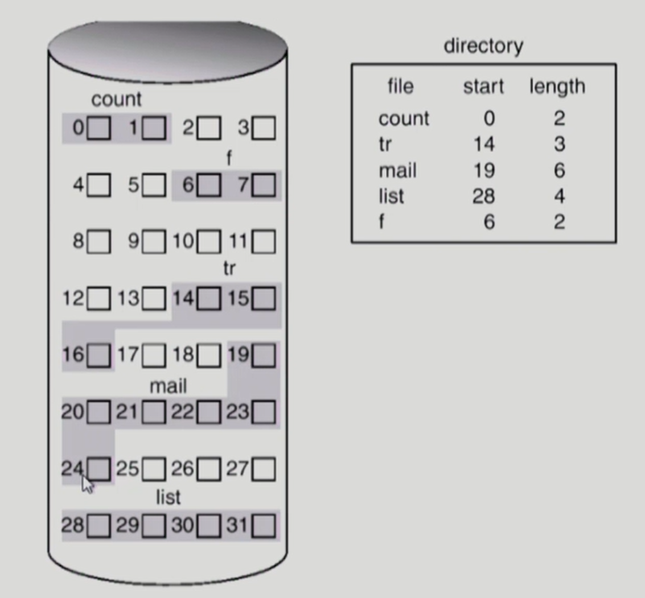

# 10. 파일 시스템

 

## 1) File and File System

- `File` : 관련된 정보들의 모임. 일반적으로 비휘발성의 보조기억장치에 저장.

  - 운영체제는 다양한 저장 장치를 file이라는 동일한 논리적 단위로 볼 수 있게 해준다.
  - `연산` : create, write, read, reposition(lseek), delete, open, close 등

   

- `File attribute (혹은 파일의 metadata)` : 파일 자체의 내용이 아니라 파일을 관리하기 위한 각종 정보들

  - 파일 이름, 유형, 저장위치, 사이즈
  - 접근 권한 (읽기/쓰기/실행), 시간 (생성/변경/사용) , 소유자 등

   

- `File System` : 운영체제에서 파일을 관리하는 부분

  - 파일 및 파일의 메타데이터, 디렉토리 정보 등을 관리
  - 파일의 저장 방법 결정
  - 파일 보호 등

 

## 2) Directory and Logical Disk

- `Directory` : 파일의 메타데이터 중 일부를 보관하고 있는 일종의 특별한 파일

  - 그 디렉토리에 속한 파일 이름 및 파일 attribute 들
  - `연산` : search for a file, create a file, delete a file, list a directory, rename a file, traverse the file system

   

- `Partition (= Logical Disk)` : 하나의 디스크 안에 여러 파티션을 두는 게 일반적이다.

  - 여러 개의 물리적인 디스크를 하나의 파티션으로 구성하기도 함
  - 디스크를 파티션으로 구성한 뒤 각각의 파티션에 file system을 깔거나 swapping 등 다른 용도로 사용할 수 있음

 

## 3) Open()

> Open은 파일의 메타데이터를 메모리에 올리는 과정을 말한다.

 

## 4) File Protection

> 각 파일에 대해 누구에게 어떤 유형의 접근을 허락할 것인가?

- `Access control Matrix` : 

  - 

   

- `Grouping` : 전체 user를 owner, group, public 세 그룹으로 분류

  - 일반적인 운영체제에서 사용하는 방법
  - 각 파일에 대해 세 그룹의 접근 권한을 3비트씩 표시
  - 

   

- `Password` : 파일마다 password를 두는 방법 (디렉토리 파일에 두는 방법도 가능)

  - `모든 접근 권한에 대해 하나의 password` : all or nothing
  - `접근 권한별 password` : 암기 문제, 관리 문제

 

## 5) Access Methods

> 시스템이 제공하는 파일 정보의 접근 방식

 

- `순차 접근`

  - 카세트 테이프를 사용하는 방식처럼 접근
  - 읽거나 쓰면 offset은 자동적으로 증가

   

- `직접 접근`

  - LP 레코드 판과 같이 접근
  - 파일을 구성하는 레코드를 임의의 순서로 접근할 수 있음

 

## 6) Allocation of File Data in Disk

- `Contiguous Allocation(연속 할당)`

  - 하나의 파일이 디스크 상에서 연속해서 저장되는 방식
  - 
  - **단점** 
    - 외부조각이 생성될 수 있다. 위 그림에서 17, 18번은 외부조각이다.
    - File grow가 어렵다. 빈 공간 만큼만 grow 될 수 있지만, 빈 공간이 부족하다면 grow 될 수 없기 때문이다.
  - **장점**
    - 빠른 I/O가 가능하다. 한번의 seek/rotation으로 많은 바이트를 transfer 할 수 있다.
    - Direct access(=random access)가 가능하다.

   

- `Linked Allocation(연결 할당)`

  - 파일의 데이터를 디스크에 연속적으로 넣지 않고, 빈 곳이면 어디든 넣는 방식
  - 
  - **장점**: 외부 조각이 발생하지 않는다. 비어있는 곳을 채우기 때문이다.
  - **단점** 
    - 직접 접근이 불가능하다. 각각의 블록을 방문해야 다음 블록의 위치를 알 수 있기 때문이다. 일일히 방문해야한다.
    - 접근 시간이 오래걸린다.
    - 안정성이 낮다. 중간에 한 블록에 문제가 발생하면 뒤에 있는 블록들을 모두 놓치게 된다.
    - 포인터를 위한 공간이 블록의 일부가 되어 공간 효율성을 떨어뜨린다.
  - **변형** : File-allocation table (FAT) 파일 시스템
    - 포인터를 별도의 위치에 보관하여 안정성과 공간 효율성 문제를 해결한다.

   

- `Indexed Allocation(인덱스 할당)`

  - index block을 두어 최초 위치를 담게 하고, index block이 가리키는 블록에 연결된 인덱스를 보관하는 방식
  - 
  - 순차적으로 접근하는 방식이 아니라, 인덱싱을 통해 바로 해당 블록에 접근할 수 있다.
  - **장점** : 외부조각 생기지 않으며 직접 접근 가능하다.
  - **단점** : index block이 필요하므로 공간이 낭비된다. Too Large File의 경우 하나의 블록으로 index를 저장하기에 부족하다.

 

## 7) UNIX File System

> Indexed Allocation 방식을 거의 그대로 사용한다.

- 논리적 디스크(Partition)에 유닉스의 파일 시스템을 저장한다.
  - `Boot Block` : 부팅에 필요한 정보 (bootstrap loader). 파일 시스템의 가장 앞에 존재.
  - `Super Block` : 파일 시스템에 관한 총체적인 정보. 어디까지가 Inode list이고, 어디까지가 Data block인지 등 디스크에 관한 정보.
  - `Inode List` : 파일 하나당 Inode가 하나씩 할당되는데, Inode는 파일의 메타데이터를 가지고 있음. (**파일의 이름은 제외. 파일의 이름은 디렉토리가 직접 가진다.**)
  - `Data Block` : 파일의 실제 내용을 보관.

 

## 8) FAT File System

> Indexed Allocation 방식을 사용하나, 단점을 거의 모두 보완했다.

- `FAT` : 파일의 메타데이터 중 일부를 보관. 파일의 위치정보만 FAT에 따로 빼놓는다.
  - FAT 테이블의 인덱스만 확인해보면 파일의 다음 위치를 알 수 있으므로 직접 접근이 가능하다.
- `Data Block` : 파일의 이름, 최초 위치 등 기본 정보를 모두 가진다. 단 최초 위치의 다음 위치 정보들은 FAT 테이블의 배열에 넣는다.

 

## 9) Free Space Management

> 비어있는 블록은 어떻게 관리할 것인가?

- `Bit map or Bit Vector` : 부가적인 공간을 필요로 한다. 비트맵이 0이면 비어있는 블록, 1이면 할당된 블록. 연속적인 n개의 free block을 찾는데 효과적.
- `Linked List` : 비어있는 블록들끼리 연결한다. 각 비어있는 블록의 포인터를 이용해, 다음 비어있는 블록을 가리킨다. 연속적인 공간을 찾는 것이 쉽지 않다.
- `Grouping` : 첫번째 free block이 n개의 포인터를 가진다. 인덱스 형식으로 grouping을 하여 비어있는 블록을 가리킨다.
- `Counting` : 프로그램들이 종종 여러개의 연속적인 블록을 할당하고 반납한다는 성질에 착안한다.

 

## 10) Directory Implementation

- `Linear List` : 구현은 간단하나, 디렉토리 내의 파일을 찾으려면 선형 탐색을 하므로 시간이 오래 걸린다.
- `Hash Table` : Linear List에 비해 탐색 시간이 굉장히 빠르다. 충돌 발생 가능하다.

 

## 11) VFS and NFS

- `Virtual File System (VFS)` : 서로 다른 다양한 파일 시스템에 대해 동일한 시스템 콜 인터페이스(API)를 통해 접근할 수 있게 해주는 OS의 Layer
- `Network File System (NFS)` : 분산시스템에서는 네트워크를 통해 파일이 공유될 수 있음. NFS는 분산 환경에서의 대표적인 파일 공유 방식임. 즉 **내 컴퓨터에 해당 파일이 없을 때, 다른 컴퓨터의 DISK에서 파일을 읽어올 수 있음.**

 

## 12) Page Cache and Buffer Cache

- `Page Cache` 
  - 가상 메모리의 페이징 시스템에서 사용하는 페이지 프레임을 캐싱의 관점에서 설명하는 용어
  - Memory-Mapped I/O를 쓰는 경우 파일의 I/O에서도 페이지 캐시 사용
- `Memory-Mapped I/O`
  - 파일의 일부를 가상 메모리에 매핑시킴
  - 매핑시킨 영역에 대한 메모리 접근 연산은 파일의 입출력을 수행하게 함
- `Buffer Cache`
  - 파일시스템을 통한 I/O 연산은 메모리의 특정 영역인 buffer cache 사용
  - File 사용의 locality 활용 (**한번 읽어온 블록에 대한 후속 요청시 buffer cache에서 즉시 전달**)
  - 모든 프로세스가 공용으로 사용
  - Replacement Algorithm 필요 (LRU, LFU 등)
- `Unified Buffer Cache` : 최근의 OS에서는 기존의 buffer cache가 page cache에 통합됨

