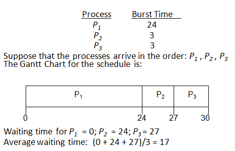
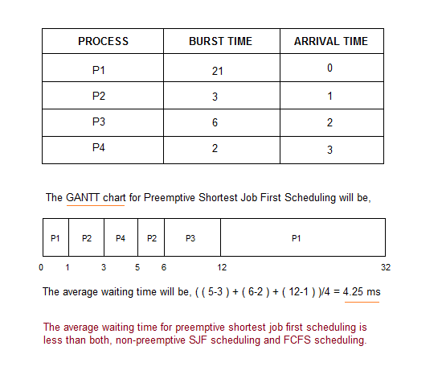
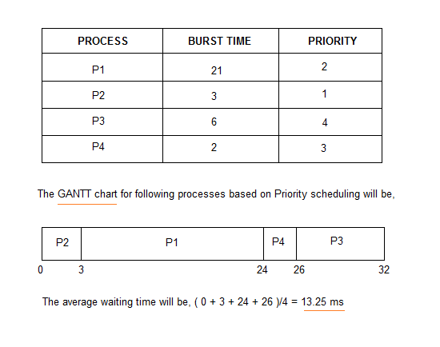
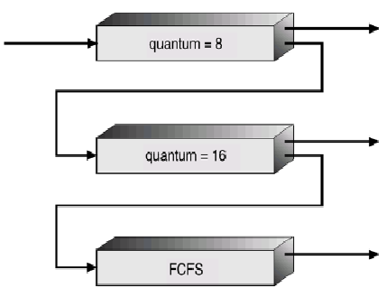
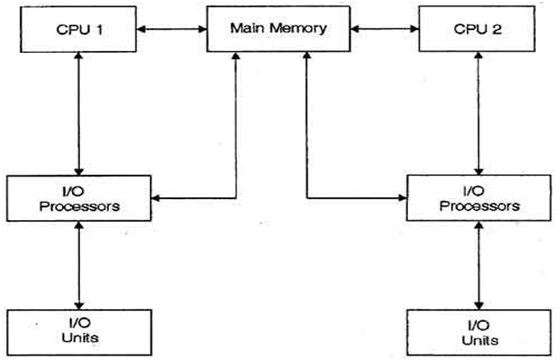

# 5. CPU 스케줄링

> 2021.05.19 작성

### 1) CPU 버스트와 I/O 버스트

- 사용자 프로그램이 수행되는 과정은 CPU 작업과 I/O 작업의 반복으로 구성된다.
- `CPU 버스트` : 사용자 프로그램이 CPU를 직접 가지고 빠른 명령을 수행하는 일련의 단계
- `I/O 버스트` : I/O 요청이 발생해 커널에 의해 입출력 작업을 진행하는 비교적 느린 단계

 

- 컴퓨터 시스템 내에서 수행되는 프로세스들은 대부분의 경우 짧은 CPU 버스트를 가지며, 극히 일부분만 긴 CPU 버스트를 가진다.
- 프로세스들의 CPU 버스트 분포는 위 그림처럼 `다수의 짧은 CPU 버스트`와 `소수의 긴 CPU 버스트`로 구성된다.
- 짧은 CPU 버스트는 주로 대화형(Interaction) 작업인 I/O 바운드 프로세스이고, 긴 CPU 버스트는 주로 I/O 작업이 없는 CPU가 계속 점유하는 CPU 바운드 프로세스이다.
- CPU 스케줄링 시, 짧은 CPU 버스트(I/O 바운드 프로세스)의 우선순위를 높여주는 것이 바람직하다.

 

### 2) CPU 스케줄러

> 준비 상태에 있는 프로세스들 중 어떠한 프로세스에게 CPU를 할당할지 결정하는 운영체제의 코드

- 프로세스가 CPU를 할당받고 기계어 명령을 수행하다가 타이머 인터럽트가 발생하면 CPU 스케줄러가 호출된다.
- 그 후 CPU 스케줄러는 준비 큐에서 CPU를 기다리는 프로세스 중 하나를 선택해 CPU에 할당한다.
- `비선점형(Nonpreemptive)` : CPU를 획득한 프로세스가 스스로 CPU를 반납하기 전까지는 CPU를 빼앗기지 않는 방법
- `선점형(Preemptive)` : 프로세스가 CPU를 계속 사용하기를 원하더라도 강제로 빼앗을 수 있는 스케줄링 방법

 

#### 3) 디스패처

> 새롭게 선택된 프로세스가 CPU를 할당받고 작업을 수행할 수 있도록 환경설정을 하는 운영체제의 코드

- 현재 수행 중이던 프로세스의 Context를 해당 프로세스의 PCB에 저장한다.
- 그 후 새롭게 선택된 프로세스의 Context를 PCB로부터 복원한 후 그 프로세스에게 CPU를 넘기는 과정을 수행한다.

 

#### 4) 스케줄링의 성능 평가

> 스케줄링 기법의 성능을 평가하기 위해 시스템 관점의 지표와 사용자 관점의 지표로 나누어진다.

- **시스템 관점의 지표**
  - `CPU 이용률` : 전체 시간 중에서 CPU가 일을 한 시간의 비율. CPU가 휴면 상태에 머무르는 시간을 최대한 줄이는 것이 스케줄링의 목표
  - `처리량 `: 주어진 시간 동안 준비 큐에서 기다리고 있는 프로세스 중 몇 개를 끝마쳤는지를 나타냄
- **사용자 관점의 지표**
  - `소요시간` : 프로세스가 CPU를 요청한 시점부터 자신이 원하는 만큼 CPU를 다 쓰고 CPU 버스트가 끝날 때 까지 걸린 시간. 즉 준비 큐에서 기다린 시간 + 실제로 CPU를 사용한 시간
  - `대기시간` : CPU 버스트 기간 중 프로세스가 준비 큐에서 CPU를 얻기 위해 기다린 시간의 합
  - `응답시간` : 프로세스가 준비 큐에 들어온 후 첫 번째 CPU를 획득하기까지 기다린 시간 (대기시간과 헷갈림 주의)

 

#### 5) 스케줄링 알고리즘

> FCFS, SJF, Priority, RR, Multi-level, Multilevel-Feedback, Multi-Processor, Real-Time

##### 5-1) 선입선출 스케줄링(First-Come First-Served: FCFS)

- 프로세스가 준비 큐에 도착한 시간 순서대로 CPU를 할당하는 방식을 말한다.
- 즉 CPU를 먼저 요청한 프로세스에게 먼저 할당하고, 해당 프로세스가 자발적으로 반납할 때까지 CPU를 빼앗지 않는다.
- 앞쪽에 위치한 프로세스의 작업 시간이 길면, 전체적으로 평균 대기 시간이 늘어나서 비효율적이다. **(Convoy Effect)**

 

##### 5-2) 최단작업 우선 스케줄링(Shortest-Job First: SJF)

- CPU 버스트가 가장 짧은 프로세스에게 제일 먼저 CPU를 할당하는 방식이다.
- 즉 CPU 버스트가 짧은 프로세스가 먼저 CPU를 사용하고 준비 큐를 빠져나간다.
- SJF 알고리즘은 평균 대기시간을 가장 짧게 하는 최적의 알고리즘이다.
- `비선점형(Nonpreemptive) 방식` : 일단 CPU를 획득하면 자진 반납 할때까지 뺏지 않는 방식
- `선점형(Preemptive) 방식` : 가장 짧은 CPU 버스트에 할당 했더라도, 더 짧은 프로세스가 오면 CPU를 빼앗아 부여하는 방식
- 일반적인 시분할 환경에서는 프로세스가 도착하는 시간이 불규칙적이므로 선점형 방식이 평균 대기시간을 많이 줄인다.
- `단점`
  - 현실적으로 프로세스의 CPU 버스트 시간을 미리 알 수 없다. (과거의 데이터로 예측만 가능)
  - CPU 버스트가 짧은 프로세스만 계속 도착할 경우, CPU 버스트가 긴 프로세스는 영원히 CPU 할당을 못받을 수 있다.(Starvation 현상 -> Aging 기법으로 해결 가능)

 

##### 5-3) 우선순위 스케줄링(Priority Scheduling)

- 준비 큐에서 기다리는 프로세스들 중 우선순위가 가장 높은 프로세스에게 제일 먼저 CPU를 할당하는 방식을 말한다.
- 우선순위를 정하는 방식은 여러가지이고, SJF도 우선순위 스케줄링 기법 중 하나라고 말할 수 있다.
- Starvation 현상은 `Aging 기법`으로 해결할 수 있는데, **기다리는 시간이 길어지면 우선순위를 조금씩 높여 언젠가는 가장 높은 우선순위가 되어 CPU를 할당받을 수 있게 해주는 기법이다.**

 

##### 5-4) 라운드 로빈 스케줄링(Round Robin Scheduling: RR)

- CPU를 연속적으로 사용할 수 있는 시간이 제한되며, 해당 시간이 경과하면 CPU를 회수하여 준비 큐에 있는 다른 프로세스에게 CPU를 할당한다. CPU를 뺏긴 프로세스는 준비 큐의 맨 뒤로가서 다시 차례를 기다린다.
- n개의 프로세스가 준비 큐에 있고 할당시간을 q라고 할 때, **모든 프로세스는 (n-1)q 시간 이내에 적어도 한 번은 CPU를 할당받는다.**

- 일반적으로 SJF 방식보다 평균 대기시간은 길지만, 응답시간은 더 짧다.
- 현대 시분할 시스템의 성질을 가장 잘 활용한 스케줄링 방식이며, 전체에게 공정하고 합리적인 스케줄링 방식이다.

 

##### 5-5) 멀티레벨 큐(Multi-level Queue)

- 준비 큐를 여러 개로 분할하여, 프로세스들이 CPU를 기다리기 위해 여러 줄로 서는 스케줄링 기법을 말한다.
- 하나의 큐 내에서 독립적인 스케줄링을 정할 필요가 있으며, 전체적인 큐들간의 스케줄링도 정할 필요가 있다.
- 멀티레벨 큐에서 준비 큐는 `전위 큐(대화형 작업)`과 `후위 큐(계산 위주 작업)`으로 나누어 운영한다. 전위 큐는 라운드 로빈 스케줄링을 사용하고 후위 큐는 FCFS 방식을 사용한다.
- 일종의 서열을 통해 관리한다고 생각하면 되는데, 위의 사진에도 나와있듯이 위쪽에 위치한 큐에 있는 프로세스 먼저 할당된다.

 

##### 5-6) 멀티레벨 피드백 큐(Multilevel-feedback Queue)

- 멀티레벨 큐와 동일하나, 프로세스가 하나의 큐에서 다른 큐로 이동 가능하다는 점이 다르다.
- 위 사진을 참고해서 설명하면, CPU 버스트 시간이 8 초과인 프로세스들은 작업을 완료할 수 없으므로 할당시간이 16인 하위 큐로 내려가서 줄 서게 된다. 16보다도 길어지면 마지막의 FCFS 큐로 내려가서 순서대로 처리된다.

 

##### 5-7) 다중처리기 스케줄링(Multi-processor Scheduling)

- CPU를 여러 개 두어 다중으로 프로세스를 처리하는 시스템을 말한다.
- 프로세스를 준비 큐에 한 줄로 세워서 각 CPU가 알아서 다음 프로세스를 꺼내어가도록 할 수 있다.

 

##### 5-8) 실시간 스케줄링(Real-time Scheduling)

- 각 작업마다 주어진 데드라인이 있어 정해진 데드라인 안에 반드시 작업을 처리해야 한다.
- `Hard real time system` : 미사일 발사, 원자로 제어 등 시간을 반드시 정확하게 지켜야 하는 시스템.
- `Soft real time system` : 멀티미디어 스트리밍 등 시간을 지키지 못했다고 해서 위험한 상황이 발생하지는 않는 시스템

 

##### 5-9) 스레드 스케줄링(Thread Scheduling)

- `Local Scheduling` : User Level Thread에서 일어나며, 사용자 수준의 thread library에 의해 어떤 thread의 스케줄을 할 것인지 결정한다.
- `Global Scheduling` : Kernel Level Thread에서 일어나며, 일반 프로세스와 마찬가지로 커널의 단기 스케줄러가 어떤 thread를 스케줄 할 것인지 결정한다.

 

### 6) 스케줄링 알고리즘의 평가

> 큐잉모델, 구현 및 실측, 시뮬레이션 방식이 있다.

- `큐잉모델(Queueing Model)` : 주로 이론가들이 수행하는 방식. 확률 분포를 통해 프로세스들의 도착률과 CPU 처리율을 입력값으로 주면 복잡한 수학적 계산을 통해 각종 성능지표인 CPU의 처리량, 프로세스의 평균 대기시간을 구하는 것.
- `구현 및 실측(Implementation and measurement)` : 구현가들이 수행하는 방식. 동일 프로그램을 원래 커널과 CPU 스케줄러를 수정한 커널에서 수행시켜보고 실행시간을 직접 측정하여 알고리즘의 성능을 평가하는 것.
- `시뮬레이션(Simulation)` : 실제 시스템에 구현해보는 것이 아니라, 가상으로 CPU 스케줄링 프로그램을 작성한 후 프로그램의 CPU 요청을 입력 값으로 넣어 어떤 결과가 나오는지 확인하는 것.