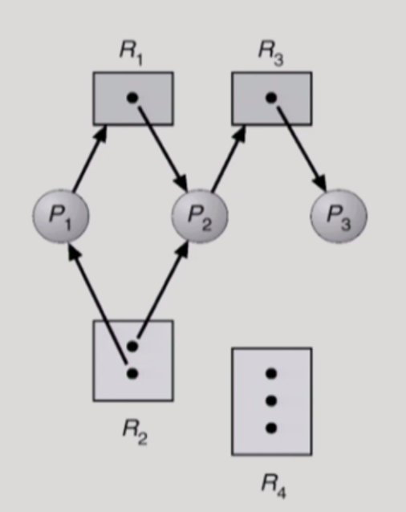
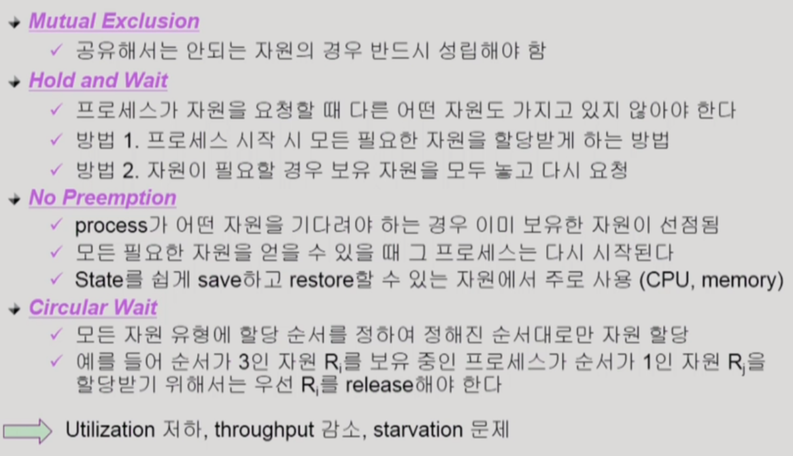
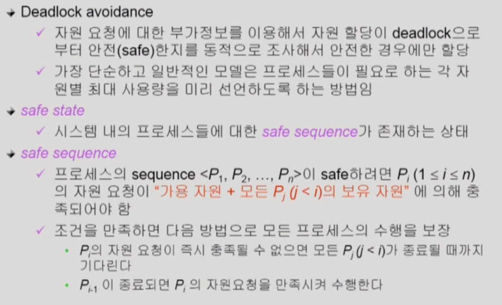
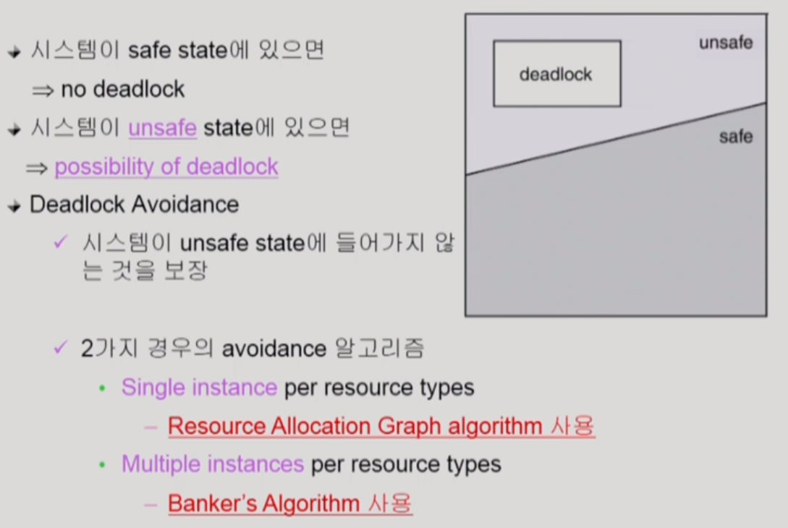
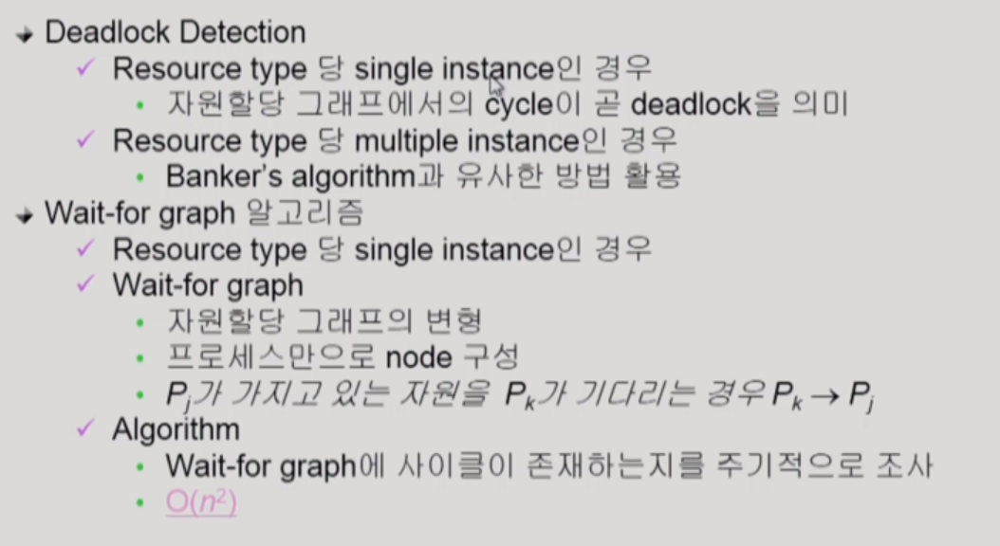

# 7. Deadlocks (교착상태)

> 2021.06.08 작성

## 1) Deadlocks 란?

> 일련의 프로세스들이 서로가 가진 자원을 기다리며 block된 상태

 

#### 자원

> Resource : 하드웨어, 소프트웨어 등을 포함하는 개념

- 프로세스가 자원을 사용하는 절차 : Request(요청), Allocate(할당), Use(사용), Release(반납)

 

#### 데드락의 조건 4가지

- `Mutual Exclusion` : 상호배제. 매 순간 하나의 프로세스만이 자원을 사용할 수 있음
- `No preeption` : 비선점. 프로세스는 자원을 스스로 내어놓을 뿐 강제로 빼앗기지 않음
- `Hold and Wait` : 보유대기. 자원을 가진 프로세스가 다른 자원을 기다릴 때 보유 자원을 놓지 않고 계속 가지고 있음
- `Circular Wait` : 순환대기. 자원을 기다리는 프로세스간에 사이클이 형성되어야 함

 

## 2) 자원할당 그래프

- R은 자원, P는 프로세스
- `P1` : R2를 점유하면서 R1을 요청한 상태
- `P2` : R1, R2를 모두 점유하면서 R3을 요청한 상태
- `P3` : R3를 점유한 상태
- **데드락인지 파악하려면 사이클이 있는지를 파악하면 된다. 사이클이 있으면 데드락! **-> 위 사진은 데드락이 아니다. (사이클이 없음)

 

## 3) 데드락의 처리 방법

- `Deadlock Prevention` : 자원 할당 시 데드락의 4가지 조건 중 어느 하나가 만족되지 않도록 하는 것

  - 

   

- `Deadlock Avoidance` : 자원 요청에 대한 부가적인 정보를 이용해서 데드락의 가능성이 없는 경우에만 자원을 할당. 시스템 state가 원래 state로 돌아올 수 있는 경우에만 자원 할당

  - 
  - 

   

- `Deadlock detection and recovery` : 데드락 발생은 허용하되 그에 대한 detection 루틴을 두어 데드락 발견시 recover

  - 

   

- `Deadlock Ignorance` 데드락을 시스템이 책임지지 않음. 대부분의 OS가 이 방법을 채택한다. (UNIX 제외)

  - Deadlock이 매우 드물게 발생하므로 deadlock에 대한 조치 자체가 더 큰 overhead일 수 있다.
  - 만약, 시스템에 deadlock이 발생한 경우 시스템이 비정상적으로 작동하는 것을 사람이 느낀 후 직접 프로세스를 죽이는 등의 방법으로 대처

