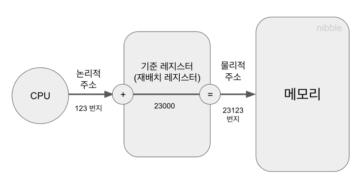
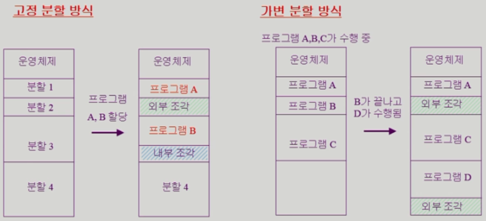

# 8. 메모리 관리

> 2021.06.11 작성

 

## 1) 주소 바인딩(Address space)

> 프로세스의 논리적 주소를 물리적 메모리 주소로 연결시켜주는 작업

- `논리적 주소(Logical Address)` : 프로그램이 실행을 위해 메모리에 적재되면 그 프로세스를 위한 독자적인 주소 공간.
  - 0번지 부터 시작한다.
  - CPU는 하드웨어이지만, 논리적 주소에 근거에 명령을 실행한다.
- `물리적 주소(Physical Address)` : 물리적 메모리에 실제로 올라가는 위치.
  - 낮은 주소 영역에는 운영체제가, 높은 주소 영역에는 사용자 프로세스가 올라간다.

 

##### 주소 바인딩의 세 가지 방식

> 프로그램이 적재되는 물리적 메모리의 주소가 결정되는 시기에 따라 분류

1. `컴파일 타임 바인딩 (Compile time binding)`

   - 컴파일을 하는 시점에 해당 프로그램이 물리적 메모리의 몇 번지에 위치할 것인지 결정
   - 물리적 메모리의 위치를 변경하려면 재 컴파일을 해야하므로, 비현실적이고 현대의 시분할 환경에 맞지 않음

2. `로드 타임 바인딩 (Load time binding)`

   - 프로그램의 실행이 시작될 때에 물리적 메모리 주소가 결정

   - 로더의 책임하에 물리적 메모리 주소가 부여되며, **프로그램이 종료될 때까지 물리적 메모리상의 위치가 고정**

     > 로더란? 사용자 프로그램을 메모리에 적재시키는 프로그램을 말한다.

3. `실행시간 바인딩 (Execution time binding 또는 Run time binding)`

   - 프로그램이 실행을 시작한 후에도 그 프로그램이 위치한 물리적 메모리상의 주소가 변경될 수 있는 바인딩 방식

   - 따라 현대의 시분할 환경에서 채택된 방식이며, MMU(메모리 관리 유닛)을 통해 주소를 매핑한다.

     > MMU란? Memory Management Unit으로 논리적 주소를 물리적 주소로 매핑해주는 하드웨어 장치이다.

 

##### MMU 기법 (MMU Scheme)

- CPU가 특정 프로세스의 논리적 주소를 참조하려고 할 때, 그 주소값에 기준 레지스터의 값을 더해 물리적 주소값을 알아낸다.
- 기준 레지스터(Base register) == 재배치 레지스터(Relocation register)
- 즉 위 그림처럼, 참조하려는 프로세스의 논리적 주소가 123번지라면 기준 레지스터 값인 23000을 더해 23123번 물리 주소를 탐색하면된다.

 

> 다중 프로그래밍 환경에서는 물리적 메모리 안에 여러 개의 프로세스가 동시에 올라가 있는 경우가 많다.
>
> 따라서 MMU 방식에서 주소 변환을 했을 때, CPU가 요청한 논리적 주소값과 재배치 레지스터의 값을 더한 결과가 해당 프로세스의 주소 공간을 벗어나는 일이 발생할 수 있다.
>
> 즉 존재하지 않는 메모리 주소를 탐색하게 되는 경우가 발생한다는 뜻이다!

 

이를 해결하기 위해 `한계 레지스터(Limit register)`를 이용한다.

한계 레지스터를 이용해 프로세스가 자신의 주소 공간을 넘어서는 메모리 참조를 하려고 하는지 체크한다.

 

 

## 2) 메모리 관리와 관련된 용어

> 동적로딩, 동적연결, 중첩, 스와핑

 

#### 2-1) 동적 로딩

> 메모리를 좀 더 효율적으로 사용하기 위해 해당 부분이 불릴 때 그 부분만을 메모리에 적재하는 방식

- 실제로 프로그램의 상당 부분은 오류 처리루틴과 같은 특별한 경우에만 사용되는 방어용 코드가 많다.
- 따라서 이러한 코드 전체를 물리적 메모리에 올리게 되면 메모리 공간의 상당한 낭비가 초래된다.
- 동적 로딩 기법은 사용되지 않는 많은 양의 코드가 메모리에 올라가는 것을 막아 메모리를 더 효율적으로 사용할 수 있게 한다.

- 운영체제의 특별한 지원 없이 사용자가 직접 구현이 가능하고, 운영체제가 이를 쉽게 하기 위한 라이브러리를 지원한다.

 

#### 2-2) 동적 연결

> 컴파일을 통해 생성된 목적 파일과 라이브러리 파일 사이의 연결을 프로그램의 실행 시점까지 지연시키는 기법

- 정적 연결에서는 목적 파일과 라이브러리 파일이 모두 합쳐져서 실행 파일이 생성된다. 따라서 물리적 메모리가 낭비되는 경향이 있다.

- 동적 연결에서는 각 라이브러리가 실행 시점에 연결되므로 이러한 물리적 메모리의 낭비를 막는다.

- `스텁(stub)` : 동적 연결을 가능하게 하기 위해 실행파일의 라이브러리 호출 부분에 해당 라이브러리의 위치를 찾기 위한 작은 코드

  > 라이브러리를 호출 할 때 스텁을 통해 해당 라이브러리가 이미 메모리에 존재하는지 살펴보고 그런 경우에는 새로 가져오지 않는다. 메모리에 존재하지 않으면 그 때 디스크에서 라이브러리 파일을 찾아 메모리에 적재한다. 즉 다수의 프로그램이 사용하는 라이브러리 파일은 메모리에 딱 한 번만 적재되기 때문에 효율성이 높아진다.

 

#### 2-3) 중첩(Overlays)

> 프로세스의 주소 공간을 분할해 실제 필요한 부분만을 메모리에 적재하는 기법

- 동적 로딩과 개념적으로는 유사하지만, 사용하는 이유는 다르다.
- 중첩은 초창기 컴퓨터 시스템에서 사용하던 기법으로, 물리적 메모리의 크기 제약으로 인해 주소 공간을 분할해 적재하는 것이다.
- 따라서 물리적 메모리가 넉넉한 경우에는 분할하지 않고 전체를 메모리에 적재한다. 이게 동적 로딩과의 큰 차이점이다.
- 또한 중첩은 동적 로딩처럼 운영체제에서 라이브러리를 지원하지 않으므로, 사용자가 일일히 모두 프로그래밍 해야한다.

 

#### 2-4) 스와핑(Swapping)

> 메모리에 올라온 프로세스의 주소 공간 전체를 디스크의 스왑 영역에 일시적으로 내려놓는 것

- `스왑 영역` : **백킹 스토어(backing store)**. 디스크 내에 파일 시스템과는 별도로 존재하는 일정한 영역
- `스왑 인(swap in)` : 디스크에서 메모리로 올리는 작업
- `스왑 아웃(swap out)` : 메모리에서 디스크로 내리는 작업 (중기 스케줄러가 담당)

- 스와핑에 소요되는 시간은 대부분 **디스크 섹터에서 실제 데이터를 읽고 쓰는 전송시간**이 차지한다. (많은 양의 데이터를 스왑 인, 아웃 하기 때문)

 

 

## 3) 물리적 메모리의 할당 방식

> 물리적 메모리는 운영체제 상주 영역과 사용자 프로세스 영역으로 나뉜다.

 

### 3-1) 연속할당 방식

- 프로세스를 메모리에 올릴 때 그 주소 공간을 분할하지 않고 물리적 메모리의 한 곳에 연속적으로 적재하는 방식
- 고정분할 방식과 가변분할 방식이 있다.

##### 고정분할 방식

> 물리적 메모리를 주어진 개수만큼의 영구적인 분할로 미리 나누어두고 각 분할에 하나의 프로세스를 적재해 실행

- 외부조각과 내부조각이 발생할 수 있다.
- `외부조각` : 프로그램의 크기보다 분할의 크기가 작은 경우 해당 분할이 비어있는데도 불구하고 프로그램을 적재하지 못하기 때문에 발생하는 메모리 공간
- `내부조각` : 프로그램의 크기보다 분할의 크기가 큰 경우 해당 분할에 프로그램을 적재하고 남는 메모리 공간

 

##### 가변분할 방식

> 메모리에 적재되는 프로그램의 크기에 따라 분할의 크기, 개수가 동적으로 변하는 방식

- 분할의 크기가 동적으로 변하므로 내부조각은 발생하지 않는다. 외부조각은 발생 가능하다.

- `동적 메모리 할당 문제 (Dynamic storage-allocation problem)`

  1. 최초 적합 방법 (first-fit) :  메모리에 존재하는 가용 공간을 차례대로 살펴보면서 가용 공간이 프로그램의 크기보다 작으면 건너뛰고, 그렇지 않은 가용 공간이 최초로 발견되면 그 공간에 프로그램을 올린다.
  2. 최적 적합 방법 (best-fit) : 크기가 n 이상인 가장 작은 가용 공간을 찾아 그곳에 새로운 프로그램을 할당한다.
  3. 최악 적합 방법 (worst-fit) : 가용 공간 중에서 가장 크기가 큰 곳에 새로운 프로그램을 할당한다.

  > 최초 적합과 최적 적합 방식이 최악 적합 방식에 비해 속도와 공간 이용률 측면에서 효과적이다. (실험적 증명)

- `컴팩션(compaction)` : 프로세스에 의해 사용 중인 메모리 영역을 한쪽으로 몰고 가용 공간들을 다른 한쪽으로 모아서 하나의 큰 가용 공간을 만드는 방법이다. **(hole을 모으는 것. 외부조각을 해결하나 비용이 많이 들고 복잡하다.)**

 

### 3-2) 불연속할당 방식

- 하나의 프로세스가 물리적 메모리의 여러 위치에 분산되어 올라갈 수 있는 메모리 할당 기법
- 페이징, 세그먼테이션, 페이지드 세그먼테이션 기법이 있다.