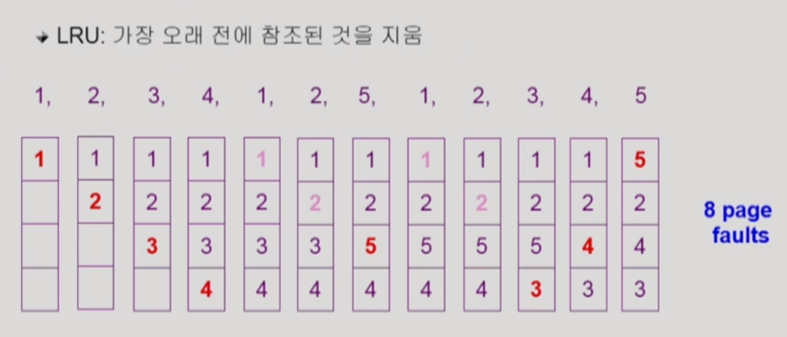

# 9. 가상 메모리

> 2021.06.20 작성

 

## 1) 가상 메모리란?

> 운영체제는 CPU에서 당장 수행해야 할 부분만을 메모리에 올려 놓고 그렇지 않은 부분은 디스크의 스왑 영역에 내려 놓았다가 다시 필요해지면 메모리에 올라가 있는 부분과 교체하는 방식이다.

- `가상메모리(Virtual Memory)` : 스왑 영역을 이용해서 메모리의 한계를 해결하여, 운영체제의 프로그램이 0번지부터 시작하는 각자 자신만의 메모리를 갖는데 이때 이 메모리 공간을 가상메모리라고 한다.
- 요구 페이징 방식과 요구 세그먼테이션 방식으로 나뉘는데, 대부분은 요구 페이징 방식을 사용한다.

 

 

## 2) 요구 페이징

> 프로그램 실행 시 당장 사용될 페이지만을 올리는 방식.
>
> 특정 페이지에 대해 CPU의 요청이 들어온 후에야 해당 페이지를 메모리에 적재.

##### 장점

- 메모리 사용량이 감소한다.
- 프로세스 전체를 메모리에 올리는 데 소요되는 입출력 오버헤드를 감소한다.
- 응답시간을 단축한다.
- 더 많은 프로세스를 수용할 수 있다.
- 물리적 메모리의 용량 제약을 벗어날 수 있다.

 

##### 유효/무효 비트

> 각 페이지가 메모리에 존재하는지 표시하는 비트

- `유효값` : 특정 페이지가 참조되어 메모리에 적재되는 경우, 해당 페이지의 유효-무효 비트는 유효값을 가진다.
- `무효값` : 페이지가 디스크의 스왑 영역으로 쫓겨날 때에는 유효-무효 비트가 무효값을 가진다.

- `페이지 부재(Page Fault)` : CPU가 참조하려는 페이지가 현재 메모리에 올라와 있지 않아 유효-무효 비트가 무효로 세팅되어 있는 현상

 

##### 페이지 부재 처리

1. 주소 변환을 담당하는 하드웨어인 MMU가 페이지 부재 트랩을 발생시킨다.
2. CPU의 제어권이 커널로 이양된다.
3. 운영체제의 **페이지 부재 처리루틴**이 호출된다.
   - 해당 페이지에 대한 접근이 적법한지 먼저 체크한다. (올바른 주소 영역을 참조하려 하는가? 권한은 있는가?)
   - 물리적 메모리에서 비어있는 프레임을 할당받아 그 공간에 해당 페이지를 읽어온다.
   - 페이지 부재를 발생시킨 프로세스는 CPU를 빼앗기고 봉쇄 상태가 된다. (Disk I/O가 오래 걸리기 때문)
   - 현재까지 수행되던 CPU 레지스터 상태 및 PC값을 PCB에 저장하여 미래를 대비한다.
   - Disk I/O가 완료되어 인터럽트가 발생하면, 페이지 테이블에서 해당 페이지를 유효값으로 비트를 바꾸고 봉쇄되었던 프로세스를 준비 큐에 올린다.
   - 해당 프로세스가 CPU를 재할당받으면 PCB에 저장한 값을 복원하여 중단된 명령부터 재개한다.

 

##### 요구 페이징의 성능

- 성능에 가장 큰 영향을 미치는 요소는 `페이지 부재의 발생 빈도`
- 그 이유는 페이지 부재는 Disk I/O 를 발생시키므로 막대한 오버헤드가 발생하기 때문이다.
- 즉 페이지 교체 시에 최대한 페이지 부재가 미래에 발생하지 않도록 고려하여 교체해야 한다. (이제 알고리즘이 아래에 나온다.)

 

 

## 3) 페이지 교체 알고리즘

> 메모리에 올라와 있는 페이지 중 하나를 디스크로 쫓아내 (스왑아웃) 메모리에 빈 공간을 확보하는 작업
>
> 페이지 교체 알고리즘의 목표는 페이지 부재를 최소화 하는 것이다.

##### 3-1) 최적 페이지 교체

> 페이지 교체 시 물리적 메모리에 존재하는 페이지 중 가장 먼 미래에 참조될 페이지를 쫓아내면 된다.
>
> 빌레디의 최적 알고리즘이라고 부른다.

- 해당 알고리즘은 `미래에 어떤 페이지가 어떠한 순서로 참조될지 미리 알고 있다는 전제`가 필요하다.
- 따라서 현실에서는 구현할 수 없다. 왜냐면 미래를 완전히 예측할 수 없기 때문!
- 따라서 해당 알고리즘은, `다른 알고리즘의 성능의 상한선을 제시하는 것` 그 이상도 이하도 아니다.

 

##### 3-2) 선입선출 알고리즘(FIFO)

> 페이지 교체 시, 물리적 메모리에 가장 먼저 올라온 페이지를 우선적으로 내쫓는다.

- 향후 상황을 고려하지 않고, 단순히 먼저 들어온 페이지를 먼저 쫓아내므로 비효율성이 발생할 수 있다.
- 따라서 향후 상황을 고려해야하는데, 그를 위해 탄생된 것이 LRU와 LFU 알고리즘이다.

 

##### 3-3) LRU (Least Recently Used) 알고리즘

> 시간지역성(최근에 참조된 페이지가 가까운 미래에 다시 참조될 가능성이 높은 성질)을 이용한다.
>
> 페이지 교체 시 가장 오래전에 참조가 이루어진 페이지를 쫓아낸다. 즉 가장 구식 페이지를 쫓아낸다.

- LRU 알고리즘은 `연결리스트`를 통해 구현할 수 있다.
- 어떤 페이지를 참조할 때마다 해당 페이지는 연결리스트의 가장 뒤쪽으로 이동한다.
- 왜냐면 참조를 하게 되었을 때, 시간지역성이 가장 높아지기 때문에 바로 연결리스트의 가장 뒤쪽으로 이동하면 된다.
- 그리고 교체할 페이지를 선정할 때는 연결리스트의 0번째 인덱스(맨앞)의 페이지를 교체하면 된다.
- 따라서 `시간 복잡도는 O(1)이다.`

 

##### 3-4) LFU (Least Frequently Used) 알고리즘

> 페이지 중에서 과거에 참조 횟수가 가장 적었던 페이지를 쫓아내고 그 자리에 새로 참조될 페이지를 적재한다.
>
> 즉 가장 인기가 없는 페이지를 쫓아낸다.

- `Incache-LFU` : 페이지가 물리적 메모리에 올라온 후부터의 참조 횟수만을 카운트 하는 방법
- `Perfect-LFU` : 메모리에 올라와 있는지 여부와 상관없이 그 페이지의 과거 총 참조 횟수를 카운트 하는 방법
- LRU는 직전에 참조된 시점만을 반영하지만 LFU는 참조 횟수를 통해 장기적인 시간 규모에서의 참조 성향을 고려한다는 차이점이 있다.
- LFU는 연결리스트로 구현하게 되면 O(n)의 시간복잡도를 가지므로 비효율적이다. LRU와 달리 LFU는 참조 횟수를 기반으로 페이지를 교체하므로, 매번 참조 횟수가 달라질 때마다 연결리스트를 정렬(sorting)해야 하기 때문이다.
- 따라서 `LFU는 힙(Heap)으로 구현`한다. 그렇게 되면 `O(logN)의 시간복잡도`를 가진다. 힙은 이진트리로 구성되어 있어서 페이지의 삽입/삭제 시 자동으로 정렬되기 때문이다.

