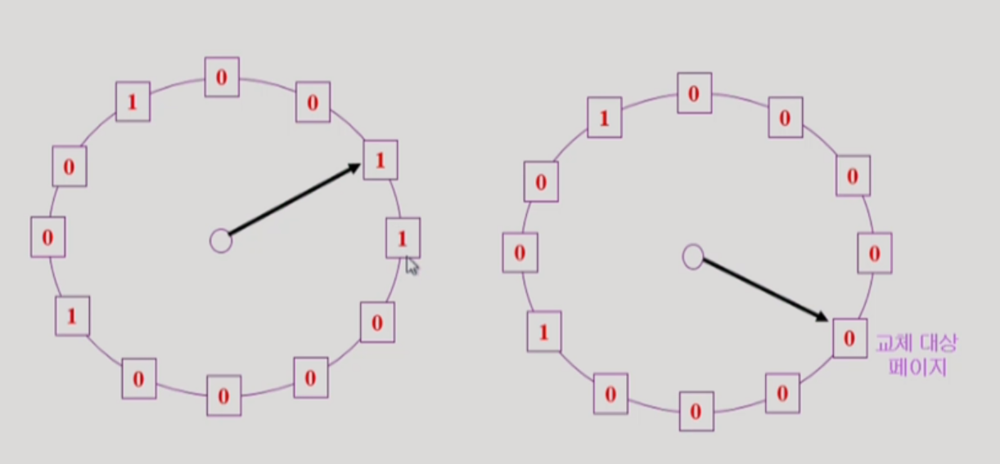
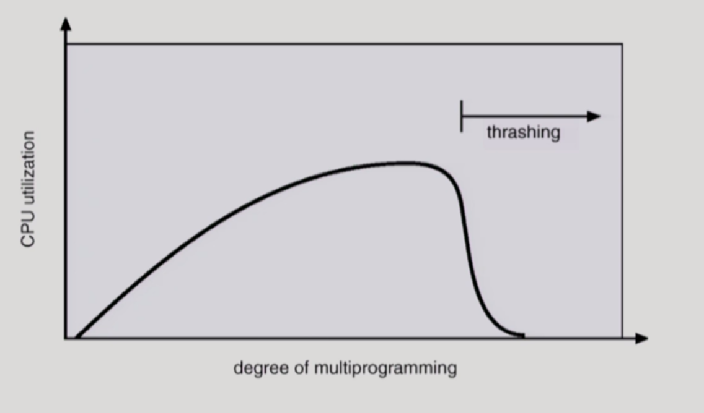
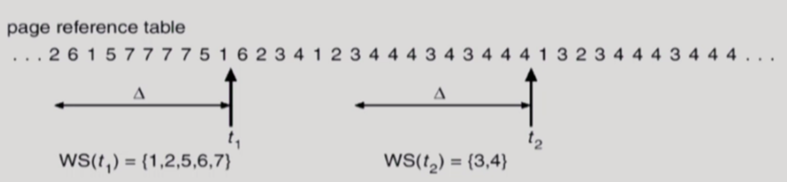
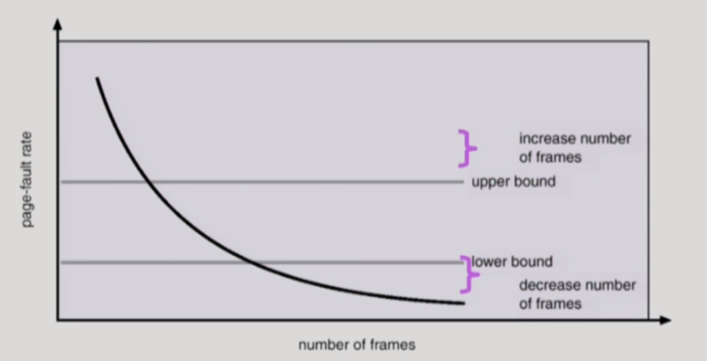

# 9. 가상 메모리

> 2021.06.20 작성

<br>

## 1) 가상 메모리란?

> 운영체제는 CPU에서 당장 수행해야 할 부분만을 메모리에 올려 놓고 그렇지 않은 부분은 디스크의 스왑 영역에 내려 놓았다가 다시 필요해지면 메모리에 올라가 있는 부분과 교체하는 방식이다.

- `가상메모리(Virtual Memory)` : 스왑 영역을 이용해서 메모리의 한계를 해결하여, 운영체제의 프로그램이 0번지부터 시작하는 각자 자신만의 메모리를 갖는데 이때 이 메모리 공간을 가상메모리라고 한다.
- 요구 페이징 방식과 요구 세그먼테이션 방식으로 나뉘는데, 대부분은 요구 페이징 방식을 사용한다.

<br>

<br>

## 2) 요구 페이징

> 프로그램 실행 시 당장 사용될 페이지만을 올리는 방식.
>
> 특정 페이지에 대해 CPU의 요청이 들어온 후에야 해당 페이지를 메모리에 적재.

##### 장점

- 메모리 사용량이 감소한다.
- 프로세스 전체를 메모리에 올리는 데 소요되는 입출력 오버헤드를 감소한다.
- 응답시간을 단축한다.
- 더 많은 프로세스를 수용할 수 있다.
- 물리적 메모리의 용량 제약을 벗어날 수 있다.

<br>

##### 유효/무효 비트

> 각 페이지가 메모리에 존재하는지 표시하는 비트

- `유효값` : 특정 페이지가 참조되어 메모리에 적재되는 경우, 해당 페이지의 유효-무효 비트는 유효값을 가진다.
- `무효값` : 페이지가 디스크의 스왑 영역으로 쫓겨날 때에는 유효-무효 비트가 무효값을 가진다.

- `페이지 부재(Page Fault)` : CPU가 참조하려는 페이지가 현재 메모리에 올라와 있지 않아 유효-무효 비트가 무효로 세팅되어 있는 현상

<br>

##### 페이지 부재 처리


1. 주소 변환을 담당하는 하드웨어인 MMU가 페이지 부재 트랩을 발생시킨다.
2. CPU의 제어권이 커널로 이양된다.
3. 운영체제의 **페이지 부재 처리루틴**이 호출된다.
   - 해당 페이지에 대한 접근이 적법한지 먼저 체크한다. (올바른 주소 영역을 참조하려 하는가? 권한은 있는가?)
   - 물리적 메모리에서 비어있는 프레임을 할당받아 그 공간에 해당 페이지를 읽어온다.
   - 페이지 부재를 발생시킨 프로세스는 CPU를 빼앗기고 봉쇄 상태가 된다. (Disk I/O가 오래 걸리기 때문)
   - 현재까지 수행되던 CPU 레지스터 상태 및 PC값을 PCB에 저장하여 미래를 대비한다.
   - Disk I/O가 완료되어 인터럽트가 발생하면, 페이지 테이블에서 해당 페이지를 유효값으로 비트를 바꾸고 봉쇄되었던 프로세스를 준비 큐에 올린다.
   - 해당 프로세스가 CPU를 재할당받으면 PCB에 저장한 값을 복원하여 중단된 명령부터 재개한다.

<br>

##### 요구 페이징의 성능

- 성능에 가장 큰 영향을 미치는 요소는 `페이지 부재의 발생 빈도`
- 그 이유는 페이지 부재는 Disk I/O 를 발생시키므로 막대한 오버헤드가 발생하기 때문이다.
- 즉 페이지 교체 시에 최대한 페이지 부재가 미래에 발생하지 않도록 고려하여 교체해야 한다. (이제 알고리즘이 아래에 나온다.)

<br>

<br>

## 3) 페이지 교체 알고리즘

> 메모리에 올라와 있는 페이지 중 하나를 디스크로 쫓아내 (스왑아웃) 메모리에 빈 공간을 확보하는 작업
>
> 페이지 교체 알고리즘의 목표는 페이지 부재를 최소화 하는 것이다.


##### 3-1) 최적 페이지 교체

> 페이지 교체 시 물리적 메모리에 존재하는 페이지 중 가장 먼 미래에 참조될 페이지를 쫓아내면 된다.
>
> 빌레디의 최적 알고리즘이라고 부른다.

- 해당 알고리즘은 `미래에 어떤 페이지가 어떠한 순서로 참조될지 미리 알고 있다는 전제`가 필요하다.
- 따라서 현실에서는 구현할 수 없다. 왜냐면 미래를 완전히 예측할 수 없기 때문!
- 따라서 해당 알고리즘은, `다른 알고리즘의 성능의 상한선을 제시하는 것` 그 이상도 이하도 아니다.

<br>

##### 3-2) 선입선출 알고리즘(FIFO)

> 페이지 교체 시, 물리적 메모리에 가장 먼저 올라온 페이지를 우선적으로 내쫓는다.

- 향후 상황을 고려하지 않고, 단순히 먼저 들어온 페이지를 먼저 쫓아내므로 비효율성이 발생할 수 있다.
- 따라서 향후 상황을 고려해야하는데, 그를 위해 탄생된 것이 LRU와 LFU 알고리즘이다.

<br>

##### 3-3) LRU (Least Recently Used) 알고리즘

> 시간지역성(최근에 참조된 페이지가 가까운 미래에 다시 참조될 가능성이 높은 성질)을 이용한다.
>
> 페이지 교체 시 가장 오래전에 참조가 이루어진 페이지를 쫓아낸다. 즉 가장 구식 페이지를 쫓아낸다.


- LRU 알고리즘은 `연결리스트`를 통해 구현할 수 있다.
- 어떤 페이지를 참조할 때마다 해당 페이지는 연결리스트의 가장 뒤쪽으로 이동한다.
- 왜냐면 참조를 하게 되었을 때, 시간지역성이 가장 높아지기 때문에 바로 연결리스트의 가장 뒤쪽으로 이동하면 된다.
- 그리고 교체할 페이지를 선정할 때는 연결리스트의 0번째 인덱스(맨앞)의 페이지를 교체하면 된다.
- 따라서 `시간 복잡도는 O(1)이다.`

<br>

##### 3-4) LFU (Least Frequently Used) 알고리즘

> 페이지 중에서 과거에 참조 횟수가 가장 적었던 페이지를 쫓아내고 그 자리에 새로 참조될 페이지를 적재한다.
>
> 즉 가장 인기가 없는 페이지를 쫓아낸다.


- `Incache-LFU` : 페이지가 물리적 메모리에 올라온 후부터의 참조 횟수만을 카운트 하는 방법
- `Perfect-LFU` : 메모리에 올라와 있는지 여부와 상관없이 그 페이지의 과거 총 참조 횟수를 카운트 하는 방법
- LRU는 직전에 참조된 시점만을 반영하지만 LFU는 참조 횟수를 통해 장기적인 시간 규모에서의 참조 성향을 고려한다는 차이점이 있다.
- LFU는 연결리스트로 구현하게 되면 O(n)의 시간복잡도를 가지므로 비효율적이다. LRU와 달리 LFU는 참조 횟수를 기반으로 페이지를 교체하므로, 매번 참조 횟수가 달라질 때마다 연결리스트를 정렬(sorting)해야 하기 때문이다.
- 따라서 `LFU는 힙(Heap)으로 구현`한다. 그렇게 되면 `O(logN)의 시간복잡도`를 가진다. 힙은 이진트리로 구성되어 있어서 페이지의 삽입/삭제 시 자동으로 정렬되기 때문이다.

<br>

##### 3-5) 클럭(Clock) 알고리즘

> LRU를 근사시킨 알고리즘으로, 오랫동안 참조되지 않은 페이지 중 하나를 교체하는 방법이다.
>
> NUR(Not Used Recently) 혹은 NRU(Not Recently Used) 알고리즘이라고도 부른다.

```
페이징 시스템에서는 현실적으로 LRU나 LFU 알고리즘을 사용할 수 없다.
왜냐하면 운영체제가 참조시간이나 참조횟수에 대한 정보를 알지 못하기 때문이다.
해당 정보를 알지 못하는 이유는, 이미 물리적 메모리에 페이지가 있는 경우에는 CPU는 물리적 메모리에 있는 해당 페이지를 그대로 읽어오기 때문에 운영체제가 어떠한 동작, 기록도 하지 못하기 때문이다.

따라서 하드웨어적인 지원을 도입한 클럭 알고리즘을 대부분의 페이징 시스템에서 채택하였다.
```



- LRU와 비슷하나, 교체되는 페이지의 참조 시점이 가장 오래되었다는 것을 보장하지는 못한다.
- 하드웨어적인 지원으로 동작하므로 LRU에 비해 페이지의 관리가 빠르고 효율적으로 이루어진다.
- 교체 페이지를 선정하기 위해 `참조비트(reference bit)`를 사용하는데, 참조비트가 1인 페이지는 0으로 바꾼 후 그냥 지나가고 참조 비트가 0인 페이지는 교체하는 방식이다.
- 즉 시계바늘이 한 바퀴 도는 동안 다시 참조되지 않은 페이지를 교체하는 방식이다.

- 시계바늘이 한 바퀴를 도는 데 소요되는 시간만큼 페이지를 메모리에 유지시켜둠으로써 페이지 부재율을 줄이도록 설계되었다.

<br>

<br>

## 4) 페이지 프레임의 할당(Allocation)

> 프로세스가 여러 개가 동시에 수행되는 상황에서는 각 프로세스에 얼마만큼의 메모리 공간을 할당할 것인지 결정해야한다.

##### 기본적인 할당 알고리즘

1. `균등할당(Equal Allocation)` : 모든 프로세스에게 페이지 프레임을 균일하게 할당하는 것
2. `비례할당(Proportional Allocation)` : 프로세스의 크기에 비례해 페이지 프레임을 할당하는 것
   - 프로세스의 크기가 모두 균일하지 않다는 점에 착안한 방식으로 프로세스의 크기를 고려한 방식이다.
3. `우선순위 할당(Priority Allocation)` : 프로세스의 우선순위에 따라 페이지 프레임을 다르게 할당하는 것
   - 프로세스 중 당장 CPU에서 실행될 프로세스와 그렇지 않은 프로세스를 구분하여 전자 쪽에 더 많은 페이지 프레임을 할당하는 방식이다.

<br>

<br>

## 5) 전역교체와 지역교체

- `전역교체(Global Replacement)` : 모든 프레이지 프레임이 교체 대상이 될 수 있는 방법
  - 페이지 교체 시 다른 프로세스에 할당된 프레임을 빼앗을 수 있다.
  - LRU, LFU, 클럭 등의 알고리즘을 물리적 메모리 내에 존재하는 전체 페이지 프레임들을 대상으로 적용하는 경우이다.
- `지역교체(Local Replacement)` : 현재 수행 중인 프로세스에게 할당된 프레임 내에서만 교체 대상을 선정할 수 있는 방법
  - 프로세스별로 페이지 프레임을 할당하고, 교체할 페이지도 그 프로세스에게 할당된 프레임 내에서 선정한다.
  - LRU, LFU 등의 알고리즘을 프로세스별로 독자적으로 운영할 때 사용한다.

<br>

<br>

## 6) 스레싱(Thrashing)

> 프로세스가 원활히 수행되기 위해서는 일정 수준 이상의 페이지 프레임을 할당받아야 한다.
>
> 최소한의 페이지 프레임을 할당받지 못할 경우, 성능상의 심각한 문제가 발생할 수 있다.
>
> 집중적으로 참조되는 페이지들의 집합을 메모리에 한꺼번에 적재하지 못하면, 페이지 부재율이 크게 상승해 CPU 이용률이 급격히 떨어진다.
>
> 이와 같은 현상을 스레싱이라고 한다.



- `다중 프로그래밍 정도(MPD : Multi-Programming Degree)` : 메모리에 동시에 올라가 있는 프로세스의 수
- CPU 이용률이 낮을 경우 운영체제는 MPD를 높인다.
- `MPD가 과도하게 높아지면` : 각 프로세스에게 할당되는 메모리의 양이 지나치게 감소한다. 그렇게 되면 필요한 최소 페이지 프레임도 할당받지 못하여 페이지 부재가 빈번히 발생한다. 페이지 부재가 발생하면 Disk I/O 작업이 일어나며 CPU가 다른 프로세스에게 이양된다. 결국 이런 악순환이 계속 반복된다.
- **모든 프로세스가 다 페이지 부재를 발생시켜 시스템은 페이지 부재를 처리하느라 매우 분주해지고 CPU의 이용률은 급격히 떨어지게 된다. 이럴때 스레싱이 발생했다고 표현한다.**

<br>

##### 6-1) 워킹셋 알고리즘

> 지역성 집합(Locality set) : 집중적으로 참조되는 페이지들의 집합
>
> 워킹셋 알고리즘은 이러한 지역성 집합이 메모리에 동시에 올라갈 수 있도록 보장하는 메모리 관리 알고리즘이다.



- `워킹셋(Working Set)` : 프로세스가 일정 시간 동안 원활히 수행되기 위해 한꺼번에 메모리에 올라와 있어야 하는 페이지들의 집합
- 워킹셋 윈도우(Working Set Window)를 사용하여 한꺼번에 메모리에 올라가야 할 페이지들의 집합을 결정한다.
- CPU 이용률을 높게 유지하면서 MPD를 적절히 조절해 스레싱을 방지한다.
- 위 사진에서 볼 수 있듯이, 워킹셋 알고리즘은 `프로세스가 메모리를 많이 필요로 할 때에는 많이 할당하고, 적게 필요로 할 때에는 적게 할당하는 일종의 동적 프레임 할당 기능`까지 수행한다.

<br>

##### 6-2) 페이지 부재 빈도 알고리즘

> 프로세스의 페이지 부재율을 주기적으로 조사하고 이 값에 근거해서 각 프로세스에 할당할 메모리 양을 동적으로 조절한다.



- 프로세스의 페이지 부재율이 시스템이 미리 정해놓은 `상한값`과 `하한값` 사이에 올 수 있도록 동적으로 조절한다.
- `상한값을 넘게 되면` : 프로세스에 할당된 프레임 수가 부족하다고 판단하여 이 프로세스에게 프레임을 추가로 할당한다. 이때 추가로 할당할 빈 프레임이 없다면, 일부 프로세스를 스왑 아웃시켜서 메모리에 올라가 있는 프로세스의 수를 조절한다.
- `하한값 이하로 떨어지면` : 프로세스에게 필요 이상으로 많은 프레임이 할당된 것으로 간주해 할당된 프레임의 수를 줄인다.

